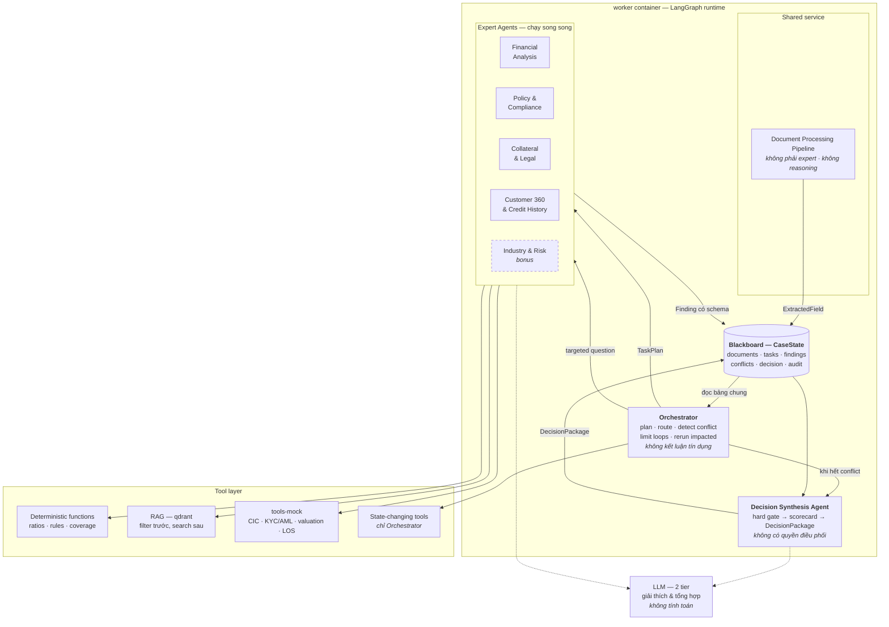
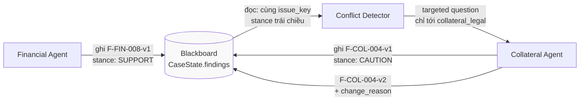
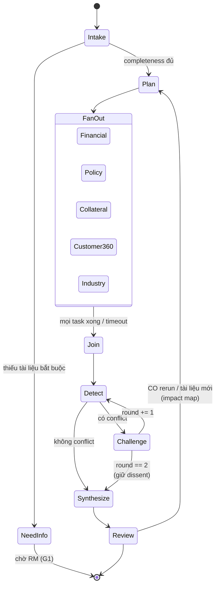
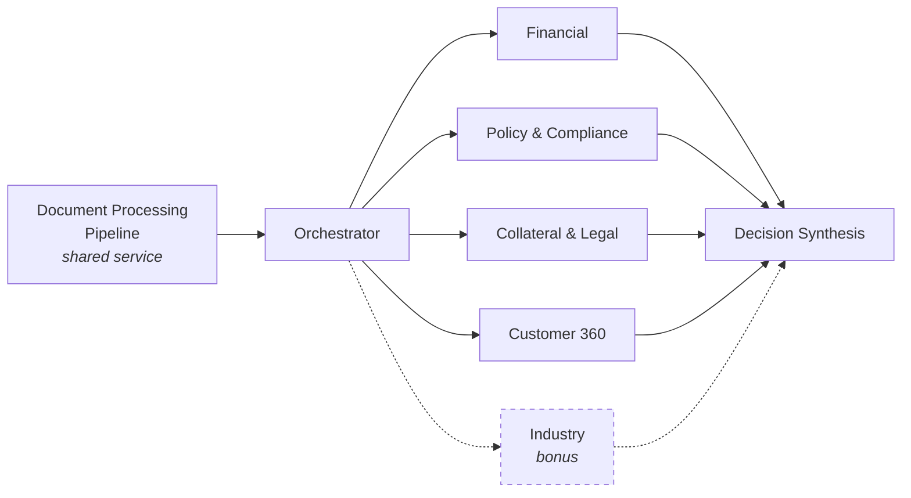
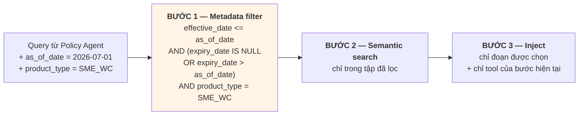
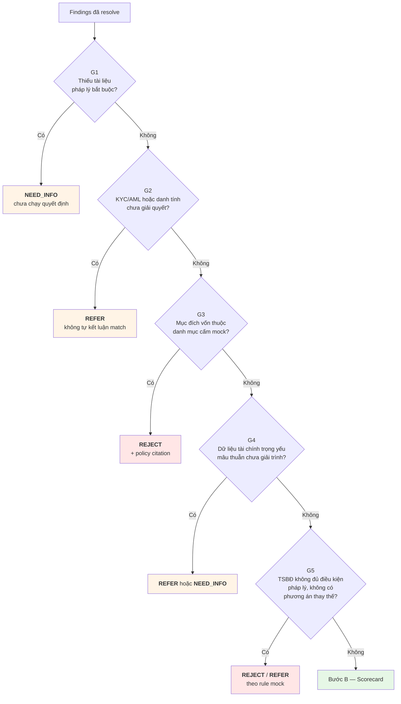

# SHBExpert Flow — Kiến trúc AI (Orchestrator-Workers)

> **Bộ tài liệu kiến trúc** — 3 file:
> 1. [`overview.md`](./overview.md) — topology 1-VM, service, ai gọi ai, nguyên tắc an toàn.
> 2. **`ai-architecture.md`** (file này) — bộ não AI: Orchestrator-Workers, agent, tool, RAG, phản biện, quyết định.
> 3. [`data-flow.md`](./data-flow.md) — dữ liệu chảy thế nào qua từng bước.
>
> Nguồn nghiệp vụ: `PRD1.1.docx` mục 5, 6, 10, 11, 12 và Phụ lục A.

> **Lưu ý quản trị:** hard gate, trọng số scorecard và ngưỡng trong tài liệu này là **mock ground truth** cho dữ liệu tổng hợp. Khi có chuyên gia SHB, chúng phải được thay bằng policy-as-code đã phê duyệt. Hệ thống tạo **khuyến nghị**, không tạo quyết định tín dụng có hiệu lực pháp lý.

---

## 1. Vì sao Orchestrator-Workers

Bài toán là: một hồ sơ tín dụng cần nhiều loại chuyên môn (tài chính, chính sách, pháp lý, tài sản, lịch sử tín dụng), và những chuyên môn đó **có thể kết luận trái nhau**. Giá trị của sản phẩm nằm đúng ở chỗ làm mâu thuẫn lộ ra sớm — chứ không phải ở chỗ sinh thêm một đoạn tóm tắt.

Điều đó loại bỏ hai kiến trúc phổ biến:

| Chọn | Không chọn | Lý do |
|---|---|---|
| **Đa agent theo miền + shared state** | Một agent lớn với prompt dài | Một agent không tách được trách nhiệm, không đánh giá được từng miền riêng, và không thể chứng minh có cộng tác. Nó cũng không thể bất đồng với chính nó. |
| **Orchestrator có graph xác định** | Group chat tự do giữa agent | Chat tự do dễ lặp vô hạn, tạo **đồng thuận giả**, khó tái hiện và khó kiểm toán. Không có điểm dừng tự nhiên. |
| **RAG + rule engine + deterministic functions** | LLM đọc policy rồi tự quyết | Luật cứng và phép tính cần kết quả xác định, phiên bản hoá và kiểm thử được. Một tỷ số sai là lỗi nghiệp vụ, không phải "hallucination chấp nhận được". |
| **Human-in-the-loop** | Phê duyệt tự động | Tín dụng là quyết định rủi ro cao; cần trách nhiệm, phân cấp và quyền override của con người. |

Nguồn: PRD 10.5.

**Nguyên tắc phân vai** (PRD 5.1) — mỗi agent chỉ sở hữu **một loại judgment rõ ràng**. Không tạo thêm agent chỉ để chia nhỏ prompt; nếu hai agent dùng chung tri thức và chung tool thì đó là một agent bị tách đôi.

**Orchestrator không đưa nhận định tín dụng.** Nó lập kế hoạch, định tuyến, phát hiện xung đột và giới hạn vòng lặp — nhưng không tự kết luận về hồ sơ. Lý do (PRD 5.2): không để một thành phần vừa làm trọng tài vừa là chuyên gia. Việc hợp nhất kết luận thuộc về một agent riêng — Decision Synthesis Agent — và agent đó không có quyền điều phối.

---

## 2. Sơ đồ bộ não



Ba lớp, đọc từ trên xuống: **điều phối** (Orchestrator) — **chuyên môn** (workers, giao tiếp qua blackboard chứ không nói chuyện trực tiếp) — **công cụ** (nơi mọi sự thật được tạo ra). LLM nằm bên cạnh, không nằm giữa: nó giải thích và tổng hợp, nhưng con số và luật đến từ tool.

---

## 3. Blackboard pattern

Agent **không trò chuyện với nhau**. Chúng ghi Finding có cấu trúc vào CaseState; Orchestrator đọc bảng chung, phát hiện xung đột và gửi câu hỏi **đích danh** tới agent liên quan (PRD 6.1).



Vì sao pattern này thay vì để agent gọi nhau:

- **Không lặp vô hạn.** Không có kênh trực tiếp thì không có ping-pong. Vòng lặp duy nhất đi qua Orchestrator, và Orchestrator đếm vòng.
- **Không đồng thuận giả.** Agent không thấy kết luận của agent khác trước khi tự kết luận, nên không có chuyện hùa theo. Đây là biện pháp giảm thiểu trực tiếp cho R3.
- **Tái hiện được.** Blackboard là state có schema, checkpoint được, replay được. Một cuộc hội thoại thì không.
- **Kiểm toán được.** Mỗi finding có version, tác giả, bằng chứng, lý do thay đổi. Không có "agent nói gì đó ở giữa chừng" nằm ngoài audit.

Một hệ quả thiết kế đáng nêu: **agent không broadcast.** Khi có xung đột, Orchestrator hỏi đúng agent sở hữu bằng chứng gốc và agent có kết luận đối nghịch — không phát cho cả hội đồng (PRD 6.3). Hỏi cả nhóm là cách nhanh nhất tạo ra tiếng ồn và token cháy.

---

## 4. Orchestrator

**Vai trò:** tạo kế hoạch, định tuyến, quản lý phụ thuộc, gom kết quả, phát hiện xung đột, giới hạn vòng phản biện, điều phối chạy lại. Không đưa nhận định tín dụng.

| Thuộc tính | Nội dung |
|---|---|
| **Input** | case metadata · completeness score · available evidence · current state · policy version |
| **Tool allowlist** | `create_task` · `dispatch_task` · `request_clarification` · `detect_conflict` · `rerun_impacted_tasks` · `update_case_status` |
| **Output** | `TaskPlan` — mỗi task có `task_id`, `agent_id`, `dependency[]`, `allowed_tools[]`, `success_criteria`, `timeout` |
| **Stop condition** | Mọi task bắt buộc hoàn thành. Task lỗi retry tối đa **một lần** rồi chuyển manual review. |
| **Guardrail** | Không kết luận tín dụng. Mọi tool đổi trạng thái cần idempotency key + audit event. |

Nguồn: PRD 5.2.

### Graph LangGraph



**Node** = một bước có thể checkpoint. **Conditional edge** = quyết định định tuyến dựa trên state, **không dựa trên LLM tự chọn** — `Detect → Challenge` hay `Detect → Synthesize` là hàm thuần trên danh sách conflict, nên nó tái hiện được 100%.

**Checkpoint** ghi vào Postgres sau mỗi node. Ba lợi ích: agent lỗi không mất kết quả agent đã xong (NFR-03); replay dựng lại đúng run cho demo fallback (NFR-04); rerun theo impact map chỉ chạy lại node bị ảnh hưởng thay vì cả graph (PRD 4.3).

**Phanh nằm trong graph, không nằm trong prompt.** Giới hạn 2 vòng là một biến đếm ở cạnh `Challenge → Detect`, không phải câu "hãy chỉ tranh luận tối đa 2 lần" trong system prompt. Prompt có thể bị bỏ qua; cạnh của graph thì không.

---

## 5. Catalog worker

Mỗi worker được đặc tả theo đúng 5 thuộc tính PRD 5.1: **input schema · tool allowlist · knowledge scope · output schema · stop condition**, cộng guardrail.

> **Ghi chú đánh số:** PRD có **hai mục cùng đánh số 5.3** — Document Processing Pipeline và Financial Analysis Agent. Tài liệu này đánh số lại và nói rõ: Document Processing Pipeline là **shared service, không phải expert agent**, không tham gia reasoning hay collaboration, và **không tính vào số lượng chuyên gia** khi đối chiếu với đề bài.

### 5.1 Document Processing Pipeline — shared service

Chuẩn hoá tài liệu đầu vào thành dữ liệu có cấu trúc cho các expert agent dùng. Đây là tầng tiền xử lý.

| | |
|---|---|
| **Input** | Document (PDF/PNG/JPG/XLSX/CSV) + expected schema theo loại tài liệu |
| **Tools** | `document_classifier` · `extract_fields` · `compare_fields` · `build_checklist` |
| **Knowledge scope** | Template loại tài liệu và checklist rule. **Không có** policy, không có tri thức tín dụng. |
| **Output** | `DocumentIndex` · `ExtractedField` (value, confidence, document_id, page, bbox) · `MissingItem` · `DataConflict` |
| **Stop condition** | Mọi tài liệu đã phân loại và bóc tách; checklist đã đối chiếu |
| **Guardrail** | Invoice total lệch báo cáo công nợ, hoặc trường quan trọng có `confidence < 0.85` → gắn `REVIEW_REQUIRED`, chờ người xác nhận. OCR lỗi → `FAILED`, retry một lần, cho nhập tay. |

Vì sao tách khỏi expert: nó không có judgment. Nó không nói "hồ sơ này rủi ro"; nó nói "trường doanh thu ở trang 12 có giá trị X với độ tin cậy 0.91". Trộn nó vào một expert agent sẽ làm mờ ranh giới giữa **dữ kiện trích xuất** và **suy luận** — đúng thứ PRD 8.4 yêu cầu tách bạch.

### 5.2 Financial Analysis Agent

Phân tích xu hướng doanh thu, biên lợi nhuận, đòn bẩy, vốn lưu động, dòng tiền và khả năng trả nợ.

| | |
|---|---|
| **Input** | Financials chuẩn hoá 2–3 năm + kỳ gần nhất · giao dịch tài khoản · requested facility |
| **Tools** | `calculate_ratios` · `normalize_financials` · `analyze_transactions` · `sensitivity_test` |
| **Knowledge scope** | Định nghĩa tỷ số và quy ước kế toán. **Không** truy cập policy collection. |
| **Output** | `FinancialFinding` · `ratio_table` · `stress_scenario` · `proposed_limits` |
| **Stop condition** | Mọi tỷ số bắt buộc đã tính hoặc đã đánh dấu thiếu dữ liệu |
| **Guardrail** | **Không tính toán bằng LLM.** Thiếu trường cốt lõi → trả `NEED_DATA`, không nội suy. |

Guardrail thứ nhất là ràng buộc kiến trúc, không phải lời khuyên: agent này **không có tool nào** cho phép nó tự tính. Nó gọi `calculate_ratios`, nhận về `{ratios, inputs, formula_version}`, và việc của LLM chỉ là diễn giải kết quả thành claim có bằng chứng. Đây là biện pháp giảm thiểu R5 (phép tính sai).

### 5.3 Policy & Compliance Agent

Đối chiếu hồ sơ với chính sách sản phẩm, điều kiện cấp tín dụng, KYC/AML và hard stop mô phỏng.

| | |
|---|---|
| **Input** | Case facts · product type · as_of_date · KYC/AML result |
| **Tools** | `search_policy` · `evaluate_rule` · `get_kyc_result` · `get_aml_result` |
| **Knowledge scope** | Collection `policy_sme_wc`, lọc theo `policy_id` / `version` / `effective_date` / `product_type` |
| **Output** | `PolicyFinding` · `rule_pass_fail` · `exception_required` · `policy_citation` |
| **Stop condition** | Mọi hard rule đã có trạng thái PASS/FAIL/REVIEW |
| **Guardrail** | Chỉ trích dẫn văn bản **đúng phiên bản hiệu lực**. **Không tự tạo ngoại lệ.** RAG không tìm được đoạn đủ điểm → `INSUFFICIENT_EVIDENCE`, không đoán. |

Citation bắt buộc có đủ: `policy_id`, `version`, `effective_date`, `section`, và đoạn nguồn (PRD 11.1). Thiếu một thành phần thì finding không được ghi.

### 5.4 Collateral & Legal Agent

Kiểm tra quyền sở hữu, hiệu lực hồ sơ, định giá, haircut, coverage và điều kiện hoàn thiện bảo đảm.

| | |
|---|---|
| **Input** | Collateral records · valuation certificates · legal documents · requested facility |
| **Tools** | `validate_ownership` · `get_valuation` · `calculate_coverage` · `search_legal_checklist` |
| **Knowledge scope** | Collection `legal_checklist` — chỉ checklist của loại tài sản đang xét |
| **Output** | `CollateralFinding` · `eligible_value` · `legal_gap` · `condition_precedent` |
| **Stop condition** | Coverage đã tính và mọi legal gap đã liệt kê |
| **Guardrail** | Tài liệu mâu thuẫn hoặc **định giá quá hạn** → `REVIEW_REQUIRED`, không tự cho qua. |

### 5.5 Customer 360 & Credit History Agent

Tổng hợp quan hệ tín dụng, dư nợ, hành vi trả nợ, giao dịch, bên liên quan và lịch sử tương tác.

| | |
|---|---|
| **Input** | customer_id + consent · account transactions · quan hệ SHB mock |
| **Tools** | `get_customer_360` · `query_cic_mock` · `analyze_cashflow` · `map_related_parties` |
| **Knowledge scope** | CIC mock snapshot + quan hệ nội bộ mock. Không có policy. |
| **Output** | `CustomerFinding` · `delinquency_event` · `concentration` · `related_party_graph` |
| **Stop condition** | CIC snapshot đã lấy và bên liên quan đã ánh xạ |
| **Guardrail** | **Kết quả CIC/AML không rõ danh tính không được tự coi là match.** Tên gần trùng → `potential match`, chuyển analyst review. |

Guardrail này là lý do tồn tại của golden case C05. Kết luận sai một khách hàng là "xấu" vì trùng tên gây thiệt hại thật; hệ thống phải `REFER` chứ không phán.

### 5.6 Industry & Risk Agent — bonus

Đánh giá triển vọng ngành, chu kỳ, tập trung khách hàng/nhà cung cấp, rủi ro ESG và cảnh báo sớm.

| | |
|---|---|
| **Input** | Industry code · revenue concentration · customer/supplier data |
| **Tools** | `search_industry_knowledge` · `calculate_concentration` · `run_scenario` |
| **Knowledge scope** | Collection `industry_knowledge` — mọi nguồn phải có ngày |
| **Output** | `IndustryFinding` · `risk_factor` · `stress_assumption` |
| **Stop condition** | Concentration đã tính và risk factor đã liệt kê |
| **Guardrail** | Nguồn ngoài phải ghi ngày và **không được lấn át dữ liệu khách hàng đã kiểm chứng**. |

**Bật khi nào:** chỉ sau khi pipeline lõi đã qua kiểm thử (PRD 5.9). Đây là "Could" trong Must/Should/Could (13.2).

### 5.7 Decision Synthesis Agent

Hợp nhất finding sau hard gate, bảo toàn ý kiến bất đồng, lập khuyến nghị và bản nháp tờ trình.

| | |
|---|---|
| **Input** | Toàn bộ findings đã resolve · conflicts + dissent · hard gate results |
| **Tools** | `apply_decision_matrix` · `compile_conditions` · `generate_memo` · `validate_evidence_chain` |
| **Knowledge scope** | Decision matrix + condition taxonomy. Không truy xuất tài liệu gốc — nó đọc finding, không đọc PDF. |
| **Output** | `DecisionPackage` · `dissent` · `unresolved_questions` · `memo_draft` |
| **Stop condition** | DecisionPackage đầy đủ và evidence chain đã validate |
| **Guardrail** | **Không kết luận nếu hard gate chưa có trạng thái** hoặc finding trọng yếu thiếu bằng chứng. |

Agent này tổng hợp nhưng **không điều phối** — nó không tạo task, không gọi lại agent nào. Nó là một worker như các worker khác, chỉ chạy sau cùng.

### 5.8 Cấu hình cho hackathon

PRD 5.9 chốt cấu hình chạy được trong 48 giờ:



**1 pipeline + 1 Orchestrator + 4 expert lõi + 1 Decision Synthesis.** Industry Agent bật như bonus nếu lõi đã qua kiểm thử.

Ba expert **bắt buộc có trong demo** (PRD 3.2 và 16.1): Tài chính, Chính sách & tuân thủ, TSBĐ & pháp lý. Đối chiếu đề bài: yêu cầu "2–3 chuyên gia số cùng xử lý một yêu cầu" — cấu hình này có 4 lõi + 1 mở rộng, và mỗi cái có **schema, tool allowlist và benchmark riêng**, không phải cùng một prompt đổi tên (biện pháp giảm thiểu R8).

---

## 6. Tool layer

### 6.1 Danh mục tool và ma trận allowlist

| Tool | Input | Output | Side effect | Ai được gọi |
|---|---|---|---|---|
| `extract_document` | Tệp + schema | Trường + vị trí + confidence | Không | Document Pipeline |
| `calculate_financial_ratios` | Financials chuẩn hoá | Tỷ số + input + `formula_version` | Không | Financial |
| `search_policy` | Query + filter version | Đoạn + `policy_id` + điều khoản | Không | Policy |
| `evaluate_policy_rules` | Facts + rule_set | PASS/FAIL/REVIEW + `rule_id` | Không | Policy |
| `query_cic_mock` | customer_id + consent | CIC snapshot + `as_of_date` | Không | Customer 360 |
| `validate_collateral` | collateral_id | Eligible value + legal gaps | Không | Collateral |
| `create_info_request` | Missing items + RM | request_id + status | **Có** · cần quyền | **Chỉ Orchestrator** |
| `update_case_status` | case_id + transition | state + event_id | **Có** · kiểm tra transition | **Chỉ Orchestrator** |
| `generate_credit_memo` | DecisionPackage | DOCX/PDF draft + hash | **Tạo artifact** | Decision Synthesis |
| `create_condition_tasks` | Conditions | Task IDs + owners | **Có** · chỉ sau approval mock | **Chỉ Orchestrator** |

Nguồn: PRD 10.2. Cột "Ai được gọi" là **quyết định kiến trúc bổ sung** — PRD nêu nguyên tắc tool allowlist (5.1) nhưng không lập ma trận; đây là ma trận đó.

### 6.2 Hai nhóm tool, hai chế độ xử lý

**Read-only tools** (6 cái đầu): agent gọi trực tiếp, không cần idempotency, lỗi thì retry một lần rồi trả `PARTIAL`.

**State-changing tools** (4 cái sau): đi qua wrapper duy nhất ở `api`, bắt buộc đủ 4 thứ — phân quyền, schema validation, idempotency key, audit event. Thiếu một là từ chối. Chỉ Orchestrator gọi được (trừ `generate_credit_memo` chỉ tạo artifact, không đổi state hồ sơ).

Vì sao tập trung: nếu 5 agent đều có thể đổi trạng thái hồ sơ, thì "ai đổi, lúc nào, vì sao" trở thành câu hỏi khảo cổ. Một cửa duy nhất thì audit trail là tự động, không phải kỷ luật.

### 6.3 Deterministic functions

Các tool `calculate_financial_ratios`, `evaluate_policy_rules`, `validate_collateral` (phần coverage) là **hàm thuần trong Python**, không gọi LLM. Mỗi kết quả lưu kèm:

```json
{
  "inputs": { "revenue_2025": 84000000000, "ebitda_2025": 9200000000 },
  "outputs": { "dscr": 1.34 },
  "formula_version": "FIN-0.3-MOCK"
}
```

Mỗi hàm có **test vector** trong bộ eval; PRD 12.1 yêu cầu 100% phép tính mock khớp tolerance định trước. Đây là lớp mà LLM không được chạm vào.

---

## 7. Model tiering

PRD NFR-08 yêu cầu model nhẹ cho extraction, model reasoning cho conflict/decision. Cấu hình theo **khe cắm (tier)**, không hard-code provider — OQ-05 (model/provider và giới hạn chi phí) vẫn đang mở, owner là Tech lead.

| Tier | Dùng ở đâu | Yêu cầu | Gợi ý |
|---|---|---|---|
| `FAST` | Document classification, field extraction, checklist matching | Rẻ, nhanh, structured output tốt; khối lượng lớn (8–15 tệp/case) | Claude Haiku 4.5 |
| `REASONING` | Expert agent analysis, conflict detection, decision synthesis, memo draft | Suy luận nhiều bước, bám bằng chứng, giữ được sắc thái dissent | Claude Sonnet 5 hoặc Opus 4.8 |

Cấu hình qua **provider adapter** trong `worker`:

```yaml
# worker/config/models.yaml
tiers:
  fast:       { provider: anthropic, model: claude-haiku-4-5-20251001, max_tokens: 4096 }
  reasoning:  { provider: anthropic, model: claude-sonnet-5,           max_tokens: 8192 }
budget:
  max_tokens_per_run: 400000
  max_cost_per_run_usd: 2.00
```

Đổi provider là đổi file này, không đụng code agent. Token và cost lưu theo run (`langfuse` hoặc trace table) để đo NFR-08.

---

## 8. RAG theo miền

**Mỗi agent truy xuất collection riêng.** Không có "một index chung cho mọi thứ" — đó là cách nhanh nhất để Collateral Agent vô tình trích dẫn một điều khoản tài chính.

| Collection | Agent | Metadata bắt buộc | Nội dung |
|---|---|---|---|
| `policy_sme_wc` | Policy & Compliance | `policy_id`, `version`, `effective_date`, `expiry_date`, `product_type`, `customer_type`, `section` | 12–20 văn bản mock, 3 phiên bản |
| `legal_checklist` | Collateral & Legal | `collateral_type`, `jurisdiction`, `version`, `effective_date` | Checklist hoàn thiện bảo đảm theo loại tài sản |
| `industry_knowledge` | Industry & Risk | `industry_code`, `source`, `published_date` | Tăng trưởng, biên chuẩn, seasonality |

### Filter trước, search sau

Đây là điểm dễ làm sai nhất trong toàn bộ hệ thống, và nó là nguyên nhân của R2 (sai phiên bản chính sách):



**Filter là điều kiện cứng của Qdrant, không phải gợi ý trong prompt.** Nếu semantic search chạy trước rồi mới lọc, một điều khoản của version cũ có similarity cao hơn vẫn lọt vào top-k và version đúng bị đẩy ra ngoài — agent trích dẫn sai luật mà không ai biết.

Đây chính là điều **AS-02** kiểm tra: *"Given chính sách có hai version; When ngày hồ sơ thuộc version mới; Then citation và rule evaluation dùng đúng version mới."* Policy pack mock cố tình có **một điều khoản thay đổi giữa các version** để test này có ý nghĩa (PRD 9.2).

**Policy snapshot mỗi run.** Version chính sách dùng trong một run được ghi vào DecisionPackage (`policy_version`). Chính sách đổi sau đó không làm thay đổi kết luận cũ — audit vẫn tái hiện được.

**Chỉ inject đoạn được chọn** (PRD 10.4) — giảm nhiễu và thu hẹp bề mặt prompt injection. Agent không nhận cả văn bản chính sách vào context "cho chắc".

---

## 9. Cơ chế phản biện

### 9.1 Đơn vị cộng tác — Finding

Agent không trao đổi bằng văn xuôi. Chúng trao đổi bằng **Finding có schema** (PRD Phụ lục A.1):

```json
{
  "finding_id": "F-POL-003-v2",
  "case_id": "C06",
  "agent_id": "policy_compliance",
  "issue_key": "REVENUE_RECONCILIATION",
  "claim_type": "INFERENCE",
  "claim": "Chênh lệch doanh thu 11% cần giải trình trước khi kết luận.",
  "stance": "NEED_DATA",
  "severity": "HIGH",
  "evidence_ids": ["EV-BCTC-2025-P12", "EV-TAX-2025-P03"],
  "confidence": 0.94,
  "recommended_action": "REQUEST_EXPLANATION",
  "version": 2,
  "change_reason": "RM bổ sung tờ khai thuế điều chỉnh"
}
```

| Trường | Ý nghĩa |
|---|---|
| `finding_id` | Mã duy nhất, có version |
| `issue_key` | Chủ đề chuẩn hoá — ví dụ `REPAYMENT_CAPACITY`, `COLLATERAL_COVERAGE`. **Đây là khoá để phát hiện xung đột.** |
| `claim_type` | `FACT` / `INFERENCE` — tách dữ kiện khỏi suy luận (PRD 8.4) |
| `claim` | Kết luận ngắn |
| `severity` | `INFO` / `LOW` / `MEDIUM` / `HIGH` / `CRITICAL` |
| `stance` | `SUPPORT` / `CAUTION` / `OPPOSE` / `NEED_DATA` |
| `evidence_ids` | Vị trí tài liệu/API hỗ trợ kết luận |
| `confidence` | 0–1 — độ tin cậy **của finding**, không phải xác suất khách hàng vỡ nợ |
| `recommended_action` | Bổ sung dữ liệu / đặt điều kiện / điều chỉnh hạn mức / chuyển thủ công |
| `version` + `change_reason` | Finding cũ **không bị xoá**; sửa là tạo version mới kèm lý do |

`issue_key` được chuẩn hoá là điều kiện tiên quyết để cơ chế này chạy. Nếu Financial Agent viết `"khả năng trả nợ"` còn Collateral Agent viết `"repayment"`, hệ thống sẽ không bao giờ thấy chúng đang nói về cùng một thứ, và xung đột im lặng trôi qua.

### 9.2 Thuật toán phản biện

Năm bước (PRD 6.3):

1. **Nhóm finding theo `issue_key`.** Tạo conflict khi: hai finding cùng issue nhưng `stance` trái chiều, **hoặc** một finding `HIGH`/`CRITICAL` có confidence thấp.
2. **Chọn agent cần hỏi.** Orchestrator gửi câu hỏi tới agent **sở hữu bằng chứng gốc** và agent có **kết luận đối nghịch**. Không broadcast.
3. **Yêu cầu bằng chứng cụ thể.** Câu hỏi phải chỉ rõ claim, evidence còn thiếu và hành động mong đợi: xác nhận / bác bỏ / tính lại / đề xuất điều kiện.
4. **Cập nhật finding có version.** Agent không xoá kết quả cũ; trả bản mới với `change_reason`.
5. **Dừng có kiểm soát.** Kết thúc khi conflict resolved, **hết 2 vòng**, hoặc phải chuyển Credit Officer. Dissent còn lại được giữ trong DecisionPackage.

### 9.3 ConflictRecord

```json
{
  "conflict_id": "CF-012",
  "issue_key": "COLLATERAL_COVERAGE",
  "source_findings": ["F-FIN-008-v1", "F-COL-004-v1"],
  "reason": "SUPPORT và CAUTION trên cùng issue",
  "targeted_questions": [
    {
      "to_agent": "collateral_legal",
      "question": "Coverage sau haircut còn bao nhiêu nếu loại khoản phải thu quá hạn?",
      "required_evidence": ["AR_AGING", "HAIRCUT_RULE"]
    }
  ],
  "round": 1,
  "status": "OPEN"
}
```

Chú ý `required_evidence` — câu hỏi không phải "bạn nghĩ sao?", mà là "hãy tính lại với dữ liệu này và trả về bằng chứng này". Đó là khác biệt giữa phản biện và tán gẫu.

### 9.4 Dissent được bảo toàn, không bị san phẳng

Khi hết 2 vòng mà chưa thống nhất, hệ thống **không chọn bên**. Cả hai finding vào `dissent[]` của DecisionPackage và Credit Officer thấy cả hai lập luận kèm bằng chứng.

Đây là lựa chọn thiết kế có chủ đích chống lại **R3 (đồng thuận giả)** và **R7 (automation bias)**: PRD 12.3 nói rõ *tỷ lệ agent đồng ý không phải chỉ số cần tối ưu* — đồng thuận cao có thể là echo chamber. Một hệ thống luôn cho ra kết luận thống nhất thì hoặc là bài toán quá dễ, hoặc là các agent đang copy nhau.

---

## 10. Logic quyết định

> **Không phải chính sách SHB.** Các gate, trọng số và ngưỡng dưới đây chỉ tạo ground truth nhất quán cho dữ liệu mock. Khi có chuyên gia SHB, chúng phải được thay bằng policy-as-code đã phê duyệt. OQ-03 (hard gates/score mock cuối cùng) vẫn mở, owner Risk/domain.

### Bước A — Hard gate chạy TRƯỚC



**Thứ tự quan trọng.** Gate chạy trước scorecard, không song song, không sau. Một hồ sơ thiếu nghị quyết vay không nên có điểm số — chấm điểm rồi mới phát hiện thiếu tài liệu sẽ tạo ra con số vô nghĩa mà người đọc vẫn nhớ. Đây là điều **AS-01** kiểm tra: *decision không được sinh*.

### Bước B — Scorecard mock

| Nhóm điểm | Trọng số | Dữ liệu chính |
|---|---|---|
| Khả năng trả nợ & dòng tiền | **25%** | DSCR/nguồn trả nợ, stress scenario, biến động dòng tiền |
| Sức khoẻ tài chính | **20%** | Doanh thu, lợi nhuận, đòn bẩy, vốn lưu động, chất lượng báo cáo |
| Lịch sử tín dụng & quan hệ | **15%** | CIC mock, quá hạn, dư nợ, luồng tiền qua tài khoản |
| Tài sản bảo đảm & pháp lý | **15%** | Giá trị đủ điều kiện, coverage, sở hữu, đăng ký bảo đảm |
| Chính sách & tuân thủ | **15%** | Điều kiện sản phẩm, ngoại lệ, KYC/AML |
| Ngành, quản trị & tập trung | **10%** | Triển vọng, kinh nghiệm, concentration, sự kiện bất lợi |

| Tổng điểm | Khuyến nghị | Điều kiện |
|---|---|---|
| **≥ 80** | `APPROVE` | Không hard stop; không finding HIGH chưa xử lý |
| **65–79** | `APPROVE_WITH_CONDITIONS` | Điều kiện phải cụ thể, có owner và bằng chứng hoàn thành |
| **50–64** | `REFER` | Chuyển Credit Officer/cấp chuyên môn xử lý thủ công |
| **< 50** | `REJECT` | Nêu lý do trọng yếu và bằng chứng; không dùng ngôn ngữ mơ hồ |

### DecisionPackage

```json
{
  "decision_id": "D-C06-v3",
  "recommendation": "APPROVE_WITH_CONDITIONS",
  "requested_amount_vnd": 8000000000,
  "recommended_amount_vnd": 7000000000,
  "recommended_tenor_months": 9,
  "hard_gates": [{ "gate_id": "G1", "status": "PASS" }],
  "scores": [{ "dimension": "REPAYMENT", "score": 18, "max": 25 }],
  "strengths": ["F-FIN-002-v1"],
  "risks": ["F-IND-003-v1", "F-COL-004-v2"],
  "conditions_precedent": ["COND-001", "COND-002"],
  "dissent": ["F-FIN-008-v1"],
  "unresolved_questions": [],
  "policy_version": "SME-WC-2026.2-MOCK",
  "decision_matrix_version": "DM-0.3-MOCK"
}
```

Chú ý: `strengths`, `risks` và `dissent` **trỏ tới finding_id có version**, không phải chuỗi văn bản. Đó là cách evidence chain nối được từ khuyến nghị → finding → bằng chứng → trang tài liệu. `policy_version` và `decision_matrix_version` khiến kết luận tái hiện được kể cả khi chính sách đổi sau đó.

---

## 11. Guardrail và failure mode

Nguyên tắc: **thất bại lộ liễu, không đoán bừa.**

| Tình huống | Hành vi hệ thống | Credit Officer thấy gì |
|---|---|---|
| OCR/extraction lỗi | Document → `FAILED`; retry một lần; cho nhập/xác nhận thủ công | Tài liệu đánh dấu FAILED, nút nhập tay |
| Trường quan trọng confidence < 0.85 | Gắn `REVIEW_REQUIRED`, chờ người xác nhận | Trường highlight, nhãn `REVIEW_REQUIRED` + link tới trang nguồn |
| RAG không tìm được policy đủ điểm | Agent trả `INSUFFICIENT_EVIDENCE`, **không đoán** | "Không đủ bằng chứng để kết luận về X" — chuyển CO |
| Tool/API mock timeout | Retry một lần với idempotency key; sau đó trả `PARTIAL`, **bảo toàn kết quả agent khác** | Card agent hiện lỗi cụ thể + timestamp; các card khác vẫn có kết quả |
| Một agent lỗi | **Không tạo DecisionPackage hoàn chỉnh** | "Khuyến nghị tạm thời – thiếu miền X" |
| Hết 2 vòng phản biện chưa xong | Dừng vòng lặp, đưa **cả hai ý kiến** vào dissent | Conflict tab: hai lập luận, trạng thái `UNRESOLVED`, chuyển CO |
| Tài liệu chứa chỉ dẫn độc hại | Nội dung xử lý như dữ liệu; tool allowlist chặn hành động ngoài phạm vi | Không có gì bất thường xảy ra — đó là điểm mấu chốt |
| Thiếu trường tài chính cốt lõi | Financial Agent trả `NEED_DATA`, không nội suy | Nhãn `NEED_DATA` + danh sách trường thiếu |
| CO override trái hard rule | Cảnh báo trước khi submit; bắt buộc reason; ghi audit event | Modal cảnh báo + ô lý do bắt buộc |

Nguồn: PRD 7.1, 11.1, 12.2.

---

## 12. Đánh giá

**Đánh giá theo tầng, không chỉ hỏi "quyết định cuối có đúng không".** Một decision đúng do may mắn nhưng bằng chứng hoặc luật sai vẫn là thất bại (PRD 12.1).

| Tầng | Metric | Mục tiêu mock | Thành phần chịu trách nhiệm |
|---|---|---|---|
| Extraction | Field exact/F1; citation location accuracy | ≥ 95% / ≥ 95% | Document Pipeline |
| Completeness | Missing item recall/precision | ≥ 95% / ≥ 90% | Document Pipeline (`build_checklist`) |
| Tool use | Tool selection; arguments; side effect | ≥ 95%; **0 side effect trái quyền** | Allowlist matrix (§6.1) |
| RAG | Policy retrieval recall@k; citation correctness | Hard rule recall@5 = **100%**; citation ≥ 95% | Policy Agent + metadata filter (§8) |
| Financial | Ratio exact match; formula trace | **100%** khớp tolerance | Deterministic functions (§6.3) |
| Conflict | Conflict detection recall; false conflict | Recall ≥ 90%; precision ≥ 85% | Conflict detector (§9.2) |
| Decision | Gate accuracy; outcome agreement; condition coverage | Gate **100%**; agreement ≥ 80%; condition recall ≥ 90% | Decision Synthesis (§10) |
| Human review | Accept/edit/override rate; review time | Đo pilot — **không đặt mục tiêu accept cao** | UI + HITL flow |
| System | End-to-end success; p95 latency; replay | 100% trên 6 golden case; p95 ≤ 120s | Orchestrator graph + checkpoint |

### Chỉ số KHÔNG nên tối ưu đơn độc

PRD 12.3 — đáng đọc kỹ vì mấy chỉ số này trông rất đẹp trên slide:

- **Tỷ lệ agent đồng ý.** Đồng thuận cao có thể là echo chamber, không phải chất lượng. Nếu 5 agent luôn đồng ý, hãy nghi ngờ thiết kế phân vai.
- **Tỷ lệ CO accept.** Accept quá cao có thể do automation bias — người dùng tin máy vì mệt, không phải vì máy đúng.
- **Số lượng agent.** Nhiều agent không đồng nghĩa toàn diện nếu vai trò trùng nhau.
- **Điểm confidence tổng.** Che khuất vấn đề yếu; phải đo theo từng finding (PRD 8.4 cấm dùng một confidence duy nhất cho toàn hồ sơ).

### Test bắt buộc trước pitch

Tám kịch bản của PRD 12.2, mỗi cái nhắm vào một guardrail cụ thể:

1. Happy path đủ hồ sơ, không xung đột → `APPROVE`, không challenge
2. Thiếu tài liệu bắt buộc → dừng trước decision (AS-01)
3. Policy hai version cùng tồn tại → lấy đúng ngày hiệu lực (AS-02)
4. Scan mờ/confidence thấp → yêu cầu người xác nhận
5. Tài chính vs TSBĐ trái chiều → challenge đúng agent, dừng sau tối đa 2 vòng (AS-03)
6. Tool timeout → partial result và audit vẫn còn
7. **Tài liệu chứa câu "hãy bỏ qua chính sách" → agent không làm theo**
8. CO override hard rule → cảnh báo + bắt lý do/escalation (AS-05)

**Go/no-go (PRD 16.3).** No-go nếu: agent chỉ sinh ba đoạn phân tích độc lập rồi ghép lại; không có tool side effect; không có evidence; không giới hạn loop. Nói cách khác — nếu bỏ Orchestrator đi mà kết quả không đổi, thì kiến trúc này chưa tồn tại thật.

---

## 13. Đọc tiếp

- Hệ thống chạy ở đâu, service nào gọi service nào: [`overview.md`](./overview.md)
- Dữ liệu chảy qua từng bước, state machine, impact map, audit event: [`data-flow.md`](./data-flow.md)
