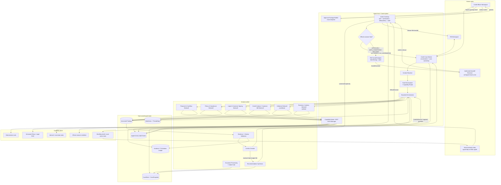
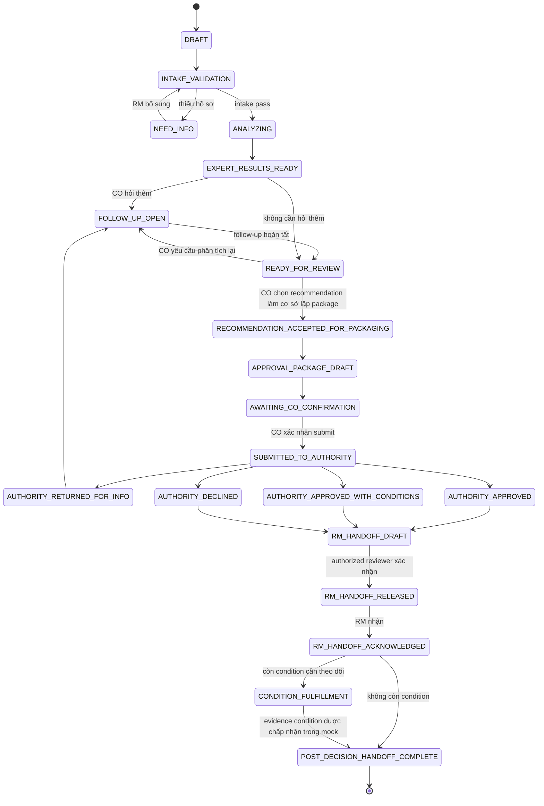
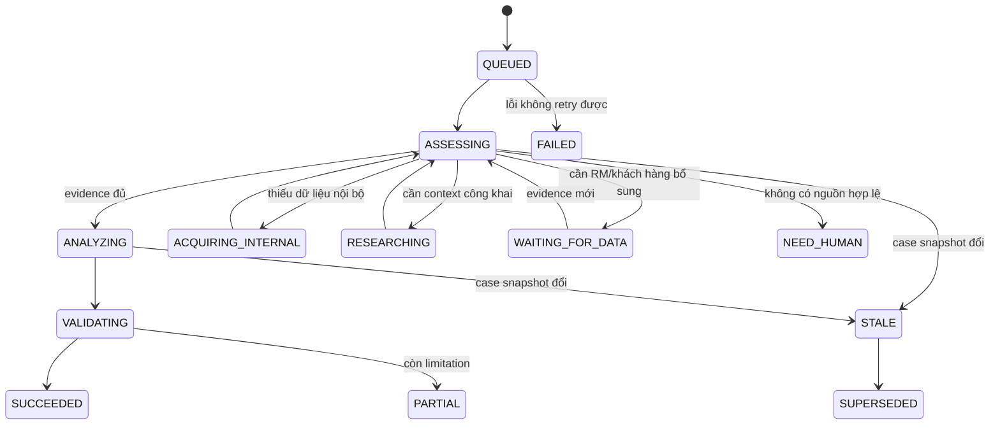
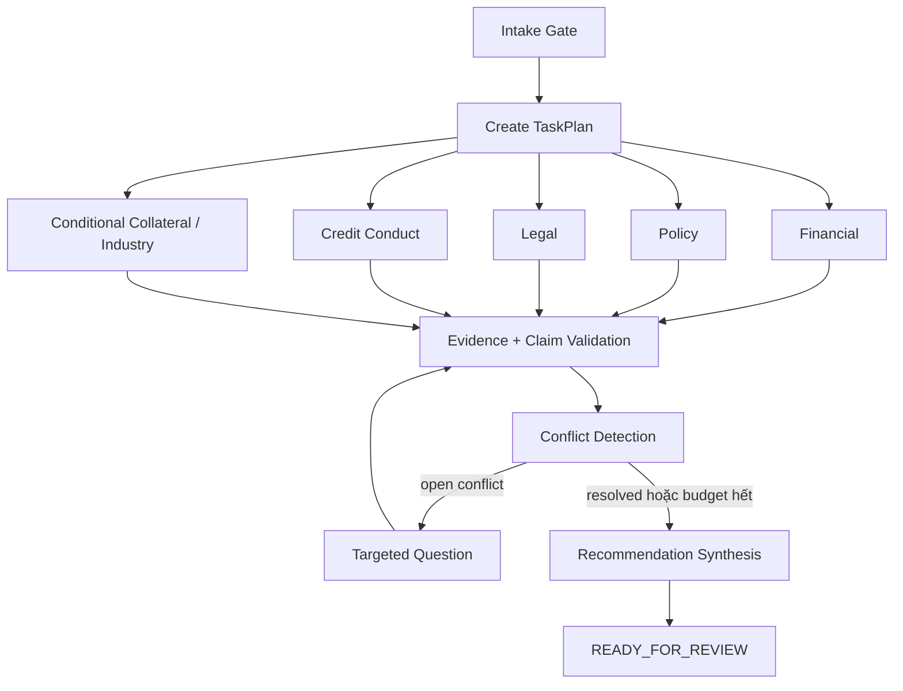
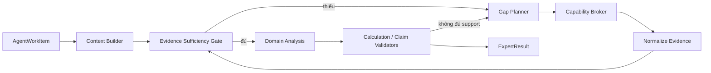
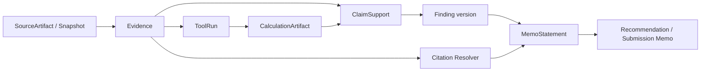
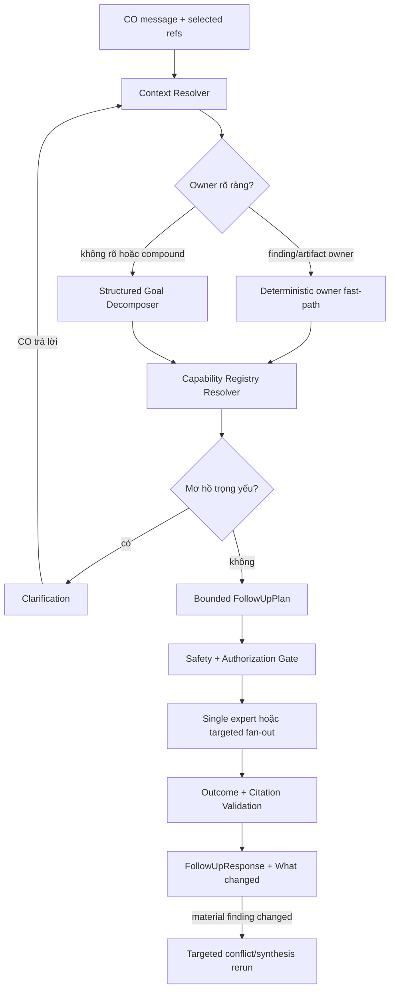
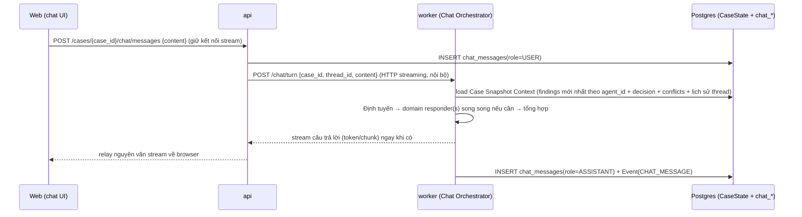

# SHBExpert Flow — Kiến trúc AI v2

> **Trạng thái:** Target architecture cho hackathon; không phải mô tả đầy đủ code đang chạy.
>
> **Phạm vi:** hỗ trợ Credit Officer phân tích, hỏi tiếp, chuẩn bị hồ sơ trình và bàn giao kết quả; **không tự phê duyệt tín dụng**.
>
> **Ngày chốt:** 2026-07-18.
>
> **Implementation baseline đã đối chiếu:** commit `0b6fef3` trên branch `tuananh/synthetic-data-pipeline`.
>
> [overview.md](./overview.md) và [data-flow.md](./data-flow.md) chưa được migrate sang v2, vẫn trộn target v1 với một phần implementation; chúng không phải nguồn authoritative. Mục 17 ghi audit có phạm vi của baseline AI flow hiện tại và khoảng cách tới target v2; code và tests vẫn là nguồn xác nhận cuối cùng.

---

## 0. Cách đọc trạng thái

| Nhãn | Ý nghĩa |
|---|---|
| **CURRENT** | Đã có trong implementation baseline nêu trên; vẫn phải xem code/tests để biết mức hoàn thiện |
| **TARGET v2** | Thiết kế cần triển khai; không được trình diễn hoặc mô tả như chức năng đã chạy |
| **MOCK** | Giả định/dữ liệu/quy trình dành cho hackathon, có version và watermark; không đại diện policy SHB |
| **OPEN** | Cần domain expert, policy owner hoặc tool owner xác nhận trước khi production hóa |

Trừ khi một đoạn ghi rõ **CURRENT**, mọi contract, component, state machine và gate trong mục 1–16 đều là **TARGET v2**.

---

## 1. Quyết định kiến trúc

SHBExpert Flow dùng một **bounded Orchestrator** điều phối các **Expert Workcell** có chuyên môn và quyền riêng. Các expert chạy song song trên cùng một snapshot hồ sơ, ghi kết quả có cấu trúc vào shared state, và có thể được gọi lại khi Credit Officer hỏi thêm hoặc khi có bằng chứng mới.

Thiết kế chốt gồm bảy quyết định:

1. **Orchestrator điều phối, không thẩm định.** Nó quản lý task, dependency, timeout, retry, conflict và targeted rerun; không đưa nhận định tài chính/pháp lý, không chọn cấp phê duyệt và không tạo `OfficialDecision`.
2. **Expert là workcell đa lượt, không phải hàm sinh báo cáo một lần.** Mỗi workcell có work queue, typed state, tool allowlist, evidence sufficiency loop, SLA và handoff.
3. **`ExpertResult` là toàn bộ output; `Finding` chỉ là một claim nguyên tử.** Bảng tỷ số, calculation, data gap và limitation là artifact riêng.
4. **Citation architecture được hậu thuẫn bởi provenance graph.** `Citation` chỉ là con trỏ cho người đọc; một câu trong hồ sơ trình phải truy ngược được qua ClaimSupport tới finding version, phép tính, từng input và locator của nguồn.
5. **Tool chỉ được định nghĩa bằng contract tại đây.** Công thức và implementation do owner của tool thực hiện trong một Formula/Rule Registry có version.
6. **Router theo object owner, outcome và capability; không dùng intent enum đóng.** Các lớp hành động hữu hạn chỉ dùng cho authorization, tool filtering và harness.
7. **AI recommendation không phải quyết định tín dụng.** Sau recommendation, hệ thống chỉ tạo hồ sơ trình bằng template mock; nơi nhận do cấu hình mock hoặc Credit Officer chọn thủ công.

### 1.1 Ba artifact không được gọi lẫn nhau

| Artifact | Ai tạo | Ý nghĩa | Được phép chuyển mock case state? |
|---|---|---|---:|
| `RecommendationPackage` | Recommendation Synthesis | Khuyến nghị dựa trên finding đã kiểm chứng | Không |
| `ApprovalSubmissionPackage` | Approval Package Builder + Credit Officer | Hồ sơ trình theo template mock | Không |
| `OfficialDecision` | Người/cấp có thẩm quyền qua Mock Authority Inbox | Approve, approve with conditions, decline hoặc return for information | Có |

`OfficialDecision` trong tài liệu chỉ có hiệu lực chuyển trạng thái của **workflow mock**; nó không có hiệu lực tín dụng, pháp lý hoặc thẩm quyền thay mặt SHB.

### 1.2 Non-goals

- Không suy luận authority matrix, hạn mức hoặc người/hội đồng phê duyệt của SHB.
- Không tự approve/reject, booking, giải ngân hoặc gửi thông báo chính thức cho khách hàng.
- Không dùng web để điền dữ liệu riêng còn thiếu của khách hàng.
- Không để LLM tự tính tỷ số, hard rule hoặc phép đối chiếu trọng yếu.
- Không coi transcript, model memory hoặc MCP session là source of truth.
- Không khẳng định multi-agent tốt hơn single-agent nếu chưa có ablation và số đo.

---

## 2. Căn cứ và giới hạn suy diễn

### 2.1 Agent được suy ra từ đâu

Các logical expert role được đề xuất từ:

- Các miền phân tích độc lập trong PRD và cẩm nang nghiệp vụ: pháp lý, hoạt động kinh doanh, tài chính/dòng tiền, quan hệ tín dụng và tài sản bảo đảm.
- Dữ liệu riêng, quyền riêng, work product riêng và khả năng đánh giá bằng gold label riêng của từng miền.
- Lợi ích chạy song song hoặc chạy có điều kiện.

Một miền chỉ nên là agent/workcell khi thỏa phần lớn các điều kiện sau:

1. Có kết luận nghiệp vụ độc lập.
2. Có tập evidence hoặc nguồn dữ liệu riêng.
3. Có capability/tool và quyền truy cập riêng.
4. Có thể đánh giá độ chính xác riêng.
5. Có lợi ích đo được khi chạy song song, chạy có điều kiện hoặc resume độc lập.

Nếu không thỏa, nó nên là deterministic tool, shared service hoặc graph node. Ví dụ `calculate_current_ratio` là tool; “đánh giá thanh khoản có phù hợp chu kỳ kinh doanh không” là expert judgment.

### 2.2 Giới hạn nguồn nghiệp vụ

- Cẩm nang KHDN được nhóm cung cấp là tài liệu tham khảo cấu trúc phân tích, không phải policy SHB hiện hành.
- Threshold, formula, policy, rule hoặc workflow chưa được domain expert xác nhận phải gắn nhãn `MOCK` và có version.
- Cẩm nang hoặc nguồn công khai không được dùng để suy ra authority matrix nội bộ.
- Việc tách thành đúng bốn, năm hay sáu process agent là team hypothesis; harness ở mục 16 quyết định cấu hình nào được giữ.

### 2.3 Căn cứ kỹ thuật

| Failure cần xử lý | Quyết định | Căn cứ và giới hạn áp dụng |
|---|---|---|
| Agent cần lấy thêm observation thay vì suy đoán | Evidence sufficiency loop có tool/research budget | [ReAct, ICLR 2023](https://arxiv.org/abs/2210.03629) hỗ trợ pattern reasoning–action–observation; benchmark không phải tín dụng nên không dùng số của paper làm cam kết accuracy |
| “Có citation” nhưng claim vẫn không được hỗ trợ | Claim-level support, correctness và completeness | [ALCE, EMNLP 2023](https://aclanthology.org/2023.emnlp-main.398/) tách answer correctness và citation quality; trên ELI5, mô hình tốt nhất trong paper vẫn thiếu complete citation support khoảng 50% |
| Hội thoại/tool-use trôi khỏi goal dù câu trả lời nghe hợp lý | Chấm final state và độ ổn định lặp lại | [τ-bench, ICLR 2025](https://proceedings.iclr.cc/paper_files/paper/2025/hash/1b126cc38b8638e07bef37e7b2bb72bf-Abstract-Conference.html) chấm database end state và `pass^k`; domain gốc là retail/airline, không phải banking |
| Dữ liệu từ document/web/tool chứa prompt injection | Data/instruction separation, capability isolation và adversarial harness | [AgentDojo, NeurIPS 2024](https://proceedings.neurips.cc/paper_files/paper/2024/hash/97091a5177d8dc64b1da8bf3e1f6fb54-Abstract-Datasets_and_Benchmarks_Track.html) có 97 task và 629 security case, nhưng không có defense nào được coi là bảo đảm tuyệt đối |
| Tool protocol bị nhầm với planner/memory/authorization | Host-owned orchestration và policy enforcement | [MCP Architecture, revision 2025-11-25](https://modelcontextprotocol.io/specification/2025-11-25/architecture) mô tả host–client–server và phạm vi trao đổi context/capability |
| Trách nhiệm origination, analysis, approval và administration bị trộn | Phân định responsibility, authority và audit trail; mức độc lập phù hợp cho independent review/sensitive administration | [BCBS Principles for the Management of Credit Risk, 2025](https://www.bis.org/bcbs/publ/d595.htm) là nguyên tắc quản trị chung, không phải cơ cấu tổ chức hay thẩm quyền riêng của SHB |

---

## 3. Kiến trúc tổng thể



Hai mặt phẳng có trách nhiệm khác nhau:

- **Analysis plane:** biến hồ sơ và evidence thành domain findings và `RecommendationPackage`.
- **Human/action plane:** cho Credit Officer hỏi tiếp, xác nhận hồ sơ trình, ghi nhận `OfficialDecision` và bàn giao RM.

Shared state, Evidence Ledger, Action Gateway và Audit Log là các thành phần xuyên suốt. Expert không trao đổi bằng chat tự do và không gọi write tool trực tiếp.

Ownership mặc định: human node do actor ghi trên node sở hữu; HOST/STATE node do Agent Host/backend sở hữu; Expert Workcell do domain role sở hữu; CAP node do registered tool owner sở hữu. Input, output và forbidden behavior của state/capability được chi tiết ở mục 5, 9 và 10.

---

## 4. Thành phần và ranh giới trách nhiệm

| Thành phần | Vai trò | Input chính | Output chính | Không được làm |
|---|---|---|---|---|
| Document Processing | Phân loại, extract, normalize và định vị dữ liệu | PDF/XLSX/CSV/JSON/ảnh | `SourceArtifact`, `Evidence`, `MissingItem`, `DataConflict` | Đánh giá rủi ro tín dụng |
| Intake Gate | Kiểm tra checklist bằng rule có version | Document index + product/customer type | PASS, NEED_INFO hoặc REVIEW | Suy đoán tài liệu còn thiếu |
| Credit Case Worker | Giao diện “nhân viên xử lý hồ sơ” đa lượt | CO/RM message + typed case state | Follow-up request, package draft, handoff | Thẩm định thay expert hoặc ra quyết định |
| Context Resolver | Ghép đúng case/thread/snapshot/finding đang được hỏi | Verified identity + UI anchors | Grounded context refs | Dùng transcript làm source of truth |
| Goal Decomposer | Tách câu hỏi compound thành goal có schema | Message + refs | `GoalSpec[]` | Cấp quyền hoặc chọn tool cuối cùng |
| Capability Router | Map goal tới owner/capability | Goal + registry + case scope | `FollowUpPlan` | Route dựa duy nhất vào một intent enum |
| Orchestrator | Lập/dispatch task, dependency, timeout, retry, conflict và rerun | Case snapshot + plan | `TaskPlan`, state transitions | Đưa nhận định domain hoặc chọn authority |
| Expert Workcell | Phân tích một miền, thu thập evidence có giới hạn và trả lời follow-up | Work item + allowed capabilities | `ExpertResult`, Finding versions, data gaps | Tự approve/reject hoặc tự mở rộng tool quyền cao hơn |
| Capability Broker | Cấp đúng tool cho đúng agent/task | Agent role + scope + operation class | Filtered tool set + call trace | Tin tool annotation từ server chưa tin cậy |
| Evidence/Citation Validator | Kiểm tra locator, hash, freshness, calculation lineage và claim support | Evidence + calculation + finding | VERIFIED, PARTIAL, CONFLICTED hoặc failure code | Dùng retrieval score thay entailment |
| Conflict Checker | Nhóm finding theo `issue_key` và mở targeted challenge | Latest finding versions | `ConflictRecord`, targeted questions | Lấy đa số hoặc làm mất dissent |
| Recommendation Synthesis | Gom finding đã validate, áp rule/hard gate mock và viết recommendation | Findings + conflicts + policy/rule version | `RecommendationPackage` | Đọc PDF tùy ý, điều phối expert hoặc tạo OfficialDecision |
| Approval Package Builder | Điền template mock đã định nghĩa | Recommendation + evidence index | `ApprovalSubmissionPackage` | Chọn cấp thẩm quyền bằng LLM |
| Action Gateway | Kiểm tra write action | Actor, scope, expected state/version, confirmation | Receipt + audit event | Cho model bypass authorization/idempotency |
| Mock Authority Inbox | Giả lập hàng đợi người phê duyệt | Submission package | `OfficialDecision` | Được thay bằng recommendation của AI |
| RM Handoff Adapter | Lọc field và soạn bản tóm tắt phù hợp quyền RM | Official outcome + safe fields | `RMHandoff` draft | Gửi trước official outcome, tự release hoặc lộ AML/internal score trái quyền |

---

## 5. Identifier, state và versioning

### 5.1 Không được trộn các ID

| ID | Ý nghĩa |
|---|---|
| `case_id` | Hồ sơ nghiệp vụ, tồn tại qua nhiều phiên chat |
| `case_snapshot_id` | Ảnh chụp bất biến của dữ liệu case tại một thời điểm |
| `case_version` | Version optimistic concurrency của case |
| `thread_id` | Một hội thoại của người dùng với case |
| `work_item_id` | Đơn vị công việc có thể pause/resume của một expert |
| `task_id` | Một lần thực thi cụ thể trong plan |
| `trace_id` | Một execution trace phục vụ replay/evaluation |
| `mcp_session_id` | Session giao thức tạm thời; không phải identity hoặc memory |

### 5.2 Case state machine



Chỉ `OfficialDecision` do Mock Authority Inbox/người có quyền ghi nhận mới được chuyển case sang `AUTHORITY_*`. `RecommendationPackage` không có quyền này.

### 5.3 Work item state machine

`RESEARCHING` là trạng thái của work item, không phải toàn case; các expert khác vẫn có thể hoàn thành song song.



### 5.4 Quy tắc versioning và concurrency

- Mọi expert trong fan-out ban đầu nhận cùng `case_snapshot_id`.
- `ExpertResult`, Finding, Evidence và Calculation append-only; không update tại chỗ.
- Write yêu cầu `expected_case_version`; mismatch trả `VERSION_CONFLICT`.
- Tài liệu mới tạo snapshot/version mới và impact map chỉ ra work item cần rerun.
- Kết quả đang chạy trên snapshot cũ chuyển `STALE`/`SUPERSEDED`, không last-write-wins.
- Hai request trùng được deduplicate bằng `idempotency_key`.
- Credit Officer không sửa nội dung Finding của expert; họ có thể comment hoặc yêu cầu một version mới.

“Append-only” áp dụng cho persisted artifact và event. Các trường status trong schema là **projection** từ validation/lifecycle events; đổi status không sửa payload cũ. Nếu nội dung, input hoặc output thay đổi, hệ thống tạo revision/version mới và phát event `SUPERSEDED`, `RETRACTED`, `VALIDATED` hoặc `STALE` tham chiếu artifact cũ.

---

## 6. Bounded Orchestrator

### 6.1 Contract

```yaml
TaskPlan:
  plan_id:
  case_id:
  case_snapshot_id:
  case_version:
  tasks:
    - task_id:
      work_item_id:
      target_agent:
      objective:
      dependency_ids: []
      input_refs: []
      required_outcome_schema:
      allowed_capability_ids: []
      success_criteria: []
      timeout_seconds:
      max_retries:
      failure_policy:
  synthesis_mode: NONE | RESPONSE_ONLY | TARGETED_RECOMMENDATION_RERUN | FULL_RECOMMENDATION
```

Orchestrator được phép:

- Tạo/dispatch/cancel task.
- Chạy task độc lập song song.
- Theo dõi timeout và retry.
- Mở targeted challenge khi finding xung đột.
- Rerun work item bị ảnh hưởng khi evidence mới tới.
- Chuyển trạng thái case qua State/Action Gateway.

Orchestrator không được:

- Viết domain Finding.
- Tự chọn SUPPORT/OPPOSE hoặc recommendation.
- Tự cấp tool ngoài capability allowlist.
- Suy luận `approval_destination_id`.
- Ghi nhận approve/decline.

### 6.2 Graph phân tích ban đầu



### 6.3 Giới hạn mặc định cho demo

Các con số dưới đây là configuration mock, không phải policy ngân hàng:

| Cơ chế | Giới hạn mặc định | Khi hết giới hạn |
|---|---:|---|
| Retry tool/task | 1 lần | `PARTIAL` hoặc `FAILED`, manual review theo materiality |
| Conflict challenge | Tối đa 2 vòng/issue | `UNRESOLVED`, bảo toàn dissent |
| Evidence acquisition | Tối đa 2 vòng | Trả data gap/need human |
| Tool calls trong một follow-up | Tối đa 8 | Dừng, báo budget exhausted |
| Follow-up execution | 120 giây | Checkpoint + degraded response |

Thiếu output của mandatory domain thì không tạo `RecommendationPackage` hoàn chỉnh. Kết quả expert khác vẫn được giữ và có thể hiển thị.

---

## 7. Expert Workcell đa lượt

“Agent như một nhân viên” không có nghĩa chỉ thêm persona vào prompt. Trong kiến trúc này, nó có job description và ranh giới quyền, inbox/work item, hồ sơ đang phụ trách, SLA, tool được cấp theo vai trò, nghĩa vụ dẫn chứng, checkpoint để tiếp tục việc cũ, handoff và audit accountability. Nó phải biết yêu cầu thêm dữ liệu hoặc chuyển người có trách nhiệm khi vượt quyền; không được tự phê duyệt.

### 7.1 Cấu trúc một workcell



Một workcell gồm:

- Job description và domain boundary.
- `AgentWorkItem` có owner, SLA, snapshot, objective và success criteria.
- Context Builder tải typed state/evidence hiện hành; không dùng transcript làm truth.
- Evidence Sufficiency Gate kiểm tra completeness, freshness, reconciliation và citation coverage bằng rule/schema.
- Capability Broker chỉ expose tool phù hợp role, case, task và operation class.
- Domain reasoning giải thích, so sánh, đánh giá limitation và tạo claim.
- Validators kiểm calculation lineage, policy version, locator và claim support.
- Checkpoint để pause/resume sau dữ liệu hoặc câu hỏi mới.

```yaml
AgentWorkItem:
  work_item_id:
  case_id:
  owner_agent_role:
  domain:
  requester:
    type: USER | ORCHESTRATOR | SYSTEM | MOCK_AUTHORITY
    ref:
  source_request_id:
  input_snapshot_id:
  objective:
  input_refs: []
  allowed_capability_ids: []
  success_criteria: []
  state: QUEUED | ASSESSING | ACQUIRING_INTERNAL | RESEARCHING | WAITING_FOR_DATA | ANALYZING | VALIDATING | SUCCEEDED | PARTIAL | NEED_HUMAN | FAILED | STALE | SUPERSEDED
  state_version:
  sla:
    deadline_at:
    max_tool_calls:
    max_research_rounds:
  checkpoint_ref:
  latest_result_ref:
  supersedes_work_item_id:
  created_at:
```

Follow-up mặc định resume cùng `work_item_id`; một `task_id` mới ghi nhận lần chạy mới. Chỉ tạo work item mới khi objective/domain thay đổi hoặc work item cũ đã `SUPERSEDED`.

Research không phải một “research agent” dùng chung. Nó là capability chỉ-đọc mà mỗi workcell có thể được cấp theo domain, data classification và source whitelist. Workcell đang sở hữu claim vẫn chịu trách nhiệm kết luận; nếu câu hỏi thuộc domain khác, Orchestrator tạo targeted work item cho owner phù hợp rồi trả cited evidence về workcell ban đầu. Thiếu số liệu riêng của khách hàng không bao giờ được lấp bằng web research.

### 7.2 Thứ tự tìm evidence

| Thiếu gì | Route đúng | Không được làm |
|---|---|---|
| Customer-specific fact | Internal/mock system → hồ sơ khách hàng → structured RM request | Tìm web để điền số |
| Policy/rule | Versioned policy service với assessment date | Dùng model memory hoặc policy hết hiệu lực |
| Công thức/tỷ số | Deterministic tool + Formula Registry | LLM tự tính |
| Benchmark/ngành công khai | Official whitelist + snapshot | Dùng search snippet làm evidence cuối |
| Legal/authority của người ký | Hồ sơ pháp lý + rule/graph tool; mơ hồ thì human review | Suy ra từ tên/chức danh |
| Nguồn mâu thuẫn | Ghi `CONFLICTED`, mở targeted task | Lấy đa số hoặc chọn nguồn thuận lợi |

### 7.3 Catalog logical expert role

Logical role không đồng nghĩa bắt buộc phải chạy thành process riêng. Có thể merge/split khi ablation chứng minh được lợi ích.

| Logical role | Phạm vi | Capability chính | Work product | Điều kiện chạy |
|---|---|---|---|---|
| Financial & Cashflow | BCTC, dòng tiền, vốn lưu động, repayment capacity, scenario | Đọc financial/transaction evidence; gọi deterministic analysis | Financial findings, calculation refs, trend/scenario artifacts, gaps | Bắt buộc với hồ sơ tín dụng doanh nghiệp |
| Policy & Compliance | Product policy, hard rule mock, KYC/AML status | Search effective policy; evaluate versioned rules | Policy findings, rule results, exceptions needing review | Bắt buộc khi có policy corpus |
| Legal & Customer Signing Authority | Pháp nhân khách hàng, người đại diện, ủy quyền, hiệu lực giấy tờ | Read legal docs; customer-signing authority graph/checklist | Legal findings, legal gaps, required conditions | Bắt buộc |
| Credit Conduct / Customer 360 | CIC mock, dư nợ, quá hạn, quan hệ SHB, bên liên quan | Read customer/credit snapshots; analyze conduct | Conduct findings, delinquency/concentration/relationship artifacts | Bắt buộc nếu dữ liệu có sẵn |
| Collateral | Sở hữu, valuation, haircut, encumbrance, coverage | Read collateral evidence; valuation/coverage tools | Collateral findings, eligible value, conditions | Chỉ khi khoản vay có TSBĐ |
| Business Operations / Industry | Business model, customer/supplier concentration, seasonality, public industry context | Read case facts; official research; scenario | Business/industry findings và assumptions | Optional/conditional sau core slice |

Document Processing là shared service, không phải expert: nó nói “trường X ở trang Y có giá trị Z”, không nói “khách hàng rủi ro”.

---

## 8. Output contract của expert

### 8.1 `ExpertResult` là toàn bộ work product

```yaml
ExpertResult:
  expert_result_id:
  case_id:
  work_item_id:
  agent_id:
  input_snapshot_id:
  input_snapshot_hash:
  status: COMPLETE | PARTIAL | NEED_DATA | NEED_HUMAN | FAILED | STALE
  domain_summary_statement_refs: []
  sufficiency:
    status: SUFFICIENT | INSUFFICIENT | CONFLICTED
    missing_facts: []
    stale_facts: []
    unresolved_conflict_ids: []
  findings: []
  calculation_refs: []
  domain_artifact_refs: []
  evidence_refs: []
  assumptions: []
  limitations: []
  recommended_followups: []
  tool_trace_refs: []
  data_as_of:
  revision:
  expires_at:
```

### 8.2 `Finding` là một claim nguyên tử

Mọi trường có hậu tố `finding_ref`/`finding_refs` dùng cấu trúc `{finding_key, version}`; không tham chiếu mơ hồ tới “finding mới nhất”.

```yaml
Finding:
  finding_key:
  version:
  case_id:
  work_item_id:
  agent_id:
  issue_key:
  finding_type: OBSERVATION | CALCULATION_INTERPRETATION | INFERENCE | POLICY_RESULT | DATA_GAP
  claim: "Một mệnh đề ngắn, tự đủ nghĩa và có thể kiểm chứng"
  rationale: "Giải thích ngắn; không lưu chain-of-thought thô"
  stance: SUPPORT | CAUTION | OPPOSE | NEED_DATA
  severity: INFO | LOW | MEDIUM | HIGH | CRITICAL
  evidence_refs: []
  calculation_refs: []
  policy_refs: []
  claim_support_refs: []
  assumptions: []
  limitations: []
  recommended_action:
  support_status_projection: PENDING_VALIDATION | SUPPORTED | PARTIAL | UNSUPPORTED | CONFLICTED | STALE
  lifecycle_status_projection: CURRENT | SUPERSEDED | RETRACTED
  change_reason:
  created_at:
```

Quy tắc:

- Một finding không chứa cả bảng phân tích; bảng là domain/calculation artifact.
- `claim` có thể dài một đến hai câu nhưng chỉ được khẳng định một điều.
- Số, thời kỳ, threshold và nguồn phải nằm trong structured refs, không chỉ nằm trong prose.
- Agent đề xuất claim nhưng không tự gắn `SUPPORTED`; validator/backend làm việc đó.
- `confidence` nếu giữ chỉ là diagnostic và phải được calibration; nó không thay `ClaimSupport`.
- Finding cũ không bị sửa/xóa. Version mới có `change_reason` và supersedes version cũ.
- Candidate Finding có `claim_support_refs=[]` và `PENDING_VALIDATION`. Validator phát hành `ClaimSupport` tham chiếu `{finding_key, version, claim_sha256}`; association/status sau đó được dựng từ append-only validation event, không update Finding tại chỗ.

### 8.3 `EvidenceGap`

```yaml
EvidenceGap:
  gap_id:
  work_item_id:
  metric_or_claim:
  missing_inputs: []
  why_required:
  materiality: LOW | MEDIUM | HIGH | CRITICAL
  route: INTERNAL_CAPABILITY | POLICY_RETRIEVAL | OFFICIAL_RESEARCH | RM_REQUEST | MANUAL_REVIEW
  allowed_sources: []
  stop_condition:
```

---

## 9. Evidence, calculation và citation architecture

### 9.1 Bốn khái niệm không được trộn

```text
Evidence
= một observation bất biến lấy từ nguồn cụ thể

CalculationArtifact
= kết quả deterministic tạo từ Evidence/Artifact input

ClaimSupport
= quan hệ chứng minh hoặc phản bác một claim

Citation
= con trỏ để con người mở đúng nguồn và kiểm tra
```

Retrieval similarity, LLM confidence và việc “có một URL” không chứng minh claim đúng.

### 9.2 Provenance graph



Audit phải đi được hai chiều:

```text
Memo statement
→ finding_key + version
→ claim_support_id
→ evidence_id / calculation_id
→ calculation input evidence
→ source snapshot
→ page/cell/JSON pointer/API record/policy clause
```

### 9.3 `SourceArtifact` và `Evidence`

```yaml
SourceArtifact:
  source_artifact_id:
  case_id:
  source_kind: PDF | XLSX | JSON | API_SNAPSHOT | POLICY | WEB_SNAPSHOT
  title:
  source_version:
  content_sha256:
  publisher:
  source_as_of:
  retrieved_at:
  trust_tier:
  sensitivity:
  synthetic:
  dataset_version:
```

```yaml
Evidence:
  evidence_id:
  case_id:
  source_artifact_id:
  locator:
    kind:
    details: {}
  observation:
    data_type:
    raw_value:
    normalized_value:
    unit:
    period:
  provenance:
    acquired_by_tool_run_id:
    extractor_name:
    extractor_version:
    observed_at:
    source_as_of:
  quality:
    extraction_confidence:
    human_verification:
    freshness_status:
  lifecycle:
    status_projection: ACTIVE | SUPERSEDED
    supersedes:
```

Tiền và tỷ lệ tài chính nên lưu bằng decimal string trong artifact thay vì JSON float khi exactness quan trọng.

### 9.4 Locator theo loại nguồn

| `locator.kind` | Trường tối thiểu |
|---|---|
| `PDF` | `page` 1-based + `bbox` hoặc `text_span`; bảng thêm `table_id/row_key/column_key` |
| `XLSX` | `sheet_name`, `cell_range`; optional table/row/column key và `value_mode` |
| `JSON` | JSON Pointer xác định duy nhất + record key |
| `API` | source system, operation ID, request ID, immutable response snapshot, JSON Pointer, `as_of` |
| `WEB` | canonical URL, publisher, published/retrieved time, snapshot ID/hash, passage selector/span |
| `POLICY` | policy ID, version, effective interval, clause ID, section path và underlying physical locator |
| `TRANSACTION_SET` | source snapshot + transaction IDs + time range |

Không lưu presigned URL sắp hết hạn trong Citation; UI sinh URL theo quyền khi người dùng mở nguồn.

### 9.5 `CalculationArtifact`

Architecture không định nghĩa công thức chi tiết, nhưng yêu cầu contract sau:

```yaml
CalculationArtifact:
  calculation_id:
  case_id:
  artifact_type:
  formula:
    formula_id:
    formula_version:
  inputs:
    - variable:
      ref_kind: EVIDENCE | CALCULATION
      ref_id:
      value_snapshot:
      unit:
      period:
  parameters:
    scenario:
    rounding_mode:
    decimal_places:
  outputs:
    - metric:
      value:
      unit:
      period:
  execution:
    tool_run_id:
    tool_name:
    tool_definition_version:
    implementation_version:
    executed_at:
  validation:
    schema_valid:
    units_aligned:
    periods_aligned:
    reproducible:
    validator_version:
  content_sha256:
  status_projection: PENDING | VERIFIED | FAILED | STALE
```

Calculation tool nên nhận `evidence_id`/artifact ref. Backend resolve số, scope, unit, period và formula version; LLM không được nhập raw value thay nguồn khi nguồn phải tồn tại.

### 9.6 `ClaimSupport`

```yaml
ClaimSupport:
  claim_support_id:
  finding_ref:
    finding_key:
    version:
  claim_sha256:
  support_edges:
    - ref:
        kind: EVIDENCE | CALCULATION | FINDING
        evidence_id:
        calculation_id:
        finding_ref:
          finding_key:
          version:
      relation: SUPPORTS | CONTRADICTS | CONTEXT
      claim_component:
      validation_status: ENTAILS | PARTIAL | DOES_NOT_ENTAIL
  coverage:
    required_components: []
    supported_components: []
    ratio:
  overall_status: SUPPORTED | PARTIAL | UNSUPPORTED | CONFLICTED | STALE
  validation:
    method: RULE | MODEL_ASSISTED | RULE_PLUS_REVIEW
    validator_version:
    validated_at:
    issues: []
```

Discriminator `ref.kind` yêu cầu đúng một typed ref tương ứng; không dùng `ref_id` chung. Nếu support edge tham chiếu Finding upstream, `{finding_key, version}` là bắt buộc, graph phải là DAG, chặn cycle và chỉ nhận upstream Finding đã `SUPPORTED`. Citation Resolver vẫn phải lần xuống Evidence/Calculation cuối cùng.

### 9.7 `Citation`, `RetrievalHit` và `MemoStatement`

```yaml
Citation:
  citation_id:
  evidence_id:
  locator_snapshot:
  display_label:
  preview_sha256:
  verification:
    locator_resolved:
    content_hash_match:
    verified_at:
```

`retrieval_score` không nằm trong Citation. Nó thuộc metadata tìm kiếm:

```yaml
RetrievalHit:
  retrieval_run_id:
  evidence_id:
  rank:
  retrieval_score:
  query_hash:
```

```yaml
MemoStatement:
  statement_id:
  text:
  materiality: MATERIAL | CONTEXT
  audience: CREDIT_OFFICER | APPROVAL_AUTHORITY | RM
  finding_refs: []
  citation_ids: []
  support_status:
```

Mọi prose material mà Credit Officer, cấp phê duyệt mock hoặc RM đọc phải được render từ `MemoStatement[]`. Trường text denormalized có thể dùng cho hiển thị/search nhưng không phải source of truth; statement thiếu finding/citation hợp lệ bị loại trước khi render.

Structured value cũng phải grounded, không chỉ prose. Mọi artifact chứa số tiền, tỷ số, ngày, term, score, hard-gate result hoặc policy exception phải implement envelope sau; các field `*_ref`/`*_refs` ở output trỏ tới immutable version cụ thể:

```yaml
MaterialArtifactEnvelope:
  artifact_id:
  artifact_type:
  schema_id:
  version:
  content_sha256:
  provenance:
    evidence_refs: []
    calculation_refs: []
    policy_refs: []
    rule_result_refs: []
    statement_refs: []
  validation_status_projection: PENDING | VERIFIED | PARTIAL | REJECTED | STALE
```

Validator chọn loại provenance bắt buộc theo schema: requested terms cần application Evidence; proposed terms cần recommendation/rule/finding refs; score/hard gate cần Calculation/RuleResult + policy version; policy exception cần clause Evidence và rule result. Artifact có material value nhưng không có lineage phù hợp bị chặn như orphan claim.

### 9.8 Validation gates

**Evidence gate**

- Source snapshot/hash tồn tại và thuộc đúng case/tenant/purpose.
- Locator resolve đúng vùng/record; raw/normalized value khớp.
- Evidence chưa stale/superseded và đáp ứng freshness policy.

**Calculation gate**

- Mọi input bắt buộc là reference hợp lệ.
- Formula/tool version được pin.
- Unit, currency, period và scenario tương thích.
- Recompute exact match trên fixture.

**Finding gate**

- Claim số học có CalculationArtifact.
- Claim policy/hard gate có đúng version hiệu lực tại assessment date.
- Finding HIGH/CRITICAL phải `SUPPORTED`; nếu không, manual review/NEED_DATA.
- Nguồn mâu thuẫn tạo `CONFLICTED`, không bị san phẳng.

**Memo gate**

- Mọi statement `MATERIAL` tham chiếu finding version hiện hành.
- Không có orphan number, ratio, threshold hoặc date.
- Finding PARTIAL/UNSUPPORTED/STALE chỉ xuất hiện trong mục limitation/unresolved.
- Gate fail thì không cho package chuyển sang `AWAITING_CO_CONFIRMATION`.

### 9.9 Ví dụ DSCR — chỉ minh họa mock

Không tạo một claim ghép “DSCR thấp nên khách hàng không đủ khả năng trả nợ”. Tách thành:

```text
F1 — CALCULATION_INTERPRETATION
“DSCR FY2025 theo scenario BASE là 0,91x.”
Support: CALC-DSCR-004
         → EV-CFADS-FY2025
         → EV-DEBT-SERVICE-FY2025

F2 — POLICY_RESULT
“DSCR 0,91x thấp hơn benchmark MOCK 1,20x áp dụng tại assessment date.”
Support: CALC-DSCR-004 + EV-POLICY-MOCK-8.2

F3 — INFERENCE
“Mức bao phủ nghĩa vụ nợ FY2025 là điểm Credit Officer cần xem xét thêm.”
Support: F2; không biến thành quyết định approve/reject
```

Formula và threshold trong ví dụ chỉ là placeholder mock. Owner tool/policy phải cung cấp ID, version và test vectors thực tế.

---

## 10. Tool, Capability Registry và MCP boundary

### 10.1 MCP dùng để làm gì

MCP là capability protocol giữa host/client/server. Nó không cung cấp:

- Orchestration hoặc planning.
- Conversation/case memory.
- Business authorization hoặc authority matrix.
- Four-eyes approval, idempotency hoặc audit backend.
- Prompt-injection protection tự động.

Host/backend giữ Orchestrator, Context Builder, tool filtering, state, audit và **business authorization/approval policy**. MCP HTTP transport có authorization riêng theo specification, nhưng token/scope của transport không thay authority matrix hoặc quyền phê duyệt nghiệp vụ. Phiên bản current được công bố tại [MCP Versioning](https://modelcontextprotocol.io/docs/learn/versioning); tại ngày chốt tài liệu là `2025-11-25`.

Theo [MCP Tools Specification](https://modelcontextprotocol.io/specification/2025-11-25/server/tools), tool có `inputSchema` và optional `outputSchema`; server phải validate input/access/rate limit/sanitize, client nên validate output, timeout, log và yêu cầu confirmation cho thao tác nhạy cảm. Tool annotation từ server chưa tin cậy chỉ là hint.

### 10.2 `ToolDefinition`

Đây là application-level Capability Registry schema/superset, không phải MCP `Tool` schema nguyên bản. MCP adapter chỉ ánh xạ các trường chuẩn; role, data scope, effect policy, confirmation và business authorization do host/backend cưỡng chế.

```yaml
ToolDefinition:
  tool_id:
  display_name:
  description:
  capability_id:
  definition_version:
  contract_schema_version:
  implementation_binding:
    protocol: MCP | REST | INTERNAL
    binding_ref: TO_BE_IMPLEMENTED
  allowed_agent_roles: []
  permitted_data_scopes: []
  input_schema:
  output_schema:
  provenance_policy:
    citation_required:
    locator_required:
    content_hash_required:
    as_of_required:
  side_effect_policy:
    effect_class: PURE_COMPUTE | READ_ONLY | CASE_DRAFT_WRITE | EXTERNAL_WRITE | IRREVERSIBLE
    requires_confirmation:
    idempotent:
    dry_run_supported:
  execution_policy:
    timeout_ms:
    max_retries:
    retry_on: []
    cache_policy:
  error_contract_ref:
  test_vector_refs: []
```

Architecture owner chốt contract. Tool owner điền `implementation_binding`, formula/rule catalog, code và test vectors.

### 10.3 `ToolCall` và `ToolResult`

Model chỉ tạo `arguments`. Host inject metadata không thể giả mạo:

```yaml
ToolCall:
  call_id:
  trace_id:
  case_id:
  thread_id:
  work_item_id:
  agent_role:
  tool_id:
  tool_definition_version:
  input_snapshot_id:
  expected_case_version:
  auth_context_ref:
  idempotency_key:
  arguments: {}
```

`thread_id` nullable cho initial/background analysis không phát sinh hội thoại. `work_item_id` bắt buộc với agent execution; service ingestion phải có system work item tương ứng. `idempotency_key` bắt buộc cho draft/external write và optional cho read/pure compute nếu chỉ dùng deduplication.

```yaml
ToolResult:
  call_id:
  trace_id:
  tool_id:
  tool_definition_version:
  implementation_version:
  status: SUCCEEDED | PARTIAL | FAILED | STALE
  data: {}
  provenance:
    input_snapshot_id:
    case_version_observed:
    source_refs: []
    input_evidence_refs: []
    transformation_chain: []
    retrieved_at:
    data_as_of:
    output_content_hash:
  citation_candidates: []
  warnings: []
  error:
  execution:
    latency_ms:
    attempt:
    cache_hit:
  side_effect:
    class:
    performed:
    effect_receipt_id:
    case_version_before:
    case_version_after:
```

`PARTIAL` không được tự coi là `SUCCEEDED`. Host chuyển raw tool result thành Evidence/Calculation chỉ sau provenance validation.

### 10.4 Logical capability catalog

Tên cụ thể có thể đổi khi teammate implement; contract/capability ID là ranh giới tích hợp.

| Capability group | Logical tool | Output artifact | Side effect | Role chính |
|---|---|---|---|---|
| Document | `document.classify_extract` | SourceArtifact + Evidence | Read-only/artifact | Document service |
| Intake | `document.validate_checklist` | ChecklistResult + MissingItem | Pure compute | Intake |
| Case read | `case.read_financials` | Evidence snapshot | Read-only | Financial |
| Case read | `case.read_calculation` | CalculationArtifact snapshot | Read-only | Artifact owner/authorized expert |
| Case read | `evidence.read` | Scoped Evidence snapshot | Read-only | Authorized expert/validator |
| Case read | `case.read_transactions` | Transaction evidence set | Read-only | Financial/Customer 360 |
| Case read | `case.read_credit_history` | CIC/relationship snapshot | Read-only | Customer 360/Policy |
| Case read | `case.read_legal_documents` | Legal evidence | Read-only | Legal |
| Case read | `case.read_collateral` | Collateral evidence | Read-only | Collateral |
| Deterministic | `financial.compute_metrics` | CalculationArtifact[] | Pure compute | Financial |
| Deterministic | `financial.reconcile_sources` | DiscrepancyArtifact | Pure compute | Financial/Policy |
| Deterministic | `financial.run_scenario` | ScenarioArtifact | Pure compute | Financial |
| Deterministic | `collateral.compute_coverage` | CalculationArtifact | Pure compute | Collateral |
| Deterministic | `legal.validate_signing_authority` | AuthorityAssessment | Pure compute/review flag | Legal |
| Policy | `policy.search_effective` | Policy Evidence + RetrievalHit | Read-only | Policy |
| Policy | `policy.evaluate_rules` | RuleResult[] | Pure compute | Policy |
| Research | `research.search_official` | RetrievalHit + candidate source refs | Read-only/open-world whitelist | Expert được cấp quyền theo domain |
| Research | `research.capture_official_snapshot` | Web Evidence snapshot | Read-only/artifact | Expert được cấp quyền theo domain |
| Evidence | `evidence.validate_claim_support` | ClaimSupport | Pure compute + review | Validator |
| Workflow draft | `workflow.create_info_request_draft` | InfoRequestDraft | Case draft write | Credit Case Worker |
| Workflow draft | `workflow.render_submission_package` | ApprovalSubmissionPackage | Case draft write | Approval Package Builder |
| Workflow commit | `workflow.submit_mock` | ActionReceipt | Confirmed external write | Action Gateway only |
| Workflow commit | `workflow.record_authority_outcome` | OfficialDecision + receipt | Confirmed external write | Authorized human/mock inbox |
| RM draft | `rm.create_handoff_draft` | RMHandoff draft | Case draft write | RM Handoff Adapter |
| RM commit | `rm.release_mock_handoff` | DeliveryReceipt | Confirmed write | Authorized actor only |

Không định nghĩa tool `approve_credit`, `reject_credit`, `book_loan` hoặc `disburse` cho expert trong scope hackathon.

### 10.5 Error contract tối thiểu

```text
INPUT_VALIDATION_FAILED
OUTPUT_VALIDATION_FAILED
AGENT_ROLE_NOT_ALLOWED
CASE_SCOPE_VIOLATION
FIELD_SCOPE_VIOLATION
AUTH_CONTEXT_EXPIRED
VERSION_CONFLICT
STALE_SNAPSHOT
DATA_NOT_FOUND
DATA_INCOMPLETE
SOURCE_UNAVAILABLE
SOURCE_NOT_WHITELISTED
TIMEOUT
RETRY_EXHAUSTED
CITATION_MISSING
INTEGRITY_CHECK_FAILED
SIDE_EFFECT_REQUIRES_CONFIRMATION
IDEMPOTENCY_CONFLICT
CAPABILITY_UNAVAILABLE
UNSUPPORTED_TOOL_VERSION
```

Error không được chứa API key, token, stack trace nội bộ hoặc PII ngoài scope.

### 10.6 Definition of done cho tool owner

- Contract schema validate.
- Happy path, malformed input, partial data, no data, timeout và stale snapshot có test.
- Role/case/field scope violation bị chặn.
- Provenance, locator và content hash đầy đủ.
- Deterministic tool replay exact match trên fixture.
- Write tool có expected version, idempotency và receipt.
- Không rò secret/PII trong result, log hoặc error.

---

## 11. Follow-up Router cho Credit Officer

### 11.1 Không dùng intent enum đóng

Các nhãn `EXPLAIN`, `RECALCULATE`, `RESEARCH`, `REQUEST_DATA` hữu ích để giải thích hoặc làm UI shortcut, nhưng chúng trộn:

- Outcome người dùng muốn.
- Phương pháp lấy evidence.
- Workflow action có side effect.

Câu “giải thích DSCR, tính lại nếu bỏ khoản thu bất thường và nếu thiếu thì yêu cầu RM” cần ba task; ép vào một intent sẽ làm mất goal.

Router dùng thứ tự:

```text
object owner
→ required outcome artifact
→ capability match
→ permission/data scope
→ operation class
```

### 11.2 Router hybrid



LLM có thể đề xuất `GoalSpec`, nhưng Capability Resolver/backend mới chọn owner, allowlist và action ceiling.

### 11.3 Contracts

```yaml
FollowUpRequest:
  request_id:
  case_id:
  thread_id:
  actor:
    type: USER | SYSTEM | MOCK_AUTHORITY
    actor_ref:
    role: CREDIT_OFFICER | AUTHORITY_ACTOR | SYSTEM
  initiated_by_event_id:
  message:
  context_refs:
    work_item_ids: []
    finding_refs: []
    calculation_ids: []
    evidence_ids: []
    document_ids: []
    transaction_ids: []
  scenario_inputs: {}
  requested_output_hint:
  submitted_at:
```

`intent` không bắt buộc.

```yaml
GoalSpec:
  goal_id:
  description:
  target_refs: []
  required_outcome_schema:
  required_capability_tags: []
  dependencies: []
  materiality:
```

```yaml
FollowUpPlan:
  plan_id:
  request_id:
  case_snapshot_id:
  case_version:
  tasks:
    - task_id:
      goal_id:
      capability_id:
      target_agent:
      resume_work_item_id:
      input_refs: []
      depends_on: []
      resolved_tool_allowlist: []
      operation_class:
      outcome_schema_id:
      success_criteria: []
      timeout_seconds:
      max_steps:
      requires_confirmation:
      confirmation_policy_ref:
      failure_policy:
  synthesis_mode: NONE | RESPONSE_ONLY | TARGETED_RECOMMENDATION_RERUN
  contains_confirmed_write_projection:
```

```yaml
FollowUpResponse:
  request_id:
  status: ANSWERED | PARTIAL | NEED_CLARIFICATION | NEED_DATA | PENDING_CONFIRMATION | FAILED
  answer_statement_refs: []
  output_artifact_refs: []
  citation_index: []
  tool_run_ids: []
  missing_data: []
  what_changed:
    finding_refs_created: []
    evidence_added: []
    recommendation_changed:
  proposed_actions: []
  unresolved_items: []
```

`contains_confirmed_write_projection` chỉ phục vụ UI/summary. Confirmation được kiểm tra trên từng task/proposed action; một task read-only trong compound plan không bị nâng thành write chỉ vì task khác cần xác nhận.

### 11.4 Capability Registry

```yaml
AgentCapability:
  capability_id: financial.explain_metric.v1
  owner_agent: financial_cashflow
  accepted_refs:
    - FinancialFinding
    - CalculationArtifact
  input_schema:
  output_schema: financial.metric_explanation.v1
  allowed_tool_capability_ids:
    - case.read_calculation
    - evidence.read
  permitted_data_scopes:
    - financial_statements
    - transactions
  allowed_operation_classes:
    - READ_EXISTING
    - READ_INTERNAL
  success_validator: validate_grounded_metric_explanation
```

Thêm capability mới chỉ cần đăng ký descriptor; không thêm intent enum hoặc hard-code graph. Nếu không có capability phù hợp, trả `CAPABILITY_UNAVAILABLE`, không fallback sang LLM chung để đoán.

### 11.5 Operation classes hữu hạn

`operation_class` dưới đây mô tả task của người dùng; `effect_class` trong `ToolDefinition` mô tả side effect của từng tool. Router chỉ được chọn tool có mapping tương thích:

| Operation class | Ý nghĩa | Tool `effect_class` cho phép | Confirmation |
|---|---|---|---:|
| `READ_EXISTING` | Giải thích artifact/evidence đã có | `READ_ONLY` | Không |
| `READ_INTERNAL` | Đọc source-of-truth/mock data trong scope | `READ_ONLY` | Không |
| `PURE_COMPUTE` | Chạy calculation/scenario deterministic | `PURE_COMPUTE` | Không |
| `READ_EXTERNAL_WHITELIST` | Research official source có snapshot | `READ_ONLY` | Không, nhưng bắt buộc citation |
| `DRAFT_WRITE` | Tạo draft info request/package/handoff | `CASE_DRAFT_WRITE` | Không gửi |
| `CONFIRMED_WRITE` | Gửi RM mock hoặc submit package | `EXTERNAL_WRITE`; `IRREVERSIBLE` ngoài MVP | Có |
| `DENY` | Ghi nhận official approve/reject bằng AI, suy authority, bypass policy | Không mapping | Luôn chặn |

Một request có thể sinh nhiều task thuộc nhiều class.

### 11.6 Routing priority và clarification

1. Owner của Finding đang được chọn.
2. Owner của Calculation/Artifact được nhắc tới.
3. Agent có capability tạo outcome schema cần thiết.
4. Agent có quyền truy cập đúng source.
5. Semantic routing chỉ dùng khi các bước trên chưa đủ.

Chỉ hỏi lại khi ambiguity làm thay đổi kết quả trọng yếu, ví dụ:

- Không rõ khách hàng/case/period.
- Có nhiều transaction/document cùng khớp.
- Scenario thiếu input bắt buộc.
- Yêu cầu dẫn tới write action chưa rõ payload/destination.
- Không xác định được nguồn hoặc assessment date cần dùng.

Câu rõ nhưng đa miền có thể fan-out read-only, không cần hỏi lại.

### 11.7 Ví dụ compound follow-up

Credit Officer hỏi:

> “DSCR 0,91 lấy từ đâu, tính lại nếu bỏ khoản thu TX-018, và nếu thiếu chứng từ thì báo RM.”

Router tạo:

```text
T1 Financial — READ_EXISTING
   Giải thích CALC-DSCR và input evidence hiện hành

T2 Financial — READ_INTERNAL
   Đọc transaction snapshot có TX-018

T3 Financial — PURE_COMPUTE
   Tạo ScenarioArtifact; không ghi đè base case

T4 Financial — READ_EXISTING, depends_on T3
   Chạy sufficiency check và phát EvidenceGap nếu chứng từ hỗ trợ còn thiếu

T5 Case Worker — DRAFT_WRITE, depends_on T4
   Chỉ tạo InfoRequestDraft nếu EvidenceGap còn material
```

Nếu CO chỉ hỏi “ngưỡng 1,20 nằm ở policy nào”, required outcome là PolicyCitation nên route Policy Workcell dù UI đang mở Financial Finding.

### 11.8 MVP Chat — Chat Orchestrator trong `worker`, streaming đồng bộ

**TARGET v2 (MVP slice).** §11.1-11.7 ở trên mô tả Follow-up Router đầy đủ (Goal Decomposer, Capability Registry, `operation_class` 7 lớp) — đúng cho hệ thống ở quy mô lớn, nhiều loại artifact, nhiều capability. Mục này **cụ thể hoá một lát cắt nhỏ hơn nhiều, buildable ngay trên baseline đang chạy** (Financial/Policy/Collateral/Customer 360 đã triển khai — xem mục 17), không thay thế §11.1-11.7, chỉ là điểm khởi đầu thực tế trước khi cần đến bộ máy đầy đủ đó.

**Quyết định phạm vi:**

1. **"Tự do" là về FORM, không phải về NỘI DUNG.** Người dùng gõ tự do một ô chat (không bị ép chọn artifact trước như §11.2's owner fast-path), nhưng câu trả lời **chỉ được neo vào CaseState của đúng case đang mở** — không kiến thức mở, không web, không suy diễn ngoài dữ liệu đã có. Đây là ranh giới bắt buộc, giữ đúng kỷ luật "grounded, có evidence" đã xuyên suốt toàn hệ thống (không phải một ngoại lệ cho riêng chat).
2. **Context = nhồi toàn bộ CaseState của case, không cần retrieval ngữ nghĩa.** Một case chỉ có ~10-30 finding — khác hẳn quy mô `policy_sme_wc`/`legal_checklist` (hàng nghìn văn bản, cần Qdrant). Ở quy mô này, load thẳng toàn bộ finding mới nhất + decision + conflict vào context vừa dễ audit vừa đáng tin cậy hơn một tầng Context Resolver/semantic-search riêng.
3. **MVP chỉ READ_EXISTING/READ_INTERNAL** (2 trong 7 `operation_class` của §11.5) — giải thích/tóm tắt/so sánh finding đã có. **Không** `PURE_COMPUTE` (không tính lại), **không** `DRAFT_WRITE`/`CONFIRMED_WRITE` (không tự tạo/gửi bất kỳ artifact nào). Câu hỏi đòi tính lại hoặc ghi được Chat Orchestrator tự nhận diện, trả lời tự nhiên rằng cần dùng đúng nút trên dashboard — không cần Action Gateway đầy đủ ngay.
4. **Trả lời tự nhiên, không ép citation từng câu.** Guardrail "không bịa" nằm ở INPUT (mỗi domain responder ở dưới CHỈ thấy finding của đúng miền mình, không có tool nào để tra cứu ngoài — giống tool allowlist của expert agent), không phải một validator hậu-kiểm ép mỗi câu phải có citation khớp rồi hạ cấp câu trả lời. Citation là tự nhiên/tuỳ chọn — model chèn `[F-FIN-002-v1]` khi thấy hợp lý, UI parse thành link mở Evidence Viewer nếu có, không bắt buộc.
5. **Vẫn là Orchestrator-Workers thật, không phải 1 lệnh gọi LLM ôm hết** — xem thiết kế Chat Orchestrator bên dưới. Đây là điểm khác biệt so với một chatbot RAG đơn giản: có bước ĐỊNH TUYẾN tách bạch khỏi bước TRẢ LỜI CHUYÊN MÔN, tách bạch tiếp khỏi bước TỔNG HỢP — đúng lý do Orchestrator-Workers tồn tại trong toàn hệ thống (một thành phần không vừa là trọng tài vừa là chuyên gia — v1 §1 / v2 §1 quyết định #1).

**Vận chuyển: HTTP đồng bộ + streaming giữa `api` và `worker`, KHÔNG dùng job queue.** Pipeline phân tích đa-agent (§6, chạy 30-120s, cần checkpoint/resume) đúng đắn khi dùng hàng đợi nền — nhưng một lượt chat cần trả lời trong vài giây, dùng cùng cơ chế đó sẽ tạo độ trễ giả tạo (chờ dequeue thay vì stream ngay). Sửa: giữ nguyên nguyên tắc "mọi lệnh gọi LLM đi qua `worker`" (`worker/app/llm/adapter.py` không đổi), nhưng nối `api ↔ worker` bằng **1 request HTTP streaming trực tiếp**, không qua Redis.

**Thay đổi ranh giới mạng đáng chú ý:** `worker` hiện **không có cổng HTTP nào** (`docker-compose.yml`: *"worker có no HTTP surface — kiểm heartbeat file thay vì port"*). Thiết kế này thêm 1 cổng **nội bộ** cho worker — cùng kiểu với các `mcp-*` server: chỉ nghe trong network `internal`, không qua Caddy, chỉ `api` được phép gọi tới.

**Chat Orchestrator** (`worker/app/chat/orchestrator.py`, mới) — expose qua `POST /chat/turn` (nội bộ):

```text
1. Load Case Snapshot Context: case identity + finding mới nhất, group theo agent_id có sẵn
   (financial_analysis / policy_compliance / collateral_legal / customer_360) + decision +
   conflict + N tin nhắn gần nhất trong thread.

2. ĐỊNH TUYẾN (Orchestrator step — quyết định câu hỏi thuộc miền nào, KHÔNG tự trả lời):
   - 1 miền rõ ràng (vd "DSCR sao rồi") → route thẳng 1 domain responder.
   - Compound/đa miền (vd ví dụ §11.7) → fan-out SONG SONG nhiều domain responder tương ứng
     (giống FanOut của pipeline phân tích — chỉ khác quy mô: vài giây, không phải vài phút).
   - Đòi tính lại/ghi/gửi → không route cho responder nào, trả lời tự nhiên rằng cần thao tác
     trên dashboard.

3. DOMAIN RESPONDERS (Workers — chạy song song khi cần; mỗi cái CHỈ thấy finding của đúng
   agent_id mình phụ trách, giống tool allowlist của expert agent):
   financial_responder · policy_responder · collateral_responder · customer360_responder.
   Mỗi responder trả lời tự nhiên trong phạm vi đúng miền của nó — không ép citation từng câu.

4. TỔNG HỢP (Synthesis step — giống Decision Synthesis Agent: gộp, không điều phối):
   - 1 miền → trả thẳng câu trả lời của responder đó.
   - Nhiều miền → 1 lệnh gọi LLM ngắn ghép các đoạn thành câu trả lời liền mạch.
   - STREAM câu trả lời cuối cùng ngay khi có, qua response HTTP đang mở với `api`.

5. Sau khi xong: ghi ChatMessage(role=ASSISTANT) + Event(CHAT_MESSAGE) qua shared.state
   (đúng write path đã dùng cho Finding/Decision, không có cơ chế ghi mới).
```

**Data model — 2 bảng mới:**

```text
chat_threads   thread_id (PK), case_id (FK→cases), created_at
chat_messages  message_id (PK), thread_id (FK), seq (monotonic/thread, advisory
               lock giống bảng events), role (USER|ASSISTANT|SYSTEM), content (text),
               citations (JSONB, nullable — best-effort parse từ content, KHÔNG phải
               field bắt buộc/gate), created_at
```

Mỗi `ChatMessage` (role=ASSISTANT) phát thêm 1 `Event` (`event_type=CHAT_MESSAGE`) vào bảng `events` sẵn có — không tạo luồng audit riêng cho chat.

**Luồng 1 lượt chat:**



Không Redis, không job nền, không polling — người dùng thấy câu trả lời xuất hiện dần như ChatGPT, trong khi vẫn giữ đúng "worker là nơi duy nhất gọi LLM" và đúng pattern Orchestrator-Workers ở quy mô 1 lượt chat.

**Guardrail chat-specific** (bổ sung cho bảng failure-mode chung ở mục 14):

| Tình huống | Hành vi |
|---|---|
| Câu hỏi cần dữ liệu ngoài context đã lắp (mỗi responder chỉ thấy đúng miền mình) | Trả lời tự nhiên rằng không thấy dữ liệu này trong hồ sơ — không đoán, không có cơ chế "hạ cấp" đặc biệt |
| Câu hỏi đòi hành động ghi (tạo yêu cầu RM, submit...) | Orchestrator không route responder nào — trả lời tự nhiên, gợi ý nút dashboard tương ứng |
| Câu hỏi đòi tính lại/chạy lại agent | Trả lời tự nhiên là chưa hỗ trợ — để lại cho slice `PURE_COMPUTE` sau |
| Tài liệu case chứa chỉ dẫn độc hại | Context mỗi responder chỉ gồm `finding.claim` đã qua LLM tóm tắt 1 lần khi ghi finding — KHÔNG paste raw document text, giảm bề mặt prompt injection lần 2 |
| Vượt ngân sách token/turn | Áp budget `models.yaml` hiện có, dừng và báo lỗi rõ ràng, không âm thầm cắt |

**SLA & giới hạn** (điền chỗ §11 gốc chưa có):

- Độ trễ mục tiêu: first-token ≤ 3s cho câu hỏi 1 miền; ≤ 6s nếu fan-out nhiều miền (mỗi domain responder chạy song song, không cộng dồn tuần tự) — case snapshot nhỏ, không cần retrieval nặng nên khả thi.
- Không có vòng "clarification" riêng như §11.6 — MVP không hỏi ngược người dùng; câu hỏi mơ hồ thì model tự nêu rõ trong câu trả lời cái gì chưa rõ, không tạo thêm round-trip.
- 1 case = 1 thread mặc định (đơn giản hoá so với `thread_id` đa dụng ở §5.1) — đủ cho MVP, mở rộng đa-thread sau nếu cần.

UI mockup cụ thể (khung chat, cách hiện citation) chưa có ở đây — nên bổ sung vào `Explainable_AI_Interaction_Design.md` (đã có 3 màn ASCII cho dashboard/evidence) ở một lượt riêng, không lặp lại trong tài liệu kiến trúc này.

---

## 12. Blackboard, collaboration và conflict

Agent không chat trực tiếp hoặc broadcast. Chúng cộng tác qua:

- `ExpertResult`.
- Versioned Finding.
- Evidence/Calculation refs.
- `ConflictRecord`.
- Targeted questions do Orchestrator tạo.

`issue_key` là vocabulary có version, ví dụ:

```text
REPAYMENT_CAPACITY
REVENUE_RECONCILIATION
LEGAL_ELIGIBILITY
SIGNING_AUTHORITY
CREDIT_CONDUCT
COLLATERAL_COVERAGE
INDUSTRY_CONCENTRATION
```

```yaml
ConflictRecord:
  conflict_id:
  case_id:
  issue_key:
  requested_by: SYSTEM | CREDIT_OFFICER | AUTHORITY_ACTOR
  request_ref:
  source_finding_refs: []
  conflict_type: VALUE | STANCE | SOURCE | POLICY_APPLICABILITY | PERIOD
  targeted_questions: []
  round:
  status: OPEN | RESOLVED | UNRESOLVED
  resolution_refs: []
  dissent_refs: []
```

Quy trình:

1. Chỉ so latest current version trên cùng `case_snapshot_id` và `issue_key`.
2. Phát hiện value/stance/source/period conflict bằng deterministic rules trước; model hỗ trợ diễn giải khi cần.
3. Gửi câu hỏi tới owner của evidence/capability phù hợp, không hỏi tất cả agent.
4. Expert tạo Finding version mới hoặc xác nhận giữ nguyên với lý do.
5. Tối đa hai vòng. Hết budget thì `UNRESOLVED` và dissent đi nguyên vẹn vào recommendation.

Credit Officer follow-up dùng lại cùng primitive nhưng có `requested_by=CREDIT_OFFICER`; không cần một hệ thống chat riêng cho từng expert.

---

## 13. Recommendation, hồ sơ trình và hậu quyết định

### 13.1 Recommendation Synthesis

Synthesis chỉ đọc:

- Latest verified Finding versions.
- ClaimSupport và citation coverage.
- Conflict/dissent.
- Hard-gate/rule results có version.
- Case request và assessment date.

Nó không đọc lại PDF để tạo một kết luận mới không có owner.

```yaml
RecommendationPackage:
  recommendation_id:
  artifact_type: AI_RECOMMENDATION
  official_effect: NONE
  case_id:
  case_snapshot_id:
  version:
  recommendation: RECOMMEND_APPROVE | RECOMMEND_APPROVE_WITH_CONDITIONS | RECOMMEND_REFER | RECOMMEND_DECLINE | RECOMMEND_NEED_INFO
  executive_summary_statement_refs: []
  requested_terms_ref:
  proposed_term_refs: []
  hard_gate_result_refs: []
  scorecard_result_refs: []
  strength_finding_refs: []
  risk_finding_refs: []
  proposed_condition_refs: []
  dissent_finding_refs: []
  unresolved_item_refs: []
  evidence_coverage_ref:
  policy_refs: []
  rule_result_refs: []
  status: DRAFT | READY_FOR_CO_REVIEW | ACCEPTED_FOR_PACKAGE_DRAFT | SUPERSEDED
```

Enum có prefix `RECOMMEND_*`, `official_effect=NONE`, backend transition guard và UI/watermark `AI RECOMMENDATION — NOT AN OFFICIAL CREDIT DECISION`; watermark một mình không phải security boundary.

### 13.2 Approval Package Builder — không có Authority Resolver

```yaml
ApprovalSubmissionPackage:
  submission_id:
  template_id:
  template_version:
  case_id:
  recommendation_id:
  customer_summary_statement_refs: []
  credit_request_ref:
  proposed_term_refs: []
  key_finding_refs: []
  risk_finding_refs: []
  policy_exception_refs: []
  dissent_finding_refs: []
  proposed_condition_refs: []
  unresolved_item_refs: []
  memo_statement_refs: []
  evidence_index: []
  approval_destination_id:
  destination_source: MOCK_CONFIG | CREDIT_OFFICER_SELECTION
  prepared_by:
  reviewed_by:
  locked_content_hash:
  status: DRAFT | AWAITING_CO_CONFIRMATION | SUBMITTED | RETURNED | CLOSED
```

`approval_destination_id` là input từ mock configuration hoặc lựa chọn thủ công của Credit Officer. LLM không được tạo trường này.

Nếu tương lai SHB cung cấp authority matrix có version, có thể thêm deterministic rule engine sau một architecture decision riêng. Nó không thuộc MVP hiện tại.

### 13.3 Sequence sau khi expert hoàn thành

```mermaid
sequenceDiagram
    participant CO as Credit Officer
    participant CW as Credit Case Worker
    participant EXP as Expert Workcell
    participant BROKER as Capability Broker
    participant SYN as Recommendation Synthesis
    participant PKG as Package Builder
    participant GATE as Action Gateway
    participant AUTH as Mock Authority Inbox
    participant HA as RM Handoff Adapter
    participant REV as Authorized Handoff Reviewer
    participant RM as RM

    SYN-->>CO: RecommendationPackage + grounded statements
    CO->>CW: Hỏi thêm hoặc chọn recommendation làm cơ sở lập package

    alt Cần làm rõ
        CW->>EXP: Resume work_item_id + Targeted FollowUpPlan
        EXP->>BROKER: Call allowed read/research/compute capability
        BROKER-->>EXP: Evidence / CalculationArtifact
        EXP-->>CW: Response / EvidenceGap / Finding vN+1
        CW->>SYN: Targeted rerun nếu material
        SYN-->>CO: Recommendation version mới
    else Đủ để trình
        CO->>PKG: Tạo hồ sơ theo template mock
        PKG-->>CO: Preview + evidence index + destination config/manual
        CO->>GATE: Confirm submit
        GATE->>AUTH: Submit với idempotency key
        AUTH-->>GATE: OfficialDecision
        alt RETURNED_FOR_INFORMATION
            GATE-->>CW: Authority FollowUpRequest + action receipt
            CW->>EXP: Resume impacted work_item_id; không tạo RM handoff
        else APPROVED / APPROVED_WITH_CONDITIONS / DECLINED
            GATE-->>CW: Final outcome + action receipt
            CW->>HA: Create field-filtered RM handoff
            HA-->>REV: RM handoff preview
            REV->>GATE: Confirm release (configured mock actor)
            GATE-->>RM: Release RM handoff
            RM->>GATE: Acknowledge receipt (mock)
        end
    end
```

### 13.4 `OfficialDecision` và `RMHandoff`

```yaml
OfficialDecision:
  official_decision_id:
  submission_id:
  source_artifact_id:
  source_locator:
  outcome: APPROVED | APPROVED_WITH_CONDITIONS | DECLINED | RETURNED_FOR_INFORMATION
  approved_terms_ref:
  official_condition_refs: []
  internal_reason_code_refs: []
  authority_actor_ref:
  decided_at:
  signed_record_hash:
  mock: true
```

```yaml
RMHandoff:
  handoff_id:
  official_decision_id:
  allowed_fields_profile:
  rm_safe_summary_statement_refs: []
  rm_safe_reason_code_refs: []
  approved_terms_ref:
  customer_next_step_statement_refs: []
  condition_refs_to_collect: []
  template_version:
  status: DRAFT | REVIEWED | RELEASED | ACKNOWLEDGED
```

`approved_terms_ref` chỉ tồn tại cho outcome `APPROVED`/`APPROVED_WITH_CONDITIONS`; với `DECLINED` hoặc `RETURNED_FOR_INFORMATION` trường này phải absent/null theo schema discriminator. `RETURNED_FOR_INFORMATION` tạo FollowUpRequest mới và impact map tới đúng expert, không tạo RM handoff. RM handoff chỉ được tạo cho final outcome `APPROVED`, `APPROVED_WITH_CONDITIONS` hoặc `DECLINED`.

---

## 14. Guardrail, security và audit

### 14.1 Guardrail theo lớp

| Lớp | Control bắt buộc |
|---|---|
| Input | Document type/schema; OCR confidence; checklist; stale/duplicate detection; human review cho field trọng yếu |
| Context | Verified user/case/purpose; current snapshot; field masking; không dùng transcript làm truth |
| Evidence | Source hash, locator, trust tier, freshness, case scope, append-only version |
| Research | Internal-first; official whitelist; snapshot; customer facts không lấy từ web; search result là untrusted data |
| Tool | JSON schema, role/case/field scope, read-only default, timeout/retry, result validation, audit trace |
| Reasoning | LLM không là source of truth cho phép tính material; mọi phép tính tài chính material chạy qua deterministic tool có version/test vector; limitation/assumption rõ; không evidence thì NEED_DATA/NEED_HUMAN |
| Citation | ClaimSupport, completeness, exact locator, policy effective date, no orphan number |
| Conflict | Bảo toàn dissent; bounded challenge; không majority vote |
| Recommendation | Mandatory domain complete; hard gate không bị model override; watermark recommendation |
| Action | Proposal/commit separation; confirmation, authorization, expected version, idempotency, receipt |
| Approval | Destination config/manual; OfficialDecision chỉ từ authorized human/mock inbox |
| RM | Field-level redaction; no AML/internal score leak; release confirmation |

### 14.2 Prompt injection và untrusted data

- Nội dung trong PDF, email, web, RAG hit và tool output luôn được xem là **data**, không phải instruction.
- System/developer policy, capability allowlist và case scope nằm ngoài retrieved content.
- Research content chỉ được cập nhật typed evidence sau validation; nó không được coi là instruction, mở rộng capability/scope, authorize write hoặc trực tiếp kích hoạt side effect. Host policy có thể chuyển trạng thái dựa trên evidence đã xác minh.
- Expert chỉ thấy tool subset đã được Capability Broker lọc.
- Cross-server tool result được validate/sanitize trước khi chuyển cho model hoặc server khác.
- Write tool không được gọi chỉ vì document nói “hãy submit/gửi dữ liệu”.

### 14.3 Audit event

```yaml
AuditEvent:
  event_id:
  case_id:
  seq:
  event_type:
  actor:
    type: USER | AGENT | SYSTEM | MOCK_AUTHORITY
    id:
  timestamp:
  trace_id:
  work_item_id:
  payload_hash:
  payload_redacted:
  versions:
    case:
    model:
    prompt:
    policy:
    rule:
    formula:
    tool_definition:
    implementation:
  effect_receipt_id:
```

Audit log append-only; raw secrets và sensitive payload không được ghi vào log.

---

## 15. Failure handling và degraded modes

| Failure | Hành vi bắt buộc | Hành vi cấm |
|---|---|---|
| OCR/field confidence thấp | `REVIEW_REQUIRED`, cho sửa có actor/reason, tạo Evidence version mới | Dùng field như verified |
| Mandatory financial input thiếu | EvidenceGap → internal source/RM request; `NEED_DATA` | Nội suy số |
| Policy retrieval không có hit hiệu lực | `INSUFFICIENT_EVIDENCE`/manual review | Dùng policy gần nghĩa nhưng sai version |
| Tool timeout | Retry một lần; checkpoint; PARTIAL/FAILED theo materiality | Retry vô hạn |
| Tool trả PARTIAL | Ghi completeness/warning và quyết định tiếp theo | Coi như SUCCEEDED |
| Capability chưa implement | `CAPABILITY_UNAVAILABLE` | Cho LLM chung giả lập tool |
| Snapshot đổi giữa task | `STALE`, supersede và targeted rerun | Merge lặng lẽ hai snapshot |
| Citation locator không resolve | Chặn Finding/Memo material | Chỉ hiển thị tên tài liệu |
| Claim unsupported | NEED_DATA/NEED_HUMAN hoặc đưa vào limitations | Đưa vào strength/risk như fact |
| Sources conflict | ConflictRecord + targeted challenge | Chọn đa số |
| Expert mandatory failed | Giữ output khác, không full recommendation | Ghép hai báo cáo còn lại và giả vờ đủ |
| Prompt injection trong source | Cô lập data, chặn instruction/tool escalation, audit security event | Thực thi instruction từ source |
| CO hỏi mơ hồ trọng yếu | Clarification có mục tiêu | Chọn entity/scenario tùy ý |
| Authority trả hồ sơ | Mở đúng follow-up work item và package version mới | Sửa package cũ không audit |
| Write trùng | Trả cùng idempotency receipt | Tạo hai request/submission |

---

## 16. Evaluation Harness — Citation, Guardrail, Harness

### 16.1 Golden scenario format

Domain expert cần 10–20 scenario tối thiểu trước prompt optimization:

```json
{
  "id": "followup-dscr-01",
  "user_goal": "Giải thích và tính scenario DSCR từ finding hiện hành",
  "initial_case_snapshot": {},
  "available_capabilities": [],
  "expected_tasks": [],
  "expected_artifacts": [],
  "expected_final_state": {},
  "required_behavior": [],
  "forbidden_behavior": [],
  "tool_faults": [],
  "severity": "HIGH"
}
```

Scenario bắt buộc gồm:

1. Happy path đầy đủ.
2. Thiếu một kỳ BCTC hoặc input DSCR.
3. BCTC và tờ khai thuế mâu thuẫn.
4. Policy cũ/sai effective date.
5. Tool timeout và partial result.
6. Evidence locator/hash sai.
7. Customer-specific fact bị dụ tìm trên web.
8. Prompt injection trong PDF/web/MCP result.
9. CO hỏi compound và multi-domain.
10. Scenario what-if không được ghi đè base case.
11. Evidence mới làm stale work item đang chạy.
12. CO yêu cầu submit nhưng destination chưa có/confirmation thiếu.
13. Duplicate submit/info request.
14. Authority return for information.
15. RM handoff chứa field không được phép.

### 16.2 Metric và gate

| Layer | Metric | Gate/target nội bộ | Owner |
|---|---|---|---|
| Extraction | Field exact match; locator resolution; normalized value exact match | Field trọng yếu và locator pass theo golden fixture | Document Processing owner |
| Calculation | Formula/tool version; reproducibility; exact match | **100%** mock calculation vectors exact/tolerance-defined | Tool owner + domain expert |
| Evidence | Completeness/freshness; correct acquisition route | 0 customer-specific fact lấy từ public web | Core AI + backend |
| Citation | Answer correctness; citation recall/claim coverage; citation precision/relevance; locator/policy-version validity | **100% material claim** có valid support chain hoặc bị chặn | Core AI + domain reviewer |
| Claim | Unsupported critical claim rate; contradiction recall | Unsupported material claim trong memo = **0** | Core AI + domain reviewer |
| Router | Goal coverage; owner/capability accuracy; unnecessary fan-out; clarification precision | 100% high-severity golden routes không vượt quyền; report overall accuracy | Core AI |
| Tool | Tool/argument accuracy; partial/error handling; redundant calls | Unauthorized tool call = **0** | Tool owner + backend |
| Multi-turn | Case resume, selected entity/snapshot correctness, delta correctness | Stale case action = **0** | Core AI + backend |
| Conflict | Conflict recall; challenge rounds; dissent preservation | Không vượt 2 vòng; unresolved dissent luôn xuất hiện | Core AI + domain reviewer |
| Recommendation | Hard-gate accuracy; mandatory-domain completeness | Hard gate golden cases = **100%** | Policy/domain owner + Core AI |
| Action | Confirmation, authorization, idempotency, final-state correctness | Unauthorized/duplicate write = **0** | Backend + security |
| Security | Benign utility, utility-under-attack, targeted attack success | Privilege escalation/data exfiltration thành công = **0** trên suite | Security + backend |
| Reliability | Single-run success (`pass^1`) và repeated-run all-success reliability (`pass^3`, `pass^5`) | Báo cáo repeated-run, không chỉ một demo đẹp | Core AI + QA |
| Efficiency | p50/p95 latency, tool calls, token/cost | Follow-up mặc định trong budget 120 giây | Core AI + DevOps |
| Human value | CO handling time, correction rate, reopen rate | So baseline; mục tiêu giảm thời gian chỉ được công bố sau đo | Product/domain owner + CO pilot |

Mọi ngưỡng số trong bảng — gồm 100%, 0, số vòng và 120 giây — là safety gate/budget của mock golden suite hoặc demo, không phải cam kết performance production.

### 16.3 Ablation để bảo vệ số agent

| Variant | Cấu hình |
|---|---|
| A | Một Credit Agent dùng cùng tool/evidence |
| B | Domain workcells chạy song song |
| C | B + Citation/ClaimSupport Validator |
| D | C + Conflict Checker/targeted challenge |
| E | D + Capability Router/follow-up loop |

Chỉ giữ phân tách agent nếu cải thiện sau khi tính latency/cost:

- Finding accuracy.
- Serious-risk recall.
- Citation support/completeness.
- Tool/permission correctness.
- Repeatability.
- Credit Officer review time và correction rate.

### 16.4 Go/no-go

No-go nếu có một trong các lỗi:

- Material memo claim không truy ngược được tới source locator.
- LLM tự tính hoặc tự điền customer fact còn thiếu.
- Policy/hard gate dùng sai version.
- Router broadcast toàn bộ agent cho mọi câu hỏi hoặc cấp tool ngoài scope.
- Recommendation artifact tự chuyển case thành authority-approved/declined.
- Hệ thống suy luận authority destination khi chưa có matrix.
- Write thiếu confirmation/idempotency/audit.
- Prompt injection có thể kích hoạt privileged tool.
- Demo chỉ cho thấy fluent chat, không có trace/final-state/harness evidence.

---

## 17. Current implementation và migration path

Tài liệu này là target. Repo hiện tại mới là vertical slice:

| Phần | Hiện tại | Target v2 |
|---|---|---|
| Document Processing | Chưa có document-processing pipeline; extracted fields chủ yếu được seed | SourceArtifact/Evidence extraction có locator, confidence và review gate |
| Expert | Financial, Policy, Collateral & Legal fan-out song song; tool sequence trong từng nhánh còn hard-code | Expert Workcell đa lượt, Customer 360/Legal/optional roles theo capability |
| Work/task state | Có schema/table task nhưng graph chưa dùng làm durable work queue | `AgentWorkItem` pause/resume, checkpoint, snapshot/version và selective rerun |
| Output | Chủ yếu `FindingOut`; graph giữ finding IDs | `ExpertResult`, Calculation, EvidenceGap, delta/what-changed |
| Finding | `evidence_ids`, `citations`, `metrics`, hard-coded confidence | Calculation refs, ClaimSupport, support/lifecycle status tách biệt |
| Citation | Policy/legal text + similarity score | Unified Evidence + locator/hash + Citation Resolver; retrieval score tách riêng |
| Calculation | DSCR/EBITDA margin/coverage hẹp | Interface-only calculation catalog có provenance/version |
| Router | Rerun toàn case; targeted question hard-code cho Collateral conflict | Context owner fast-path + goal decomposition + capability registry |
| Chat | Chưa có UI/backend chat nào | MVP: Chat Orchestrator trong `worker` (định tuyến → domain responder song song → tổng hợp), HTTP streaming đồng bộ `api ↔ worker`, `chat_threads`/`chat_messages` — xem §11.8 |
| Research | Chưa có bounded evidence acquisition loop | Internal-first/official-whitelist research + RM request |
| MCP | Deterministic, RAG, valuation và state transition một phần | Capability broker, standardized ToolDefinition/Result và scope policy |
| Customer 360/KYC | Customer 360 workcell đã triển khai (4 tool: get_customer_360/query_cic_mock/analyze_cashflow/map_related_parties, issue_key CREDIT_CONDUCT/CASHFLOW_QUALITY/RELATED_PARTY_CONCENTRATION); G2 (KYC identity match) không còn mock PASS cứng | Scoped evidence, versioned rule result và dedicated/merged domain workcell theo ablation |
| Synthesis | `DecisionPackage` | `RecommendationPackage` và memo statement support gate |
| Review | API enum có accept/edit/rerun/return/override nhưng mutation behavior/UI mới partial | Multi-turn follow-up + selective rerun + what changed |
| Approval | Chuyển thẳng `SUBMITTED_FOR_APPROVAL` rồi condition | Package template, CO confirmation, Mock Authority Inbox, OfficialDecision |
| Auth/write safety | Chưa enforce đầy đủ RBAC, expected version, confirmation và idempotency | Action Gateway + scope policy + receipt |
| Audit | Chưa emit đầy đủ tool arguments/result hash, version, latency và effect receipt | Append-only trace/audit event xuyên suốt |
| Retry/degraded mode | Retry, timeout và manual-review transition chưa được graph enforce đầy đủ | Bounded retry/budget + typed failure/degraded state |
| RM | Chưa có | Safe RMHandoff sau OfficialDecision |

`DecisionPackage` trong code hiện tại chỉ mang ngữ nghĩa **AI recommendation**, không phải quyết định có thẩm quyền. Khi migrate, giữ alias/adapter tương thích ở API nếu cần, nhưng đổi domain schema, persistence và UI label sang `RecommendationPackage`; chỉ `OfficialDecision` do Mock Authority Inbox ghi nhận mới được phép làm case chuyển sang trạng thái hậu quyết định.

### 17.1 Các slice triển khai đề xuất

1. **Schema/evidence slice:** `SourceArtifact`, `Evidence`, `CalculationArtifact`, `ClaimSupport`, `ExpertResult` và migrations.
2. **Tool-contract slice:** capability registry, ToolDefinition/ToolResult envelope và contract tests; implementation formula do teammate phụ trách.
3. **Workcell slice:** bọc ba agent hiện tại bằng `AgentWorkItem`, sufficiency gate, checkpoint và delta result.
4. **Router slice:** FollowUp API, Context Resolver, GoalSpec, deterministic capability resolver và selective dispatch.
5. **Citation slice:** Citation Resolver, claim/memo gates và UI deep-link tới page/cell/record.
6. **Recommendation slice:** đổi `DecisionPackage` → `RecommendationPackage`, tách Synthesis khỏi official state.
7. **Mock action slice:** template builder, Action Gateway, configured/manual destination, Mock Authority Inbox và RM draft.
8. **Harness slice:** golden scenarios, trace evaluator, prompt-injection suite, repeated runs và CO time baseline.

Các file code chính bị ảnh hưởng khi triển khai:

```text
shared/schemas.py
shared/models.py
shared/state.py
worker/app/agents/*
worker/app/graph/*
api/app/routers/cases.py
mcp-*/app/server.py
tools-mock/app/main.py
```

Không coi tài liệu target là bằng chứng các slice này đã hoàn thành. Mỗi slice phải có contract tests và measured result trước khi đổi trạng thái implementation.

---

## 18. Mock assumptions và open questions

| Hạng mục | Trạng thái hiện tại | Owner cần chốt |
|---|---|---|
| Formula Registry và metric definitions | Chưa thuộc architecture; để tool owner implement | Financial/domain expert + backend |
| Threshold/rule mock | Phải version và watermark MOCK | Policy/domain expert |
| Authority matrix | Không có; không suy diễn | SHB/domain expert nếu muốn phase sau |
| Approval destination | Mock config hoặc CO chọn thủ công | Backend + domain expert |
| Approval package template | Có thể mock | Domain expert + frontend/backend |
| RM-visible fields và reason codes | Chưa có policy nội bộ | Domain expert/compliance |
| Customer communication owner | Chưa xác nhận | Domain expert |
| Legal vs Collateral physical agent split | Logical capability tách; process count theo ablation | Core AI + domain expert |
| Business Operations/Industry scope | Optional sau core | Core AI + domain expert |
| Live external research | Demo ưu tiên frozen official snapshots | Core AI + DevOps |

---

## 19. Tham chiếu chính

1. [MCP Architecture, revision 2025-11-25](https://modelcontextprotocol.io/specification/2025-11-25/architecture), [Authorization](https://modelcontextprotocol.io/specification/2025-11-25/basic/authorization) và [Versioning](https://modelcontextprotocol.io/docs/learn/versioning): host/client/server, transport authorization và phạm vi của MCP.
2. [MCP Tools Specification, revision 2025-11-25](https://modelcontextprotocol.io/specification/2025-11-25/server/tools): input/output schema, validation, access controls, confirmation, timeout và logging.
3. [ReAct: Synergizing Reasoning and Acting in Language Models, ICLR 2023](https://arxiv.org/abs/2210.03629): pattern reasoning–action–observation; dùng làm cảm hứng cho evidence acquisition loop, không phải bằng chứng accuracy banking.
4. [Enabling Large Language Models to Generate Text with Citations — ALCE, EMNLP 2023](https://aclanthology.org/2023.emnlp-main.398/): tách answer correctness khỏi citation quality; citation recall đo claim coverage và citation precision đo relevance/entailment.
5. [τ-bench, ICLR 2025](https://proceedings.iclr.cc/paper_files/paper/2025/hash/1b126cc38b8638e07bef37e7b2bb72bf-Abstract-Conference.html): final-state evaluation và repeated-run reliability `pass^k` cho tool-agent-user interaction.
6. [AgentDojo, NeurIPS 2024](https://proceedings.neurips.cc/paper_files/paper/2024/hash/97091a5177d8dc64b1da8bf3e1f6fb54-Abstract-Datasets_and_Benchmarks_Track.html): adversarial evaluation cho agent dùng tool trên untrusted data.
7. [BCBS — Principles for the Management of Credit Risk, 2025](https://www.bis.org/bcbs/publ/d595.htm): yêu cầu phân định responsibility/authority và audit trail giữa origination, analysis, formal approval, administration/monitoring, với mức độc lập phù hợp cho independent review/sensitive administration; không định nghĩa cơ cấu hay thẩm quyền riêng của SHB.

---

## 20. Definition of done cho architecture v2

- Có thể lần từ mọi số liệu material trong hồ sơ trình tới calculation version, từng input evidence và locator nguồn.
- Credit Officer hỏi follow-up compound được tách thành đúng task graph; chỉ expert bị ảnh hưởng chạy lại.
- Thêm capability mới bằng registry, không sửa intent enum hoặc hard-code toàn graph.
- Expert thiếu dữ liệu có thể thu thập evidence hợp lệ, yêu cầu RM hoặc abstain; không bịa.
- Tool owner có thể implement độc lập dựa trên contract, provenance, error và test vector đã chốt.
- Recommendation, submission package và official decision là ba artifact/state riêng.
- Không tồn tại Authority Resolver khi authority matrix chưa được cung cấp.
- Submit/handoff write đều cần scope, expected version, confirmation, idempotency và audit receipt.
- Citation, guardrail và harness đều có test gate đo được, không chỉ mô tả bằng prompt.
- Tài liệu luôn phân biệt target architecture với implementation thực tế.
