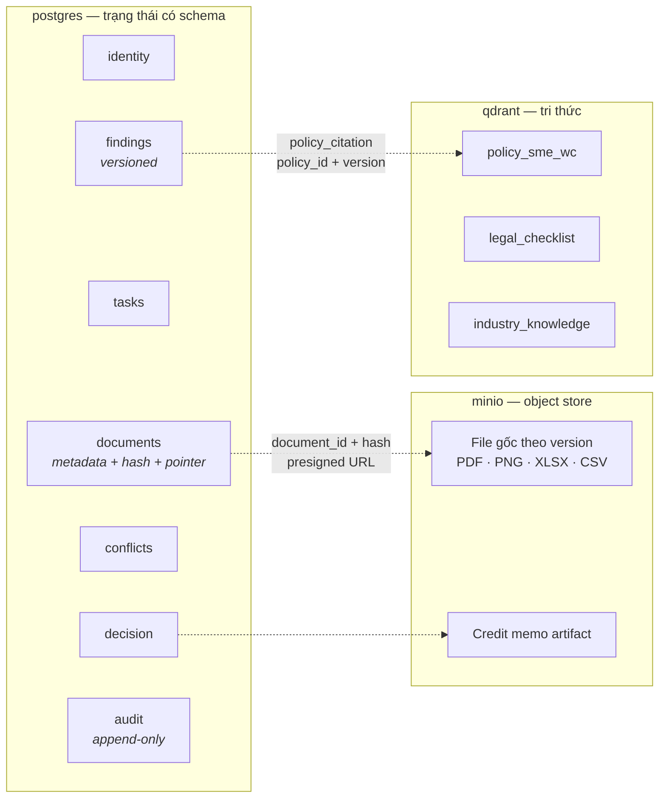
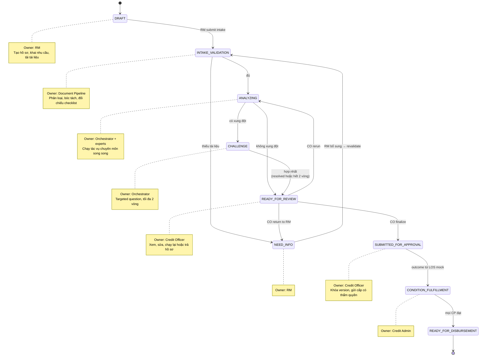
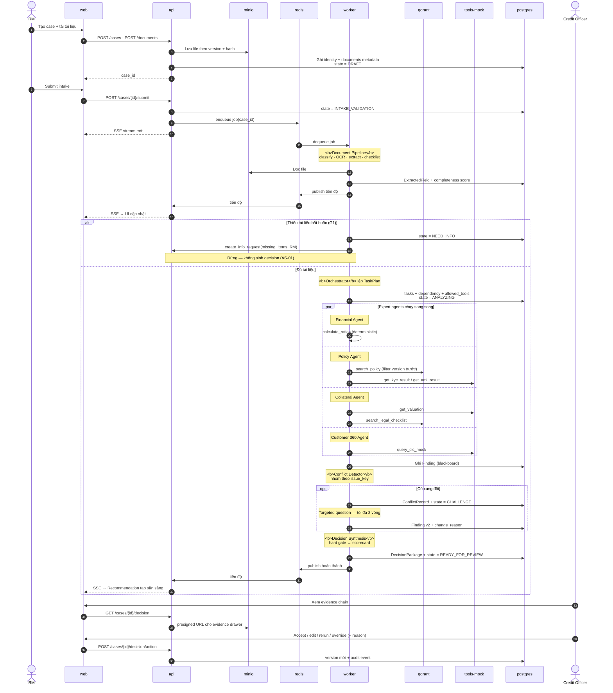
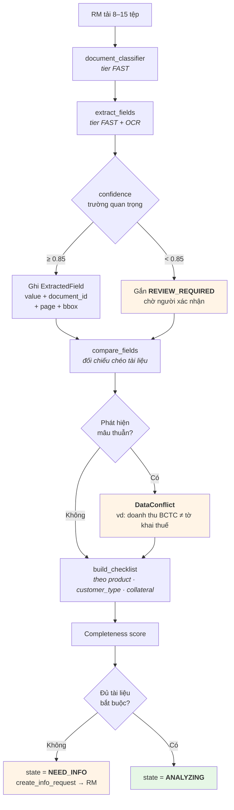
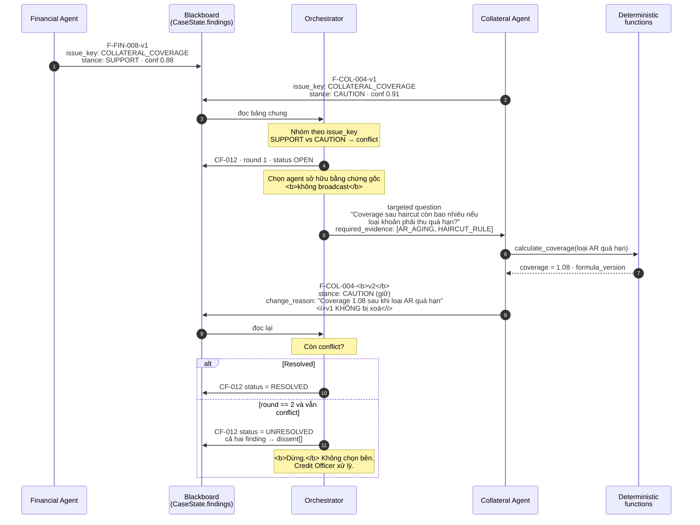
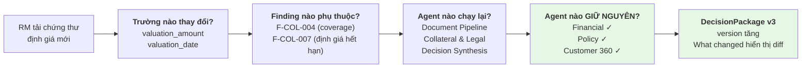
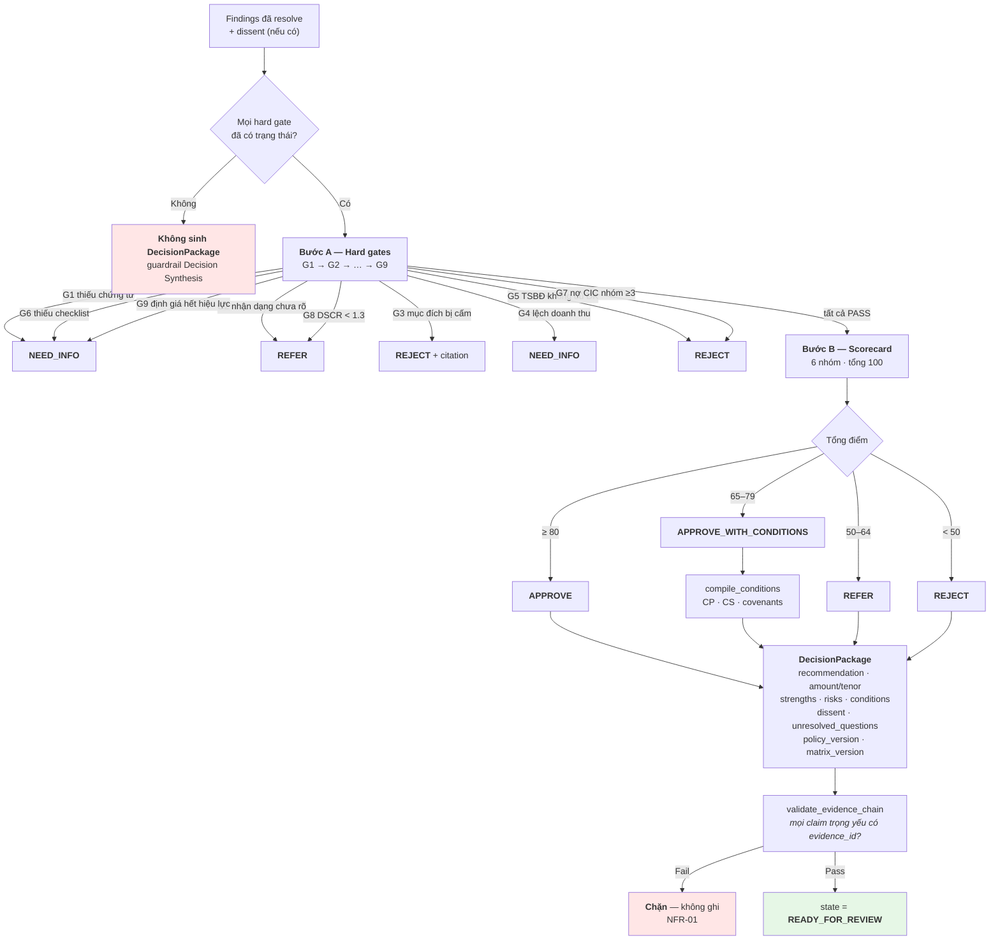
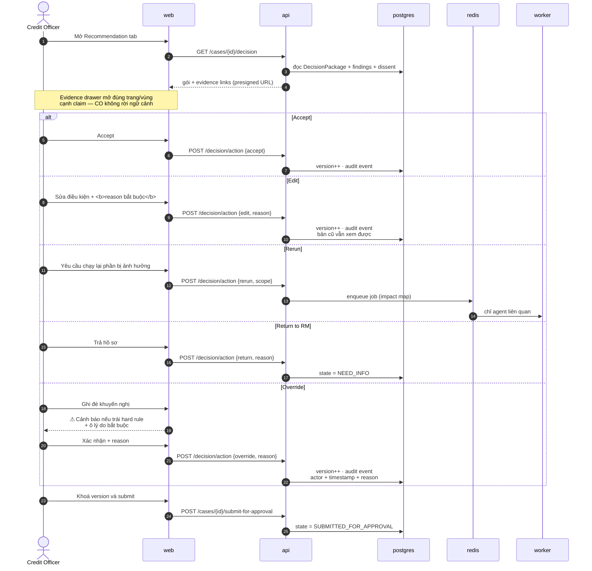
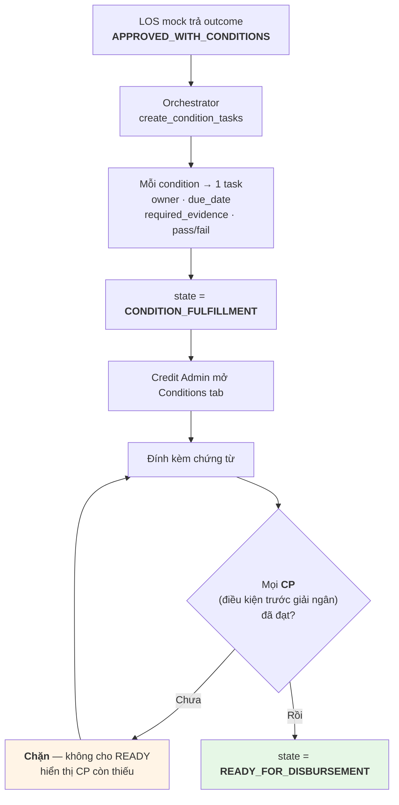
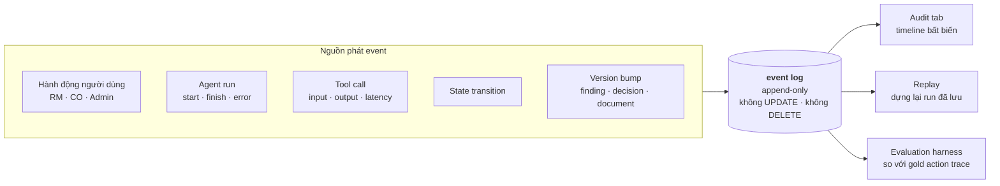

# SHBExpert Flow — Luồng dữ liệu và hoạt động

> **Bộ tài liệu kiến trúc** — 3 file:
> 1. [`overview.md`](./overview.md) — topology 1-VM, service, ai gọi ai, nguyên tắc an toàn.
> 2. [`ai-architecture.md`](./ai-architecture.md) — bộ não AI: Orchestrator-Workers, agent, tool, RAG, phản biện.
> 3. **`data-flow.md`** (file này) — dữ liệu chảy thế nào qua từng bước, kèm sequence/state diagram.
>
> Nguồn nghiệp vụ: `PRD1.1.docx` mục 4, 7, 9, 10.3, 14 và Phụ lục A.

> **Lưu ý quản trị:** mọi chính sách, ngưỡng và luồng phê duyệt là mô phỏng cho cuộc thi. Hệ thống tạo **khuyến nghị** cho Credit Officer; không phê duyệt, không ký, không giải ngân.

Tên service trong tài liệu này (`web`, `api`, `worker`, `tools-mock`, `postgres`, `qdrant`, `minio`, `redis`) khớp chính xác với [`overview.md`](./overview.md) và với `docker-compose.yml`.

---

## 1. Bản đồ dữ liệu

CaseState là mặt phẳng dữ liệu chung — vừa là blackboard cho agent, vừa là nguồn sự thật cho UI. Bảy nhóm (PRD 10.3):

| Nhóm | Nội dung | Lưu ở đâu |
|---|---|---|
| `identity` | case_id, customer_id, product, requested_facility, owner, state, version | `postgres` |
| `documents` | metadata, extraction, review status, evidence index | `postgres` (metadata + trường bóc tách) · `minio` (file) |
| `tasks` | TaskPlan, dependencies, allowed tools, run status, retries | `postgres` |
| `findings` | Finding có version theo `issue_key` và agent | `postgres` |
| `conflicts` | source findings, questions, rounds, resolution, dissent | `postgres` |
| `decision` | gate results, scores, recommendation, conditions, human action | `postgres` |
| `audit` | immutable event IDs, actor, timestamp, input/output hash, policy/model/tool version | `postgres` (append-only) |



**Ba nguyên tắc lưu trữ:**

- **File không vào state** (PRD 10.1). `postgres` giữ metadata, hash và con trỏ; file gốc nằm ở `minio` theo version. Evidence drawer mở tài liệu bằng presigned URL, không nhồi base64 vào CaseState.
- **Không ghi đè** (FR-02). Tài liệu mới tạo version mới. Hash lưu cùng để chống thay thế âm thầm.
- **Audit chỉ ghi thêm** (FR-12). Bảng event không có quyền `UPDATE`/`DELETE`. Sửa một finding không xoá bản cũ — nó tạo `version: 2` kèm `change_reason`.

---

## 2. State machine hồ sơ



Nguồn: PRD 4.1. Mọi chuyển trạng thái đi qua tool `update_case_status` — tool này **kiểm tra transition có hợp lệ không** trước khi ghi, và sinh audit event. Không có đường tắt: không component nào được `UPDATE cases SET state = ...` trực tiếp.

`READY_FOR_DISBURSEMENT` là điểm dừng của MVP. Giải ngân thật nằm ngoài phạm vi (PRD 3.3).

---

## 3. Luồng end-to-end

Chín bước của PRD 4.2, vẽ ở mức service để nối được với [`overview.md`](./overview.md):



Điểm đáng chú ý trong sơ đồ: **khối `par`**. Bốn expert agent chạy đồng thời — đó là cách đạt NFR-02 (≤ 120s). Nếu chạy tuần tự, 4 agent × ~25s + intake + synthesis đã vượt ngân sách.

---

## 4. Luồng intake và extraction



**Mỗi trường bóc tách mang theo nguồn của nó** (FR-03): `value`, `confidence`, `document_id`, `page`, `bbox`. Đây là thứ khiến evidence drawer mở đúng chỗ trên tài liệu cạnh claim, thay vì bắt Credit Officer tự đi tìm. Không có `page`/`bbox` thì evidence chain đứt ở mắt xích cuối và NFR-01 không đạt.

**Checklist là động** (FR-04): sinh theo loại khách hàng, sản phẩm và TSBĐ; hiển thị bốn trạng thái — đủ / thiếu / **hết hạn** / mâu thuẫn — kèm lý do cần. "Hết hạn" là trạng thái riêng vì chứng thư định giá quá hạn là một tình huống thật (flagship case C06).

**OCR lỗi** → document `FAILED`, retry một lần, cho nhập/xác nhận thủ công (PRD 7.1). Không im lặng bỏ qua tài liệu.

---

## 5. Luồng phản biện

Ví dụ thật từ PRD Phụ lục A.2 — conflict `COLLATERAL_COVERAGE` của case C06:



Ba chi tiết định hình cơ chế này:

- **`round` là biến đếm trong graph**, không phải chỉ dẫn trong prompt. Cạnh `Challenge → Detect` tăng nó; đến 2 là cạnh đóng. Không có cách nào agent "thuyết phục" hệ thống cho thêm vòng.
- **Câu hỏi có `required_evidence`.** Nó không hỏi "bạn nghĩ sao?" mà yêu cầu tính lại với dữ liệu cụ thể và trả về bằng chứng cụ thể.
- **v1 vẫn còn.** Credit Officer xem được agent đã đổi ý thế nào và vì sao — đó là dữ liệu để đánh giá chất lượng agent, không phải rác.

---

## 6. Luồng bổ sung hồ sơ và impact map

Khi RM tải tài liệu mới, hệ thống **không chạy lại mọi agent**. Nó tính bản đồ ảnh hưởng (PRD 4.3):



**Vì sao quan trọng, không chỉ là tối ưu tốc độ:** chạy lại Financial Agent khi không có dữ liệu tài chính nào đổi sẽ tạo ra một finding version mới không lý do — làm nhiễu audit trail và khiến Credit Officer phải đọc lại thứ không đổi. Impact map giữ cho "What changed?" thật sự chỉ hiển thị cái đã thay đổi.

Kỹ thuật: dependency giữa `ExtractedField` → `Finding` → `DecisionPackage` được ghi khi tạo (mỗi Finding đã có `evidence_ids` trỏ tới trường nguồn), nên impact map là **truy vấn đồ thị trên dữ liệu sẵn có**, không phải suy đoán của LLM.

Đây là **AS-04**: *Given RM tải chứng thư mới; When revalidate; Then chỉ task bị ảnh hưởng chạy lại và What changed hiển thị decision version mới.*

---

## 7. Luồng quyết định



**Hai chốt chặn ở hai đầu.** Trước khi chấm: hard gate chưa có trạng thái thì không chạy. Sau khi có gói: `validate_evidence_chain` không qua thì không ghi. Một DecisionPackage tồn tại nghĩa là cả hai đã qua.

Chi tiết gate và trọng số scorecard: xem [`ai-architecture.md` §10](./ai-architecture.md#10-logic-quyết-định).

---

## 8. Luồng human-in-the-loop



**Bốn ràng buộc bất di bất dịch** (FR-11, AS-05):

1. Edit và override **bắt buộc reason** — không có ô trống thì không submit được.
2. Mọi hành động **tăng version**; bản cũ vẫn xem được.
3. Override trái hard rule **hiện cảnh báo trước** khi cho xác nhận.
4. Actor + timestamp + reason vào audit event, không thể sửa sau.

Đây là biện pháp giảm thiểu R7 (automation bias): PRD 12.3 nói rõ **tỷ lệ CO accept cao không phải mục tiêu**. Ma sát ở bước override là có chủ đích — nó buộc người dùng dừng lại và diễn đạt lý do, thay vì bấm qua theo quán tính.

---

## 9. Luồng điều kiện sau phê duyệt



Điều kiện được phân loại: **conditions precedent** (trước giải ngân) · **conditions subsequent** (sau giải ngân) · **covenants** (cam kết). Chỉ CP mới chặn `READY_FOR_DISBURSEMENT`.

Credit Admin **không sửa được kết luận thẩm định** — chỉ đính kèm chứng từ và đánh dấu đạt/chưa đạt (PRD mục 2, Phụ lục B). `create_condition_tasks` là tool có side effect và **chỉ chạy sau approval mock**.

Đây là **AS-06**: *Given outcome APPROVED_WITH_CONDITIONS từ LOS mock; When Credit Admin mở case; Then mọi condition có task, owner, evidence requirement và pass/fail.*

---

## 10. Luồng audit và event

Mỗi bước có ý nghĩa đều phát một event. Audit trail không phải log — nó là **cấu trúc dữ liệu chính** mà Audit tab đọc thẳng.



### Event schema

```json
{
  "event_id": "EVT-C06-000142",
  "case_id": "C06",
  "seq": 142,
  "event_type": "TOOL_CALL",
  "actor": { "type": "AGENT", "id": "collateral_legal" },
  "timestamp": "2026-07-17T09:14:22.318Z",
  "payload": {
    "tool": "calculate_coverage",
    "input_hash": "sha256:3f2a…",
    "output_hash": "sha256:9c71…",
    "latency_ms": 34,
    "status": "SUCCESS",
    "error": null
  },
  "versions": {
    "policy_version": "SME-WC-2026.2-MOCK",
    "formula_version": "FIN-0.3-MOCK",
    "model_tier": "reasoning",
    "tool_version": "1.0.0"
  }
}
```

Bốn thứ khiến schema này đủ dùng thay vì chỉ đẹp:

- **`input_hash` / `output_hash`** thay vì nguyên văn — audit chứng minh được "cái gì vào, cái gì ra" mà không đổ PII vào log (NFR-06). Nguyên văn nằm trong CaseState có phân quyền.
- **`versions`** đi kèm mọi event — không có nó thì replay vô nghĩa (NFR-04): cùng input mà policy đổi thì kết quả khác, và không ai biết vì sao.
- **`seq`** đơn điệu theo case — timeline dựng lại được đúng thứ tự kể cả khi các agent chạy song song và timestamp gần nhau.
- **`actor.type`** phân biệt `USER` / `AGENT` / `SYSTEM` — PRD 8.4 yêu cầu tách bạch dữ kiện, suy luận của agent và sửa đổi của người.

Audit tab hiển thị: thứ tự agent/tool, input hash, output hash, latency, trạng thái, error, policy version và người thao tác (FR-12). Nó đọc `postgres`, không đọc `docker logs` — đó là lý do nó trình được cho ban giám khảo.

---

## 11. Đối chiếu luồng ↔ kịch bản demo C06

Flagship case: **An Phú Packaging** — đề nghị hạn mức vốn lưu động 8 tỷ / 12 tháng. Dòng tiền trả nợ chấp nhận được, nhưng doanh thu giữa BCTC và tờ khai thuế **lệch 11%**, chứng thư định giá **sắp hết hạn**, và **42% doanh thu phụ thuộc một người mua**.

Bảng dưới nối 6 mốc của run-of-show 7 phút (PRD 14.2) với mục luồng tương ứng — để người dựng demo biết code phần nào phục vụ phút nào:

| Thời gian | Nội dung demo | Mục luồng | Bằng chứng trên màn hình |
|---|---|---|---|
| 0:00–0:45 | Nêu pain point, mở Case Queue chọn C06 | §2 state machine | Trạng thái, SLA, conflict count |
| 0:45–1:45 | Intake — bóc tách, lộ 11% chênh doanh thu và chứng thư sắp hết hạn | **§4** intake & extraction | Evidence links, checklist 4 trạng thái, `DataConflict` |
| 1:45–2:45 | Planner + tools — 3 agent gọi 3 tool khác nhau | **§3** end-to-end (khối `par`) | Task trace, tool call log có kết quả |
| 2:45–4:00 | Collaboration — Financial SUPPORT / Collateral CAUTION / Policy NEED_DATA | **§5** phản biện | Conflict tab: targeted question + finding v2 |
| 4:00–5:00 | Hành động — `create_info_request`; RM bổ sung; chỉ Intake/Policy/Collateral/Decision chạy lại | **§6** impact map | "What changed?" + side effect có trạng thái |
| 5:00–6:15 | Khuyến nghị — `APPROVE_WITH_CONDITIONS`, 7 tỷ / 9 tháng | **§7** quyết định | Evidence drawer, điều kiện, dissent |
| 6:15–7:00 | Human control — CO sửa điều kiện + lý do, submit; Admin nhận checklist; mở Audit | **§8** HITL · **§9** conditions · **§10** audit | Timeline bất biến |

**Demo phải chứng minh 5 điều** (PRD 14.3), và mỗi điều neo vào một luồng:

1. Ba agent có chuyên môn và tool **khác nhau** — không phải ba prompt giống nhau → §3
2. Ít nhất một mâu thuẫn dẫn tới câu hỏi phản biện và **thay đổi finding có version** → §5
3. Ít nhất một **side effect**: tạo yêu cầu bổ sung / cập nhật trạng thái / tạo condition task → §6, §9
4. Khuyến nghị có bằng chứng, điều kiện, dissent và hard gate — không phải đoạn văn chung chung → §7
5. Con người kiểm soát và mọi thay đổi có audit → §8, §10

---

## 12. Bảng truy vết luồng ↔ FR ↔ acceptance scenario

| Mục | Luồng | FR liên quan | AS |
|---|---|---|---|
| §1 | Bản đồ dữ liệu | FR-02 (không ghi đè, hash, version) | — |
| §2 | State machine | FR-01 (tạo case), FR-12 (audit) | — |
| §3 | End-to-end | FR-05 (TaskPlan), FR-06 (3 agent lõi), FR-07 (≥3 tool call thật) | — |
| §4 | Intake & extraction | FR-03 (bóc tách có trích dẫn), FR-04 (checklist động), FR-13 (yêu cầu bổ sung cho RM) | **AS-01** |
| §5 | Phản biện | FR-08 (ConflictRecord), FR-09 (targeted question, max 2 vòng) | **AS-03** |
| §6 | Impact map | FR-14 (chạy lại theo ảnh hưởng) | **AS-04** |
| §7 | Quyết định | FR-10 (DecisionPackage sau hard gate), FR-16 (xuất tờ trình) | **AS-02** |
| §8 | Human-in-the-loop | FR-11 (accept/edit/rerun/return/override + reason) | **AS-05** |
| §9 | Điều kiện sau phê duyệt | FR-15 (checklist Credit Admin) | **AS-06** |
| §10 | Audit & event | FR-12 (audit dashboard), FR-17 (feedback loop — P2) | — |

FR-18 (theo dõi sau cấp tín dụng) là P2, ngoài demo.

---

## 13. Đọc tiếp

- Hệ thống chạy ở đâu, service nào gọi service nào: [`overview.md`](./overview.md)
- Agent nào, tool nào, phản biện và quyết định ra sao: [`ai-architecture.md`](./ai-architecture.md)
