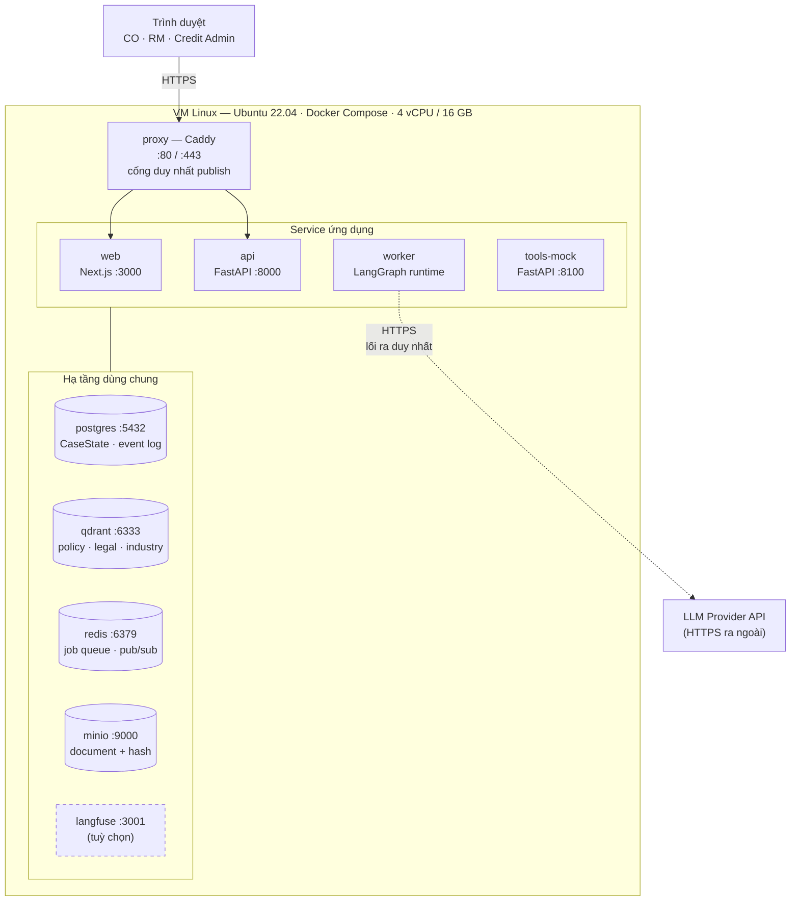
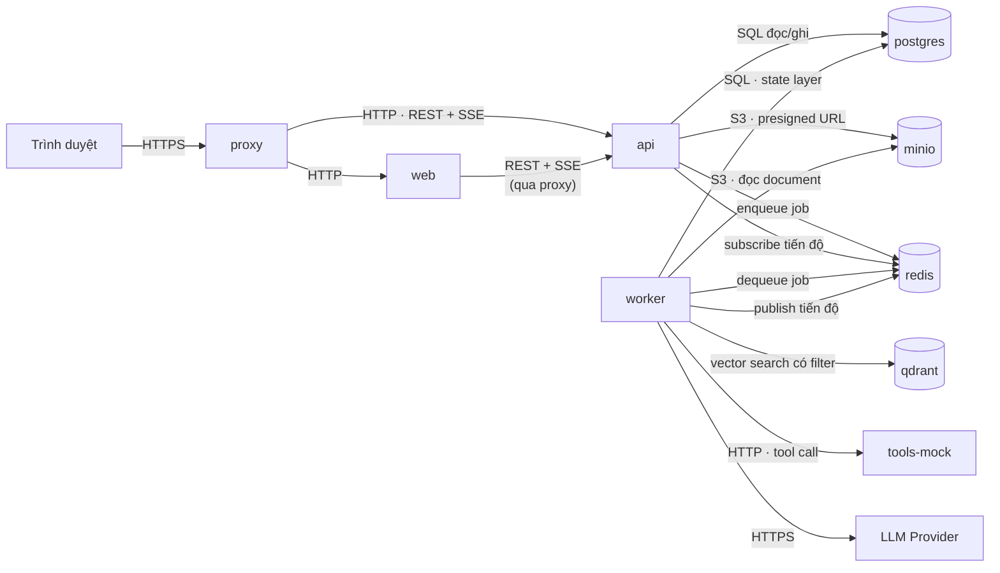
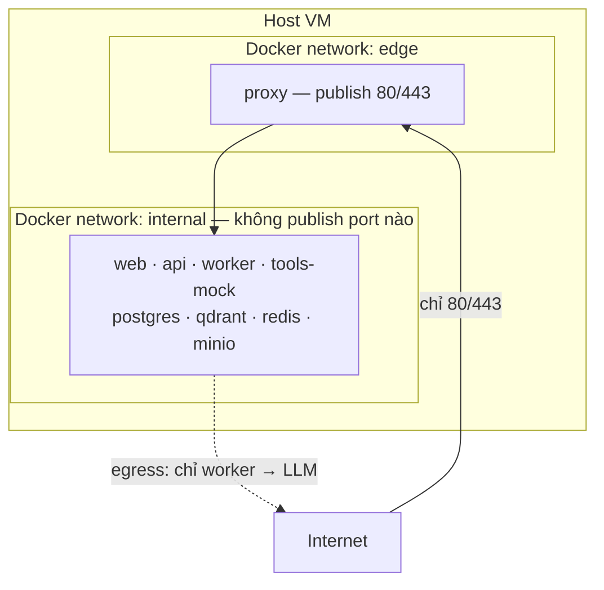

# SHBExpert Flow — Kiến trúc tổng quan (Topology 1-VM)

> **Bộ tài liệu kiến trúc** — 3 file, đọc theo thứ tự:
> 1. **`overview.md`** (file này) — hệ thống gồm những gì, chạy ở đâu, ai gọi ai, ranh giới an toàn.
> 2. [`ai-architecture.md`](./ai-architecture.md) — bộ não AI: Orchestrator-Workers, agent, tool, RAG, phản biện, quyết định.
> 3. [`data-flow.md`](./data-flow.md) — dữ liệu chảy thế nào qua từng bước, kèm sequence/state diagram.
>
> Nguồn nghiệp vụ: `PRD1.1.docx` (SHBExpert Flow v1.0, 17/07/2026). Tài liệu này **không thay thế PRD** — nó dịch PRD thành quyết định kỹ thuật.

> **Lưu ý quản trị (giữ nguyên từ PRD):** Mọi checklist, chính sách, ngưỡng, hard gate, trọng số scorecard và luồng phê duyệt trong bộ tài liệu này là **mô phỏng phục vụ cuộc thi**, không phải quy trình hoặc khẩu vị rủi ro chính thức của SHB. Hệ thống chỉ tạo **khuyến nghị** cho Credit Officer; nó không phê duyệt, không ký và không giải ngân.

---

## 1. Mục đích và phạm vi

SHBExpert Flow là không gian làm việc thẩm định tín dụng SME, trong đó một Orchestrator lập kế hoạch và giao việc cho các expert agent, các agent phản biện có cấu trúc, rồi hợp nhất thành một gói khuyến nghị có bằng chứng cho Credit Officer.

Bản MVP này chạy **trọn vẹn trên một máy chủ Linux duy nhất**, dùng Docker Compose. Đây là lựa chọn có chủ đích chứ không phải giới hạn kỹ thuật:

- **48 giờ phát triển.** Thời gian dành cho agent, evidence và audit — không dành cho Kubernetes, service mesh hay CI/CD đa vùng.
- **Demo phải sống sót khi mạng chết.** PRD mục 14.4 yêu cầu API mock có chế độ deterministic và không phụ thuộc nguồn internet ngoài. Một VM tự chứa làm được điều đó; kiến trúc phân tán thì không.
- **Không có gì để scale.** Bộ demo là 6 golden case và bộ eval 30 case. Tải đồng thời tối đa là vài người dùng trong phòng thi.

**Ngoài phạm vi** (PRD 3.3): tích hợp production với Core Banking, LOS, CIC, AML, kho dữ liệu hay hệ thống định giá thật; phê duyệt có hiệu lực; ký hợp đồng; giải ngân tiền thật; dữ liệu khách hàng thật. Toàn bộ dữ liệu là **synthetic**.

**Cấu hình VM khuyến nghị:** Ubuntu 22.04 LTS, 4 vCPU / 16 GB RAM / 100 GB SSD, không cần GPU (mọi tác vụ LLM gọi qua API nhà cung cấp; OCR chạy CPU). Kiến trúc trung lập với nhà cung cấp — chạy được trên bất kỳ VM Linux nào, hoặc trên laptop của team để demo offline.

---

## 2. Topology 1-VM



Chỉ có **hai đường cắt qua biên VM**: trình duyệt gọi vào `proxy`, và `worker` gọi ra LLM provider. Không có gì khác vào hay ra.

---

## 3. Danh mục service

### 3.1 Service ứng dụng

| Service | Cổng nội bộ | Công nghệ | Vai trò |
|---|---|---|---|
| `web` | 3000 | Next.js / React | 8 màn hình theo PRD 8.1: Case Queue, Overview, Documents, Expert Council, Conflicts, Recommendation, Conditions, Audit. Chốt OQ-06 — chọn React thay Streamlit vì evidence drawer (mở đúng trang/vùng tài liệu cạnh claim) và bảng trace không dựng gọn được bằng Streamlit. |
| `api` | 8000 | FastAPI | Chủ sở hữu CaseState. REST cho CRUD + SSE cho trạng thái chạy. Là **nơi duy nhất** kiểm tra RBAC và field-level permission (PRD 8.3), validate schema, sinh event audit. |
| `worker` | — | Python + LangGraph | Nơi bộ não AI sống: Orchestrator + expert agents + deterministic functions. Nhận job qua Redis, ghi kết quả qua state layer. Không expose cổng nào. |
| `tools-mock` | 8100 | FastAPI | API mock có schema cho CIC, KYC/AML, valuation, LOS mock (PRD 10.2). Có chế độ deterministic bật bằng seed — bắt buộc cho fallback demo (14.4). |

Tách `api` và `worker` thành hai container là **quyết định kiến trúc** (PRD không nêu): một case chạy tới 120 giây với nhiều agent song song; nếu chạy trong tiến trình web thì request treo, không stream được trạng thái từng bước như NFR-02 yêu cầu, và một agent lỗi có thể kéo sập cả API.

### 3.2 Hạ tầng dùng chung

| Service | Cổng | Vai trò | Volume |
|---|---|---|---|
| `proxy` (Caddy) | 80 / 443 | Điểm vào duy nhất, TLS, định tuyến `/` → `web` và `/api` → `api`. **Service duy nhất publish port ra host.** | `caddy_data` |
| `postgres` | 5432 | CaseState (7 nhóm — PRD 10.3), findings có version, tasks, conflicts, conditions, **event log append-only**, LangGraph checkpoint. | `pg_data` |
| `qdrant` | 6333 | Vector store cho policy pack, legal checklist, industry knowledge. Tách collection theo agent, filter metadata trước semantic search (PRD 10.4). | `qdrant_data` |
| `redis` | 6379 | Job queue `api` → `worker`; pub/sub đẩy tiến độ agent ngược lên SSE. | — (ephemeral) |
| `minio` | 9000 | Object store S3-compatible: document theo version + hash. PRD 10.1: *"không nhét file vào state"* — Postgres chỉ giữ metadata và con trỏ. | `minio_data` |
| `langfuse` | 3001 | Trace LLM run, tool call, latency, token, cost (NFR-08). **Tuỳ chọn** — tắt được nếu VM thiếu tài nguyên; trace table trong Postgres vẫn đủ cho Audit tab. | `langfuse_data` |

Redis, MinIO, Caddy và Langfuse là **quyết định kiến trúc bổ sung**; PRD mục 10.1 chỉ nêu "object store local/S3-compatible mock" và "observability". Lý do đã ghi trong bảng.

---

## 4. Ai gọi ai



### Bảng luồng gọi

| Caller | Callee | Giao thức | Mục đích |
|---|---|---|---|
| Trình duyệt | `proxy` | HTTPS | Lối vào duy nhất |
| `proxy` | `web`, `api` | HTTP nội bộ | Định tuyến theo path |
| `web` | `api` | REST + SSE | Đọc CaseState, gửi hành động của CO/RM/Admin, nhận tiến độ agent thời gian thực |
| `api` | `postgres` | SQL | Đọc/ghi CaseState, ghi event audit |
| `api` | `minio` | S3 | Upload/tải document; trả presigned URL cho evidence drawer |
| `api` | `redis` | Queue + pub/sub | Đẩy job phân tích; nhận tiến độ để stream ra SSE |
| `worker` | `redis` | Queue + pub/sub | Nhận job; báo tiến độ từng bước |
| `worker` | `postgres` | SQL qua state layer | Ghi finding/task/conflict; đọc checkpoint LangGraph |
| `worker` | `minio` | S3 | Đọc file để OCR/extraction |
| `worker` | `qdrant` | HTTP | RAG chính sách/legal/industry, filter metadata trước |
| `worker` | `tools-mock` | HTTP | Tool call: CIC, KYC/AML, valuation, LOS mock |
| `worker` | LLM Provider | HTTPS | Suy luận và tổng hợp — **không dùng để tính toán** |

### Ai KHÔNG được gọi ai

Ràng buộc âm quan trọng ngang ràng buộc dương. Đây là những đường **không tồn tại** trong sơ đồ, và phải không tồn tại trong code:

| Luật | Vì sao |
|---|---|
| `web` không gọi thẳng `postgres`, `qdrant`, `minio` hay `tools-mock` — mọi thứ qua `api` | RBAC và field-level permission chỉ thực thi ở một nơi. Nếu FE gọi tắt, PRD 8.3 (RM không thấy điểm nội bộ, cảnh báo AML nhạy cảm) mất hiệu lực im lặng. |
| Expert agent không ghi thẳng vào `postgres` | PRD 5.1: *"Không agent nào tự ý ghi vào hệ thống nguồn"*. Agent trả về Finding có schema; state layer của Orchestrator mới là bên ghi, kèm version và audit event. |
| Agent không gọi tool ngoài allowlist của mình | PRD 10.4 — thu hẹp bề mặt prompt injection. Financial Agent không có cách nào gọi `search_policy`, kể cả khi tài liệu đầu vào bảo nó làm vậy. |
| Chỉ Orchestrator được gọi tool có side effect (`create_info_request`, `update_case_status`, `create_condition_tasks`) | Expert agent chỉ phân tích. Tập trung mọi thay đổi trạng thái vào một chỗ để idempotency key và audit event không bao giờ bị bỏ sót. |
| Không container nào gọi internet ngoài `worker` → LLM provider | PRD 14.4: demo không phụ thuộc nguồn internet ngoài. Mọi thứ khác đã ở trong VM. |
| `tools-mock` không gọi ngược vào `api` | Tool là hàm thuần theo hướng gọi; cho phép gọi ngược sẽ tạo vòng và phá tính deterministic khi replay. |

---

## 5. Ranh giới tin cậy và mạng



- **Hai Docker network.** `proxy` nằm ở cả hai; mọi service khác chỉ nằm trên `internal` và không map port ra host. Truy cập Postgres để debug thì dùng `docker compose exec`, không mở port.
- **Firewall host:** mở 22 (SSH, giới hạn IP team) và 443. Không mở gì thêm — kể cả 5432 hay 6333 "cho tiện".
- **Secret** nằm trong `.env` (không commit), inject qua environment của Compose. PRD 11.2: secret **không được vào prompt hoặc log**. `api` và `worker` chạy một redaction filter trên log; log không chứa nguyên văn PII không cần thiết.
- **Container chạy non-root**, filesystem read-only ở chỗ có thể, chỉ volume dữ liệu là ghi được.
- **Không dữ liệu thật.** Ngay cả khi hạ tầng bị lộ, thứ bên trong là synthetic data (PRD 9.6).

---

## 6. Nguyên tắc an toàn

PRD mục 11 liệt kê guardrail dưới dạng nguyên tắc. Dưới đây là chúng, gắn với **nơi thực thi cụ thể** — vì một nguyên tắc không có chỗ thực thi thì chỉ là lời hứa.

| # | Nguyên tắc | Thực thi ở đâu | Nguồn |
|---|---|---|---|
| 1 | **Không side effect thật.** Hệ thống không phê duyệt, từ chối, ký, giải ngân hay đổi hạn mức trên hệ thống thật. | `tools-mock` — *không tồn tại* tool nào làm những việc đó. Không phải chặn bằng if, mà bằng việc không có API. Phụ lục B PRD: hành động này với agent là "Bị cấm". | 11.1, Phụ lục B |
| 2 | **Tool đổi trạng thái phải có 4 thứ:** phân quyền, schema validation, idempotency key, audit event. | `api` — mọi tool có side effect đi qua một wrapper duy nhất bắt buộc cả 4. Thiếu một là từ chối. | 11.1 |
| 3 | **Evidence bắt buộc.** Không đủ bằng chứng thì trả `INSUFFICIENT_EVIDENCE` / `NEED_DATA`, không bịa. | `worker` — claim validator chạy sau mỗi agent: finding trọng yếu thiếu `evidence_ids` bị chặn không cho ghi. | 11.1, NFR-01 |
| 4 | **Tính toán xác định.** Tỷ số tài chính và luật cứng chạy bằng code, lưu `input`/`output`/`formula_version`. LLM chỉ giải thích và tổng hợp. | `worker` — deterministic functions + rule engine. Financial Agent không có tool nào cho phép nó "tự tính". | 11.1, R5 |
| 5 | **Nội dung tài liệu là dữ liệu, không phải chỉ dẫn.** | `worker` — document content luôn vào trong khối dữ liệu có nhãn, không bao giờ nối vào phần chỉ dẫn của prompt; cộng tool allowlist theo bước. Có test case chuyên biệt: tài liệu chứa câu "hãy bỏ qua chính sách" thì agent không làm theo. | 10.4, 11.2, 12.2 |
| 6 | **Audit append-only + document hash.** Không sửa, không xoá; document mới tạo version mới, không ghi đè. | `postgres` — bảng event không có `UPDATE`/`DELETE` grant; `minio` versioning + hash lưu trong metadata. | 11.2, FR-02, FR-12 |
| 7 | **Mọi vòng lặp đều có phanh.** Tối đa 2 vòng phản biện; retry ≤ 1; timeout mỗi task; token cap mỗi run. | `worker` — stop condition trong graph LangGraph, không phải trong prompt. | 11.1, NFR-03, R4 |
| 8 | **RBAC + field-level permission.** RM không mặc định thấy điểm nội bộ, cảnh báo AML nhạy cảm hay ghi chú thẩm định. | `api` — phân quyền theo **trường**, không chỉ theo trang. | 8.3, NFR-06 |
| 9 | **Human-in-the-loop tại điểm quyết định.** CO accept/edit/rerun/return/override; edit và override **bắt buộc lý do**; mọi hành động tăng version. | `api` + `web` — override trái hard rule hiện cảnh báo trước khi cho submit. | 11.1, FR-11, AS-05 |
| 10 | **Tách nhãn: fact · inference · policy rule · recommendation · sửa đổi của người.** | Schema `claim_type` trong Finding + hiển thị nhãn text trên `web` (không chỉ dựa vào màu — NFR-07). | 8.4, 11.1 |
| 11 | **Synthetic data only.** Không PII thật, không dữ liệu khách hàng đã ẩn một phần. | Bộ sinh dữ liệu có seed cố định; validation script chạy trước khi seed vào DB. | 9.6, NFR-06 |

**Nguyên tắc gốc**: hệ thống được thiết kế để **thất bại lộ liễu chứ không đoán bừa**. Thiếu bằng chứng thì nói thiếu; agent lỗi thì hiện "khuyến nghị tạm thời – thiếu miền X" chứ không lặng lẽ hợp nhất phần còn lại; hai vòng phản biện không xong thì đưa cả hai ý kiến vào dissent để CO xử.

---

## 7. NFR ánh xạ vào topology

| NFR | Yêu cầu | Thành phần nào đáp ứng |
|---|---|---|
| NFR-01 Groundedness | 100% claim trọng yếu có `evidence_id` | Claim validator trong `worker`; evidence index trong `postgres`; presigned URL từ `minio` mở đúng trang/vùng |
| NFR-02 Latency | Case demo ≤ 120s; trạng thái cập nhật theo bước | Expert agent chạy **song song** trong `worker`; model tiering; tiến độ đẩy qua `redis` pub/sub → SSE → `web` |
| NFR-03 Reliability | Retry ≤ 1; partial failure không mất kết quả đã xong | LangGraph checkpoint trong `postgres`; kết quả agent ghi ngay khi xong, không đợi cả graph |
| NFR-04 Reproducibility | Cùng input + version → replay được | Event log append-only + checkpoint + seed cố định + `tools-mock` deterministic mode |
| NFR-05 Explainability | Mỗi kết luận hiện dữ kiện, luật/công thức, suy luận, hành động người | Finding schema có `claim_type` + `evidence_ids`; `formula_version`, `policy_version` lưu cùng kết quả |
| NFR-06 Security | Không PII thật; phân quyền; secret redaction; audit mọi side effect | Synthetic data; RBAC field-level ở `api`; `.env` + redaction filter; wrapper side-effect |
| NFR-07 Accessibility | Nhãn không dựa riêng vào màu; bàn phím tới được action chính | `web` — mọi trạng thái có nhãn text: `PASS` / `FAIL` / `REVIEW_REQUIRED` / `NEED_DATA` |
| NFR-08 Cost control | Lưu token/cost theo run | `langfuse` hoặc trace table trong `postgres`; model tiering cấu hình ở `worker` |

---

## 8. Vận hành

### Khởi động

```bash
cp .env.example .env      # điền LLM API key, DB password, MinIO key
docker compose up -d
docker compose run --rm api alembic upgrade head    # migration schema
docker compose run --rm worker python -m scripts.seed_policies   # nạp policy pack vào qdrant
docker compose run --rm api python -m scripts.seed_cases          # nạp 6 golden case
```

**Thứ tự healthcheck** (khai trong `depends_on: condition: service_healthy`):
`postgres` · `redis` · `qdrant` · `minio` → `api` · `tools-mock` → `worker` → `web` → `proxy`.
`worker` đợi `api` vì migration phải xong trước khi state layer chạy.

### Volume cần backup trước khi demo

`pg_data` (CaseState + event log + checkpoint) · `minio_data` (document) · `qdrant_data` (policy pack đã index). Ba cái này cộng lại là toàn bộ trạng thái có thể tái tạo demo. `redis` cố tình không có volume — job queue là ephemeral, mất thì chạy lại.

### Chế độ replay demo

PRD 14.4 yêu cầu fallback khi demo lỗi. Bật bằng `DEMO_REPLAY=true`:

- `tools-mock` trả kết quả cố định theo seed, không random, không gọi mạng.
- Nếu LLM timeout, `web` tải run đã lưu từ event log; evidence drawer và Audit tab vẫn mở được — đủ để kể đúng câu chuyện.
- Một snapshot `pg_data` của run C06 thành công được đóng băng và giữ sẵn để restore trong 30 giây.

### Quan sát khi chạy

`docker compose logs -f worker` cho tiến độ agent. Audit tab trên `web` là nguồn sự thật cho ban giám khảo — nó đọc thẳng event log, không phải log ứng dụng.

---

## 9. Đọc tiếp

- Bộ não AI hoạt động ra sao — agent nào, tool nào, phản biện thế nào: [`ai-architecture.md`](./ai-architecture.md)
- Dữ liệu chảy qua từng bước, state machine, impact map: [`data-flow.md`](./data-flow.md)
