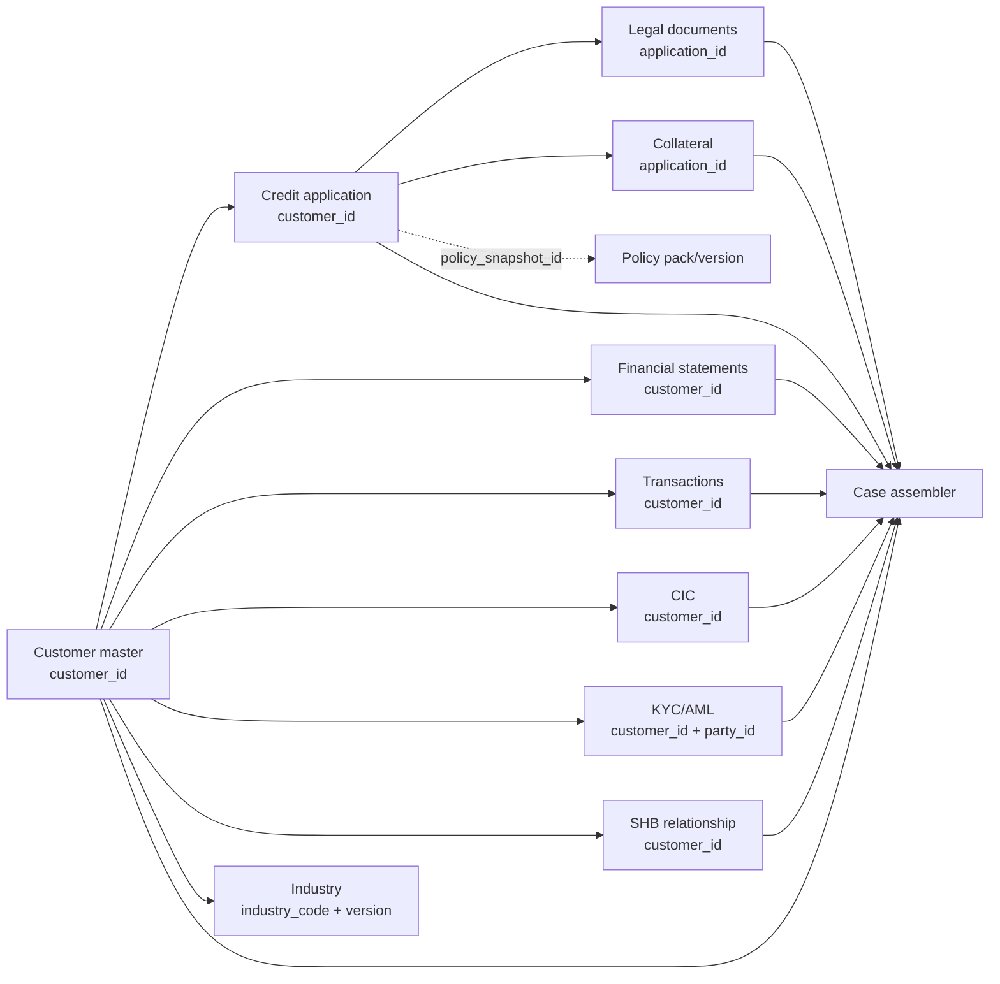

# Báo cáo dữ liệu hiện có và mức độ khớp PRD 1.1 — Mục 9

Ngày đối chiếu: 18/07/2026
Phạm vi: dữ liệu đã commit trên nhánh `tuananh/synthetic-data-pipeline`, đối chiếu trực tiếp với các yêu cầu tại PRD 1.1, mục 9.1–9.6.

## 1. Kết luận ngắn

Bộ dữ liệu hiện tại **đã đủ tốt để làm master pool có cấu trúc cho agent phát triển và kiểm thử integration**, nhưng **chưa phải bộ benchmark hoàn chỉnh theo mục 9 của PRD**.

- Đã có **11/12 nhóm dữ liệu** trong danh mục mục 9.1. Nhóm còn thiếu là `Workflow & audit`.
- Nếu chấm nghiêm theo cả trường tối thiểu và định dạng: **4 nhóm khớp đầy đủ, 7 nhóm khớp một phần, 1 nhóm chưa có**.
- Đã có 120 khách hàng, 120 hồ sơ vay, 14.811 giao dịch, 18 bản policy và 4 case có lỗi cố ý.
- Chưa có 6 golden cases, bộ 30 evaluation cases, phân bố outcome, ít nhất 10 conflict cases và các nhãn ground truth bắt buộc.
- Không còn PDF trong bộ dữ liệu. Đây là **chủ đích thiết kế theo quyết định chuyển sang JSON/JSONL**, không phải lỗi export. Vì vậy dữ liệu hiện tại kiểm thử được logic/rule/agent, nhưng chưa kiểm thử được OCR, tài liệu scan và citation theo trang/vùng.

Nói cách khác: **schema coverage đã khá tốt; evaluation readiness còn thiếu**.

## 2. Dữ liệu được tạo và nối với nhau như thế nào

Toàn bộ số, ID, ngày, quan hệ và nhãn được sinh bằng generator có seed cố định. LLM của FPT AI Factory chỉ viết bốn trường narrative không có quyền quyết định: mô tả doanh nghiệp, RM note, financial note và mô tả tài sản. Narrative được lưu riêng cùng model, prompt hash, latency và token usage; nó không ghi đè dữ liệu định lượng.



Các khóa nối chính:

- `customer_id` là khóa gốc xuyên suốt customer, application, financials, transactions, CIC, KYC/AML và quan hệ SHB.
- `application_id` nối hồ sơ vay với hồ sơ pháp lý và tài sản bảo đảm.
- `proposed_collateral_ids` trong application trỏ tới `collateral_id`.
- `industry_code` + `industry_version` nối customer với dữ liệu ngành.
- `policy_snapshot_id` chọn policy pack theo thời điểm hồ sơ. Hiện quan hệ từ pack tới 18 policy records mới được suy ra theo version, chưa có file mapping tường minh.
- `party_id` được dùng cho người đại diện, bên liên quan, chủ tài sản và KYC/AML. Generator có kiểm tra các ID này, nhưng bản export chưa có `party_master`, nên agent chưa thể tra cứu chi tiết của party từ file đã publish.

## 3. Inventory hiện tại

| Thành phần | Quy mô hiện có | Nơi lưu |
|---|---:|---|
| Customer | 120 bản ghi | [`customer_master.json`](../artifacts/master_jsonl/customer_master.json), [`customer_master.csv`](../artifacts/master_jsonl/customer_master.csv) |
| Credit application | 120 bản ghi | [`credit_applications.json`](../artifacts/master_jsonl/credit_applications.json) |
| Hồ sơ pháp lý | 600 bản ghi; đúng 5 loại × 120 customer | [`legal_documents.jsonl`](../artifacts/master_jsonl/legal_documents.jsonl) |
| Báo cáo tài chính | 480 kỳ; 2023, 2024, 2025 và 2026-H1 cho mỗi customer | [`financial_statements.xlsx`](../artifacts/master_jsonl/financial_statements.xlsx), [`financial_statements.jsonl`](../artifacts/master_jsonl/financial_statements.jsonl) |
| Giao dịch tài khoản | 14.811 dòng; min 51, trung bình 123,4, max 200/customer | [`account_transactions.csv`](../artifacts/master_jsonl/account_transactions.csv) |
| CIC | 120 báo cáo | [`cic_mock.json`](../artifacts/master_jsonl/cic_mock.json) |
| KYC/AML | 240 screening records | [`kyc_aml_mock.json`](../artifacts/master_jsonl/kyc_aml_mock.json) |
| Tài sản bảo đảm | 120 tài sản | [`collateral.jsonl`](../artifacts/master_jsonl/collateral.jsonl) |
| Quan hệ SHB | 120 bản ghi | [`shb_relationship.json`](../artifacts/master_jsonl/shb_relationship.json), [`shb_relationship.csv`](../artifacts/master_jsonl/shb_relationship.csv) |
| Policy/rulebook | 18 bản; 6 policy families × 3 versions | [`policy_rulebook.jsonl`](../artifacts/master_jsonl/policy_rulebook.jsonl), [`policy_rulebook.md`](../artifacts/master_jsonl/policy_rulebook.md) |
| Dữ liệu ngành | 96 bản; 12 ngành × 8 quý | [`industry_data.csv`](../artifacts/master_jsonl/industry_data.csv), [`industry_data.md`](../artifacts/master_jsonl/industry_data.md) |
| Narrative do FPT sinh | 120 bản, tách khỏi dữ liệu quyết định | [`narrative_enrichment.json`](../artifacts/narrative_enrichment.json) |
| Mutation/case mẫu | 4 lỗi cố ý và 4 case đã assemble | [`mutations.json`](../artifacts/mutations.json), [`cases/`](../artifacts/cases/) |
| Nguồn tham chiếu public | 4 snapshot đã tải + 1 nguồn SHB chỉ curate thủ công | [`source_manifest.json`](../artifacts/reference_snapshots/source_manifest.json) |

Manifest của master pool cố định `global_seed = 20260718`, `as_of_date = 2026-06-30` và `synthetic_only = true`: [`manifest.json`](../artifacts/master_jsonl/manifest.json).

## 4. Đối chiếu từng dataset với mục 9.1

Quy ước:

- **Khớp**: có toàn bộ trường tối thiểu và ít nhất một định dạng PRD yêu cầu.
- **Một phần**: dataset đã có nhưng thiếu trường, thiếu quan hệ tra cứu hoặc lệch định dạng.
- **Chưa có**: chưa có dataset tương ứng để agent tiêu thụ.

| Dataset trong PRD | Mức khớp | Bằng chứng hiện có | Phần còn thiếu hoặc lệch |
|---|---|---|---|
| Customer master | **Một phần** | 120 rows; có ID, tên, MST giả, ngành, ngày thành lập, địa chỉ, đại diện và related-party IDs; JSON/CSV | Chưa export `party_master`, nên `representative_party_id` và `related_party_ids` chưa tra được tên/thuộc tính party. |
| Credit application | **Khớp** | 120 rows; có sản phẩm, số tiền, kỳ hạn, `purpose_code`, phương thức và nguồn trả nợ, TSBĐ đề xuất; JSON | Không có gap bắt buộc trong mục 9.1. Có thể thêm purpose narrative nếu UI cần giải thích tự nhiên. |
| Hồ sơ pháp lý | **Một phần** | 600 records, đủ 5 loại: ĐKKD, điều lệ, quyết định bổ nhiệm, ID giả và nghị quyết vay; canonical fields có cấu trúc | PRD yêu cầu PDF/ảnh; hiện chỉ JSON/JSONL theo quyết định bỏ PDF. Chưa kiểm thử OCR, chữ ký, trang/vùng citation, scan mờ hay hết hạn ở mức file. |
| Báo cáo tài chính | **Một phần** | 3 năm + kỳ gần nhất/customer; có bảng cân đối, KQKD, LCTT; JSON/JSONL/XLSX; có `formula_version` | Chưa có thuyết minh BCTC và hệ thống line items chi tiết; không có PDF. |
| Giao dịch tài khoản | **Một phần** | 14.811 rows; 51–200/customer; có ngày, số tiền, chiều, đối tác và số dư; CSV | Chưa có trường nội dung giao dịch tự do. `category` không thay thế hoàn toàn cho `description`. Chưa gắn nhãn/sinh đủ pattern mùa vụ, dòng tiền vòng tròn, tập trung đối tác và khoản thu bất thường. |
| CIC mock | **Khớp** | 120 reports; có dư nợ, nhóm nợ, DPD/lịch sử quá hạn, tổ chức tín dụng giả và inquiry; JSON | PDF là lựa chọn bổ sung trong PRD, không bắt buộc vì JSON đã đáp ứng định dạng cho phép. |
| KYC/AML mock | **Khớp** | 240 screenings; có match status, score, list ID, checked_at và analyst status; JSON | Không có gap bắt buộc trong mục 9.1. |
| Tài sản bảo đảm | **Một phần** | 120 records; có loại, owner ID, địa chỉ giả, valuation, valuation date, haircut và encumbrance; JSON/JSONL | Chưa có trường `description` trong master record; narrative đang nằm ở file enrich riêng. Không có PDF/ảnh, nên chưa kiểm thử chứng thư/giấy tờ sở hữu. |
| Quan hệ SHB mock | **Khớp** | 120 records; có account, exposure hiện hữu, turnover in/out, past due, products và RM note; JSON/CSV | Không có gap bắt buộc trong mục 9.1. |
| Chính sách/rulebook | **Một phần** | 18 records, 3 versions; có hiệu lực, sản phẩm, rules, hard stops và change set; JSON/JSONL/Markdown | Chưa biểu diễn `exceptions` tường minh; điều kiện mới là rule IDs, chưa có rule body đầy đủ. Chưa có mapping tường minh từ `policy_snapshot_id` tới tập policy records. |
| Dữ liệu ngành | **Một phần** | 96 rows; có growth, benchmark margin, risk, seasonality; CSV/Markdown | Mỗi row mới có `source_type`, chưa có source URL và ngày nguồn. Giá trị vẫn là `synthetic_estimate`; các snapshot public chưa được parse thành thống kê có lineage cấp dòng. |
| Workflow & audit | **Chưa có** | Narrative provenance có model, prompt hash, latency và token usage, nhưng đây chỉ là log của bước enrich | Chưa có case state, task, event, actor, timestamp, input/output hash, lỗi và expected trace cho toàn workflow. Cần dataset/event store riêng. |

Tổng hợp nghiêm theo bảng trên: **4 Khớp / 7 Một phần / 1 Chưa có**.

## 5. Đối chiếu quy mô và ground truth — mục 9.2–9.6

| Yêu cầu PRD | Hiện trạng | Đánh giá |
|---|---|---|
| 6 golden cases end-to-end | Có 4 case mẫu | **Chưa đạt**. Bốn case hiện tại chỉ minh họa mutation, chưa khớp đầy đủ sáu kịch bản C01–C06. |
| Flagship case có conflict và bổ sung tài liệu giữa chừng | Chưa có event sequence và decision version | **Chưa đạt**. |
| 30 evaluation cases: 6 APPROVE, 8 APPROVE_WITH_CONDITIONS, 8 REFER, 8 REJECT | Chưa có outcome labels hoặc split eval | **Chưa đạt**. |
| Ít nhất 10 conflict cases | Có 4 mutations, chỉ một revenue mismatch là conflict trực tiếp | **Chưa đạt**. |
| 8–15 files/case, khoảng 300 PDF/ảnh/XLSX/CSV | Master pool là structured data; mỗi sample case là một `case.json`; không có PDF | **Chủ động lệch định dạng**. Phù hợp demo logic, không phù hợp benchmark OCR/multimodal. |
| 12–20 policy docs, 3 versions, có clause thay đổi | 18 policy records, 3 versions, có `change_set` | **Đạt về số lượng và versioning**; nội dung rule/exception còn mỏng. |
| 50–200 transactions/case | 51–200/customer | **Đạt về volume**. |
| Seasonality, circular flow, concentration, unusual receipts | Chưa có mutation/ground-truth labels tương ứng | **Chưa đạt về behavior coverage**. |
| Gold extraction + source location | Chưa có | **Chưa đạt**; JSON có canonical value nhưng không có vị trí trang/vùng. |
| Gold completeness | Mutation thiếu nghị quyết đã có; chưa có checklist gold tổng quát | **Một phần**. |
| Gold findings/conflicts/decision/action trace | Chưa có | **Chưa đạt**. |
| Seed cố định, tính nhất quán toán học, PII giả | Có seed, synthetic flag và validator | **Đạt**. |
| `event_time` và `as_of_date` | Có `as_of_date` và nhiều ngày nghiệp vụ; chưa có event timeline | **Một phần**. |
| Manifest cho từng lỗi cố ý | Có 4 mutation records với type, target và expected detector | **Một phần**; thiếu expected severity, evidence và expected outcome. |
| Tách train/demo/eval | Chưa có split manifest | **Chưa đạt**. |

## 6. Chất lượng và guardrail đã có

Validator hiện kiểm tra các invariant quan trọng:

- ID không trùng và foreign key trong dữ liệu sinh không bị gãy.
- Ngày thành lập không vượt `as_of_date`.
- Phương trình bảng cân đối: `assets = liabilities + equity`.
- Lưu chuyển tiền: `opening_cash + net_cash_flow = ending_cash`.
- Mỗi customer có 50–200 transactions và số dư cuối khớp `ending_cash` kỳ gần nhất.
- `eligible_value = valuation_amount × (1 - haircut_rate)`.
- Dư nợ quan hệ SHB khớp tổng dư nợ CIC.
- Match score KYC/AML nằm trong `[0, 1]` và trạng thái `NO_MATCH` không được gắn matched entity.
- Mutation được áp trên case copy, không làm bẩn clean master pool.
- Narrative guard không cho LLM tự thêm số, identifier hoặc policy reference.

Các kiểm tra nằm tại [`core.py`](../synthetic_data_pipeline/core.py) và [`test_pipeline.py`](../tests/test_pipeline.py). Artifact hashes cho phép phát hiện file bị thay đổi sau khi freeze: [`artifact_hashes.json`](../artifacts/master_jsonl/artifact_hashes.json).

## 7. Bốn case mẫu hiện có

| Mutation | Case | Ý nghĩa |
|---|---|---|
| `MUT-001 MISSING_DOCUMENT` | `CUS-00001` | Bỏ nghị quyết vay; kiểm thử completeness/NEED_INFO. |
| `MUT-002 REVENUE_MISMATCH` | `CUS-00002` | Tạo chênh lệch doanh thu; kiểm thử financial conflict. |
| `MUT-003 CIC_NEAR_MATCH` | `CUS-00003` | Tạo near-match cho KYC/AML review; không được tự kết luận xấu. |
| `MUT-004 VALUATION_EXPIRED` | `CUS-00004` | Làm chứng thư định giá hết hạn; kiểm thử collateral validity. |

Đây là **sample integration cases**, chưa nên gọi là golden cases vì chưa có bộ `ground_truth/` chứa expected findings, decision và action trace.

## 8. Việc cần làm tiếp theo để đạt mục 9

### P0 — cần trước khi đánh giá agent

1. Thêm `party_master` để giải được người đại diện, bên liên quan và chủ tài sản.
2. Thêm `workflow_events.jsonl` với case state, task, actor, timestamp, input/output hash, latency, error và rerun relation.
3. Đóng gói đúng 6 golden cases C01–C06, sau đó tạo 30 eval cases theo đúng outcome distribution.
4. Tạo private ground truth cho extraction, completeness, findings, conflicts, decision và action trace.
5. Bổ sung transaction `description` và bốn family pattern có label: seasonality, circular flow, counterparty concentration, unusual receipts.
6. Bổ sung policy rule body, conditions, exceptions và policy-pack manifest.
7. Tạo split manifest `train/demo/eval`; không để application nhìn thấy gold labels.

### P1 — hoàn thiện độ giàu dữ liệu

1. Thêm thuyết minh BCTC và line items chi tiết.
2. Đưa collateral description vào master schema thay vì chỉ nằm trong narrative enrichment.
3. Gắn source URL, retrieved date và transformation lineage cho từng industry observation.
4. Mở rộng mutation manifest với expected severity, evidence IDs, outcome và impacted tasks.

### P2 — chỉ làm nếu cần benchmark OCR/multimodal

Render một tập nhỏ PDF/ảnh từ canonical JSON, tạo scan mờ/hết hạn/mâu thuẫn có kiểm soát và lưu bounding-box/page ground truth. Nếu hackathon chỉ chấm decision logic, citation theo record và thời gian xử lý, có thể giữ JSON/JSONL để tránh tăng scope.

## 9. Một lệch phạm vi ngoài mục 9 cần lưu ý

PRD giới hạn sản phẩm MVP ở khoản vay/hạn mức tối đa 10 tỷ đồng, trong khi dữ liệu hiện tại có **38/120 applications vượt 10 tỷ**, lớn nhất 13.844.837.000 VND. Đây không phải thiếu field của mục 9, nhưng cần sửa generator trước khi dùng dữ liệu để demo đúng product scope.

## 10. Cách kiểm tra lại

```powershell
python -m synthetic_data_pipeline validate --customers 120
python -m pytest -q
```

Kết quả mong đợi: validation pass và toàn bộ test pass. Lệnh `validate` không cần API key vì chỉ chạy generator và invariant checks; API key chỉ được dùng bởi bước `enrich-narratives`.
