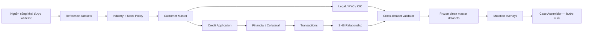

# Synthetic Data Pipeline Plan

## 1. Mục tiêu và nguyên tắc

Pipeline tạo **11 master datasets trong Bảng 9 trước**, kiểm tra tính nhất quán và đóng băng dữ liệu sạch; `Case Assembler` chỉ lấy snapshot và áp dụng lỗi có chủ đích ở bước cuối.

Nguyên tắc thiết kế:

- Số liệu, ID, ngày, policy version, hard gate và nhãn vàng do deterministic code tạo.
- Data Designer/OpenAI chỉ làm giàu narrative không quyết định kết quả.
- Dữ liệu sạch và mutation overlays tách riêng; không sửa trực tiếp master data đã freeze.
- Mọi record có khóa, `as_of_date`, version, seed, provenance và synthetic flag.
- Ground truth không nằm trong runtime/RAG corpus.
- Không crawl hồ sơ khách hàng, CIC, KYC, tài sản hoặc dữ liệu cá nhân thật.

## 2. Kiến trúc dataset-first



### Shared keys

```text
customer_id
party_id
application_id
document_id
account_id
collateral_id
policy_snapshot_id
industry_code
as_of_date
record_version
generator_seed
synthetic_flag
```

Mọi foreign key phải resolve trong cùng dataset version. File bị sửa phải có version và hash mới.

## 3. Quy mô master pool P0

| Dataset | Quy mô P0 | Định dạng giao hàng |
|---|---:|---|
| Customer master | 120 customers, 12 ngành | JSON/CSV |
| Credit application | 120 active applications | JSON |
| Hồ sơ pháp lý | Khoảng 600 document records | PDF/ảnh |
| Báo cáo tài chính | 3 năm + 1 kỳ gần nhất/customer | XLSX/PDF |
| Giao dịch tài khoản | 50–200 dòng/customer | CSV |
| CIC mock | 1 report/customer, 0–5 facilities | JSON/PDF |
| KYC/AML mock | Customer, representative và related parties | JSON |
| Tài sản bảo đảm | 1–2 bất động sản/application | JSON/PDF/ảnh |
| Quan hệ SHB mock | 1–3 accounts/customer | JSON/CSV |
| Chính sách/rulebook | 6 policy families × 3 versions | JSON/Markdown/PDF |
| Dữ liệu ngành | 12 ngành × 8 quý | CSV/Markdown |

Canonical tabular data lưu ở Parquet/JSONL; các định dạng trong bảng là delivery views dành cho agent.

## 4. Data factories

### 4.1 Customer master

**Schema tối thiểu:** `customer_id`, tên pháp nhân, MST giả, `industry_code`, ngày thành lập, địa chỉ, người đại diện, bên liên quan và `as_of_date`.

**Generator:** seeded Faker/từ điển nội bộ; tên công ty và địa chỉ được tổ hợp; MST dùng namespace `MOCK-TAX-*` và không có checksum thật. `industry_code` lấy từ Industry dataset.

**Invariant:** ID/tên/MST duy nhất; ngày thành lập trước `as_of_date`; ngành tồn tại; không có identifier hoặc PII thật.

### 4.2 Credit application

**Schema tối thiểu:** `application_id`, `customer_id`, sản phẩm, số tiền, kỳ hạn, mục đích, phương thức và nguồn trả nợ, danh sách TSBĐ đề xuất, ngày nộp và policy snapshot.

**Generator:** P0 dùng sản phẩm mock `SME_WORKING_CAPITAL`; amount tương quan với revenue band; tenor, purpose và repayment method bị ràng buộc bởi policy version đang hiệu lực.

**Invariant:** customer/policy/collateral resolve được; amount dương; tenor và purpose hợp lệ tại ngày nộp.

### 4.3 Hồ sơ pháp lý

Sinh structured record trước rồi render năm loại tài liệu: ĐKKD, điều lệ, quyết định bổ nhiệm, ID giả và nghị quyết vay.

**Schema metadata:** `document_id`, customer/application, loại, số hiệu, issued/valid dates, version, người ký, canonical fields, template và quality profile.

**Invariant:** tên/MST/đại diện nhất quán với Customer master; người ký có thẩm quyền tại ngày ký; mỗi field được map tới page/bounding box; mọi trang có watermark synthetic.

### 4.4 Báo cáo tài chính

Sinh balance sheet, P&L, cash flow, notes và derived metrics cho ba năm cùng một kỳ gần nhất.

**Thứ tự:** revenue/margin → P&L → working-capital accounts → debt/equity → balance sheet → cash flow → ratios → notes.

**Invariant:** `Assets = Liabilities + Equity`; opening cash + net cash movement = closing cash; retained earnings reconcile; mọi ratio lưu input fact IDs và formula version. LLM không được sinh hoặc sửa số.

### 4.5 Giao dịch tài khoản

Sinh 50–200 giao dịch từ monthly revenue, COGS, payroll, tax, debt repayment và industry seasonality. Counterparty lấy từ synthetic counterparty pool.

**Invariant:** running balance chính xác; inflow/outflow reconcile trong tolerance với cash-flow facts; không âm nếu không có overdraft mock. Circular flow, unusual receipt và concentration chỉ xuất hiện trong mutation overlays.

### 4.6 CIC mock

**Schema:** dư nợ/facility, mã `MOCK_BANK_*`, facility type, debt group, days past due, delinquency history, maturity và inquiry counts.

**Invariant:** outstanding không âm; debt group khớp mock delinquency rules; inquiry không sau `checked_at`; CIC summary bằng tổng facility rows. Near-match và CIC–SHB mismatch là mutation, không thuộc clean pool.

### 4.7 KYC/AML mock

Tạo riêng `mock_watchlist`; không sử dụng danh sách cá nhân hoặc tổ chức thật.

**Schema:** party/customer, check date, list ID, match status/score, matching fields và analyst status.

**Invariant:** score trong `[0,1]`; `NO_MATCH` không có matched entity; ambiguous match phải dẫn tới review/refer, không tự động adverse conclusion.

### 4.8 Tài sản bảo đảm

P0 chỉ hỗ trợ bất động sản.

**Schema:** owner, loại/mô tả/địa chỉ giả, valuation amount/date, haircut, eligible value, encumbrance và ownership document.

**Invariant:** owner là customer/related party hợp lệ; valuation date không ở tương lai; haircut đúng policy version; `eligible_value = valuation_amount × (1 - haircut_rate)`; coverage tính lại được từ application/exposure.

### 4.9 Quan hệ SHB mock

Gồm account, exposure snapshot, turnover summary, past due, products và RM note. Account IDs dùng `MOCK-SHB-*`.

**Generator:** turnover và balance được aggregate từ Transactions; exposure liên kết facility/CIC; RM note chỉ được viết từ `asserted_fact_ids`.

**Invariant:** turnover/balance/exposure reconcile với nguồn; narrative không thêm số, ngày hoặc entity ngoài allowlist.

### 4.10 Chính sách/rulebook

Sáu families: product eligibility; completeness; purpose/hard gates; financial assessment; collateral/valuation; CIC/KYC/AML và decision routing. Mỗi family có ba effective-dated versions, tổng 18 documents.

JSON policy-as-code là source of truth; Markdown/PDF là rendered views. Ít nhất một clause thay đổi giữa v2 và v3. Mỗi policy ghi rõ `MOCK POLICY — FOR HACKATHON ONLY`.

**Invariant:** mỗi ngày chỉ có một active version/family; không có overlap ngoài chủ đích; hard stop/exception có unit tests; PDF/Markdown chứa đúng rule IDs và version trong JSON.

### 4.11 Dữ liệu ngành

Gồm industry reference, quarterly observations, benchmark bands, risk profile và seasonality.

- Mã ngành lấy từ [VSIC 2025 — QĐ 36/2025/QĐ-TTg](https://chinhphu.vn/?docid=215475&pageid=27160).
- Aggregate observations lấy từ [NSO PXWeb](https://pxweb.nso.gov.vn/api/v1/vi).
- BCTC line-item vocabulary tham khảo [Thông tư 133/2016/TT-BTC](https://congbao.chinhphu.vn/van-ban/thong-tu-so-133-2016-tt-btc-21048/15524.htm).
- Nếu không có public margin/risk value, sinh benchmark band và đánh dấu `synthetic_estimate=true`; không gắn nguồn thật cho số giả.

**Invariant:** giá trị public có source/table ID/hash/retrieved time; synthetic values được phân loại rõ; seasonality index có trung bình chuẩn hóa bằng 1.

## 5. Crawl và provenance

### Auto-snapshot whitelist

- VSIC taxonomy từ cổng Chính phủ.
- NSO aggregate industry tables.
- Accounting form structure và SME classification metadata từ nguồn chính thức.
- Regulatory metadata/effective dates, không tự chuyển thành SHB internal rules.

### Curate thủ công

- SHB product name, purpose, tenor/security facts và URL/as-of date.
- Không mirror full text hoặc dùng để train vì [SHB robots.txt](https://www.shb.com.vn/robots.txt) hạn chế AI crawlers/training.

### Không crawl

- CIC, tax/e-invoice, business registry records, SHB login hoặc property registry.
- Financial statements, transactions, KYC/AML hoặc hồ sơ khách hàng thật.
- Dữ liệu public của một công ty thật rồi chỉ đổi tên.

Mỗi snapshot lưu `source_url`, publisher, document/table ID, effective dates, retrieved time, SHA-256, robots/license decision và parser version. Demo không phụ thuộc live Internet.

## 6. Data Designer/OpenAI boundary

Data Designer nhận canonical rows qua seed dataset và chỉ tạo business description, legal/financial notes, RM note, collateral narrative và industry summary.

Mỗi output phải lưu:

```text
asserted_fact_ids[]
model
prompt_hash
config_hash
output_hash
introduced_numeric_tokens[]
retry_count
token_cost
```

Local validator loại output có number/date/entity/policy reference ngoài allowlist. Không dùng Data Designer cho financial values, IDs, policy version, hard gate, recommendation, expected findings hoặc ground truth. Tham khảo tài liệu chính thức về [seed datasets](https://docs.nvidia.com/nemo/datadesigner/concepts/seed-datasets), [columns](https://docs.nvidia.com/nemo/datadesigner/concepts/columns) và [validators](https://docs.nvidia.com/nemo/datadesigner/concepts/validators).

Spike pin chính xác v0.8.0 và giữ nếu hoàn thành tích hợp trong 120 phút, accepted yield ít nhất 90%, schema/fact preservation 100% và không tạo critical fact mới. Nếu không đạt, dùng deterministic templates + direct OpenAI SDK; pipeline còn lại không đổi.

## 7. Freeze, mutations và case assembly

Sau khi 11 datasets pass validation, tạo immutable `clean-v1` manifest và hashes. Mutation catalog chứa tối thiểu:

```text
MISSING_DOCUMENT
EXPIRED_DOCUMENT
IDENTITY_MISMATCH
REVENUE_MISMATCH
STALE_POLICY_VERSION
CIC_NEAR_MATCH
CIC_SHB_EXPOSURE_MISMATCH
COLLATERAL_OWNER_MISMATCH
VALUATION_EXPIRED
TRANSACTION_CIRCULAR_FLOW
COUNTERPARTY_CONCENTRATION
UNUSUAL_RECEIPT
BLUR_SKEW_LOW_CONTRAST
```

Mỗi mutation lưu target record, before/after, injection stage, expected detector/severity/action và impacted downstream datasets.

`Case Assembler` chỉ chạy sau freeze: chọn customer/application, lấy snapshot của 11 datasets theo `as_of_date`, áp dụng mutations, render artifacts và compile private gold. Nó không được sinh facts mới.

## 8. CLI và build gates

```text
mockdata refs sync
mockdata schema validate
mockdata generate industry policy customers applications
mockdata generate legal financial transactions cic kyc collateral relationship
mockdata enrich-narratives
mockdata validate dataset --all
mockdata freeze --version clean-v1
mockdata mutate --catalog default
mockdata assemble --split demo
mockdata assemble --split blind-eval
```

`assemble` bị chặn nếu master datasets chưa freeze hoặc validation chưa pass.

Hard gates:

- 100% schema, primary-key, foreign-key và temporal integrity.
- 100% financial, transaction, exposure, turnover và collateral reconciliation.
- 100% policy effective-date/version correctness.
- 100% rendered evidence locators resolve đúng artifact/value.
- 100% planned mutations xuất hiện; không có critical contradiction ngoài manifest.
- Cùng seed/config/version tạo cùng canonical values và deterministic hashes.
- Không có real PII; mọi document có watermark.
- Runtime corpus không chứa canonical private truth hoặc evaluation gold.

Workflow/audit là metadata tự sinh trong lúc pipeline chạy, không phải business data factory: event, actor, input/output hash, duration, generator version và error.
