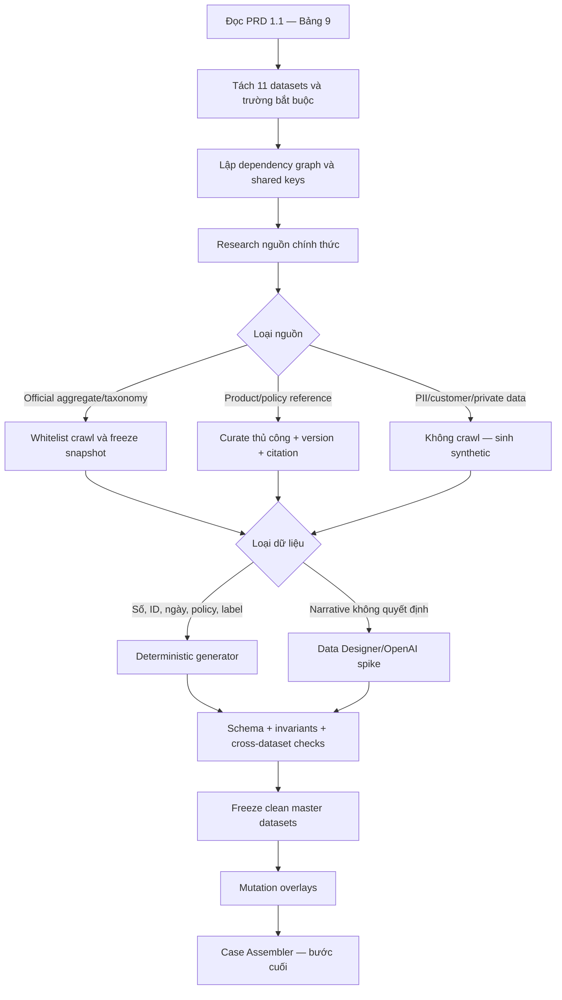

```mermaid
flowchart TD
    A["Đọc PRD 1.1 — Bảng 9"] --> B["Tách 11 datasets và trường bắt buộc"]
    B --> C["Lập dependency graph và shared keys"]
    C --> D["Research nguồn chính thức"]
    D --> E{"Loại nguồn"}
    E -->|"Official aggregate/taxonomy"| F["Whitelist crawl và freeze snapshot"]
    E -->|"Product/policy reference"| G["Curate thủ công + version + citation"]
    E -->|"PII/customer/private data"| H["Không crawl — sinh synthetic"]
    F --> I{"Loại dữ liệu"}
    G --> I
    H --> I
    I -->|"Số, ID, ngày, policy, label"| J["Deterministic generator"]
    I -->|"Narrative không quyết định"| K["Data Designer/OpenAI spike"]
    J --> L["Schema + invariants + cross-dataset checks"]
    K --> L
    L --> M["Freeze clean master datasets"]
    M --> N["Mutation overlays"]
    N --> O["Case Assembler — bước cuối"]
```
